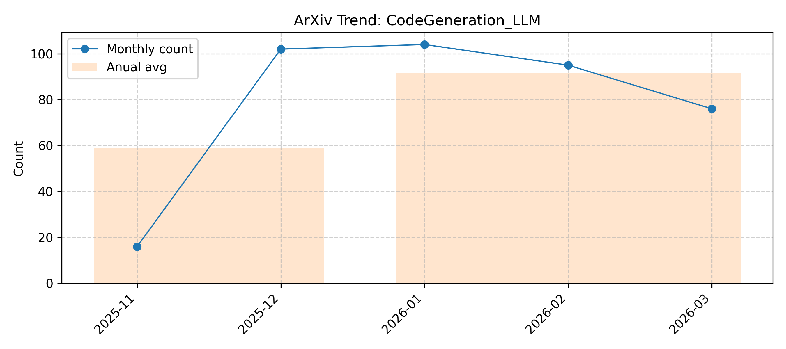

# CodeGeneration_LLM

> Updated on 2026.01.04

[🔙 Back to Index](README.md)

| Date | Title | Categories | Abstract | PDF | Code |
|:---|:---|:---|:---|:---|:---|
|**2025-12-31**|**Vulcan: Instance-Optimal Systems Heuristics Through LLM-Driven Search**|cs.OS, cs.AI, cs.DC| 

Full Abstract
Resource-management tasks in modern operating and distributed systems continue to rely primarily on hand-designed heuristics for tasks such as scheduling, caching, or active queue management. Designing performant heuristics is an expensive, time-consuming process that we are forced to continuously go through due to the constant flux of hardware, workloads and environments.   We propose a new alternative: synthesizing instance-optimal heuristics -- specialized for the exact workloads and hardware where they will be deployed -- using code-generating large language models (LLMs). To make this synthesis tractable, Vulcan separates policy and mechanism through LLM-friendly, task-agnostic interfaces. With these interfaces, users specify the inputs and objectives of their desired policy, while Vulcan searches for performant policies via evolutionary search over LLM-generated code. This interface is expressive enough to capture a wide range of system policies, yet sufficiently constrained to allow even small, inexpensive LLMs to generate correct and executable code.   We use Vulcan to synthesize performant heuristics for cache eviction and memory tiering, and find that these heuristics outperform all human-designed state-of-the-art algorithms by upto 69% and 7.9% in performance for each of these tasks respectively.
|[2512.25065v1](http://arxiv.org/abs/2512.25065v1)| null|
|**2025-12-31**|**On the Effectiveness of Training Data Optimization for LLM-based Code Generation: An Empirical Study**|cs.SE| 

Full Abstract
Large language models (LLMs) have achieved remarkable progress in code generation, largely driven by the availability of high-quality code datasets for effective training. To further improve data quality, numerous training data optimization techniques have been proposed; however, their overall effectiveness has not been systematically evaluated. To bridge this gap, we conduct the first large-scale empirical study, examining five widely-used training data optimization techniques and their pairwise combinations for LLM-based code generation across three benchmarks and four LLMs. Our results show that data synthesis is the most effective technique for improving functional correctness and reducing code smells, although it performs relatively worse on code maintainability compared to data refactoring, cleaning, and selection. Regarding combinations, we find that most combinations do not further improve functional correctness but can effectively enhance code quality (code smells and maintainability). Among all combinations, data synthesis combined with data refactoring achieves the strongest overall performance. Furthermore, our fine-grained analysis reinforces these findings and provides deeper insights into how individual techniques and their combinations influence code generation effectiveness. Overall, this work represents a first step toward a systematic understanding of training data optimization and combination strategies, offering practical guidance for future research and deployment in LLM-based code generation.
|[2512.24570v1](http://arxiv.org/abs/2512.24570v1)| null|
|**2025-12-31**|**Localized Calibrated Uncertainty in Code Language Models**|cs.SE, cs.AI| 

Full Abstract
Large Language models (LLMs) can generate complicated source code from natural language prompts. However, LLMs can generate output that deviates from what the user wants, requiring supervision and editing. To support this process, we offer techniques to localize where generations might be misaligned from user intent. We first create a dataset of "Minimal Intent Aligning Patches" of repaired LLM generated programs. Each program uses test cases to verify correctness. After creating a dataset of programs, we measure how well various techniques can assign a well-calibrated probability to indicate which parts of code will be edited in a minimal patch (i.e., give a probability that corresponds with empirical odds it is edited). We compare white-box probing (where we propose a technique for efficient arbitrary-span querying), against black-box reflective and self-consistency based approaches. We find probes with a small supervisor model can achieve low calibration error and Brier Skill Score of approx 0.2 estimating edited lines on code generated by models many orders of magnitude larger. We discuss the generalizability of the techniques, and the connections to AI oversight and control, finding a probe trained only on code shows some signs of generalizing to natural language errors if new probability scaling is allowed.
|[2512.24560v1](http://arxiv.org/abs/2512.24560v1)| null|
|**2025-12-30**|**iCLP: Large Language Model Reasoning with Implicit Cognition Latent Planning**|cs.CL, cs.AI| 

Full Abstract
Large language models (LLMs), when guided by explicit textual plans, can perform reliable step-by-step reasoning during problem-solving. However, generating accurate and effective textual plans remains challenging due to LLM hallucinations and the high diversity of task-specific questions. To address this, we draw inspiration from human Implicit Cognition (IC), the subconscious process by which decisions are guided by compact, generalized patterns learned from past experiences without requiring explicit verbalization. We propose iCLP, a novel framework that enables LLMs to adaptively generate latent plans (LPs), which are compact encodings of effective reasoning instructions. iCLP first distills explicit plans from existing step-by-step reasoning trajectories. It then learns discrete representations of these plans via a vector-quantized autoencoder coupled with a codebook. Finally, by fine-tuning LLMs on paired latent plans and corresponding reasoning steps, the models learn to perform implicit planning during reasoning. Experimental results on mathematical reasoning and code generation tasks demonstrate that, with iCLP, LLMs can plan in latent space while reasoning in language space. This approach yields significant improvements in both accuracy and efficiency and, crucially, demonstrates strong cross-domain generalization while preserving the interpretability of chain-of-thought reasoning.
|[2512.24014v1](http://arxiv.org/abs/2512.24014v1)| null|
|**2025-12-29**|**From Correctness to Collaboration: Toward a Human-Centered Framework for Evaluating AI Agent Behavior in Software Engineering**|cs.SE, cs.AI, cs.HC| 

Full Abstract
As Large Language Models (LLMs) evolve from code generators into collaborative partners for software engineers, our methods for evaluation are lagging. Current benchmarks, focused on code correctness, fail to capture the nuanced, interactive behaviors essential for successful human-AI partnership. To bridge this evaluation gap, this paper makes two core contributions. First, we present a foundational taxonomy of desirable agent behaviors for enterprise software engineering, derived from an analysis of 91 sets of user-defined agent rules. This taxonomy defines four key expectations of agent behavior: Adhere to Standards and Processes, Ensure Code Quality and Reliability, Solving Problems Effectively, and Collaborating with the User.   Second, recognizing that these expectations are not static, we introduce the Context-Adaptive Behavior (CAB) Framework. This emerging framework reveals how behavioral expectations shift along two empirically-derived axes: the Time Horizon (from immediate needs to future ideals), established through interviews with 15 expert engineers, and the Type of Work (from enterprise production to rapid prototyping, for example), identified through a prompt analysis of a prototyping agent. Together, these contributions offer a human-centered foundation for designing and evaluating the next generation of AI agents, moving the field's focus from the correctness of generated code toward the dynamics of true collaborative intelligence.
|[2512.23844v1](http://arxiv.org/abs/2512.23844v1)| null|
|**2025-12-26**|**State-of-the-art Small Language Coder Model: Mify-Coder**|cs.SE, cs.AI, cs.CL| 

Full Abstract
We present Mify-Coder, a 2.5B-parameter code model trained on 4.2T tokens using a compute-optimal strategy built on the Mify-2.5B foundation model. Mify-Coder achieves comparable accuracy and safety while significantly outperforming much larger baseline models on standard coding and function-calling benchmarks, demonstrating that compact models can match frontier-grade models in code generation and agent-driven workflows. Our training pipeline combines high-quality curated sources with synthetic data generated through agentically designed prompts, refined iteratively using enterprise-grade evaluation datasets. LLM-based quality filtering further enhances data density, enabling frugal yet effective training. Through disciplined exploration of CPT-SFT objectives, data mixtures, and sampling dynamics, we deliver frontier-grade code intelligence within a single continuous training trajectory. Empirical evidence shows that principled data and compute discipline allow smaller models to achieve competitive accuracy, efficiency, and safety compliance. Quantized variants of Mify-Coder enable deployment on standard desktop environments without requiring specialized hardware.
|[2512.23747v1](http://arxiv.org/abs/2512.23747v1)| null|
|**2025-12-26**|**AgenticTCAD: A LLM-based Multi-Agent Framework for Automated TCAD Code Generation and Device Optimization**|cs.SE, cs.AI| 

Full Abstract
With the continued scaling of advanced technology nodes, the design-technology co-optimization (DTCO) paradigm has become increasingly critical, rendering efficient device design and optimization essential. In the domain of TCAD simulation, however, the scarcity of open-source resources hinders language models from generating valid TCAD code. To overcome this limitation, we construct an open-source TCAD dataset curated by experts and fine-tune a domain-specific model for TCAD code generation. Building on this foundation, we propose AgenticTCAD, a natural language - driven multi-agent framework that enables end-to-end automated device design and optimization. Validation on a 2 nm nanosheet FET (NS-FET) design shows that AgenticTCAD achieves the International Roadmap for Devices and Systems (IRDS)-2024 device specifications within 4.2 hours, whereas human experts required 7.1 days with commercial tools.
|[2512.23742v1](http://arxiv.org/abs/2512.23742v1)| null|
|**2025-12-29**|**AKG kernel Agent: A Multi-Agent Framework for Cross-Platform Kernel Synthesis**|cs.AI, cs.LG| 

Full Abstract
Modern AI models demand high-performance computation kernels. The growing complexity of LLMs, multimodal architectures, and recommendation systems, combined with techniques like sparsity and quantization, creates significant computational challenges. Moreover, frequent hardware updates and diverse chip architectures further complicate this landscape, requiring tailored kernel implementations for each platform. However, manual optimization cannot keep pace with these demands, creating a critical bottleneck in AI system development. Recent advances in LLM code generation capabilities have opened new possibilities for automating kernel development. In this work, we propose AKG kernel agent (AI-driven Kernel Generator), a multi-agent system that automates kernel generation, migration, and performance tuning. AKG kernel agent is designed to support multiple domain-specific languages (DSLs), including Triton, TileLang, CPP, and CUDA-C, enabling it to target different hardware backends while maintaining correctness and portability. The system's modular design allows rapid integration of new DSLs and hardware targets. When evaluated on KernelBench using Triton DSL across GPU and NPU backends, AKG kernel agent achieves an average speedup of 1.46$\times$ over PyTorch Eager baselines implementations, demonstrating its effectiveness in accelerating kernel development for modern AI workloads.
|[2512.23424v1](http://arxiv.org/abs/2512.23424v1)| null|
|**2025-12-29**|**Post-Training Quantization of OpenPangu Models for Efficient Deployment on Atlas A2**|cs.LG, cs.AI| 

Full Abstract
Huawei's openPangu-Embedded-1B and openPangu-Embedded-7B, variants of the openPangu large language model, integrate three distinct Chain-of-Thought (CoT) reasoning paradigms, namely slow_think, auto_think, and no_think. While these CoT modes enhance reasoning capabilities, their generation of extended reasoning traces introduces substantial memory and latency overheads, posing challenges for practical deployment on Ascend NPUs. This paper addresses these computational constraints by leveraging low-bit quantization, which transforms FP16 computations into more efficient integer arithmetic. We introduce a unified low-bit inference framework, supporting INT8 (W8A8) and W4A8 quantization, specifically optimized for openPangu-Embedded models on the Atlas A2. Our comprehensive evaluation, conducted across all three CoT modes on code generation benchmarks (HumanEval and MBPP), demonstrates the efficacy of this approach. INT8 quantization consistently preserves over 90\% of the FP16 baseline accuracy and achieves a 1.5x prefill speedup on the Atlas A2. Furthermore, W4A8 quantization significantly reduces memory consumption, albeit with a moderate trade-off in accuracy. These findings collectively indicate that low-bit quantization effectively facilitates efficient CoT reasoning on Ascend NPUs, maintaining high model fidelity.
|[2512.23367v1](http://arxiv.org/abs/2512.23367v1)| null|
|**2025-12-29**|**Anka: A Domain-Specific Language for Reliable LLM Code Generation**|cs.CL, cs.LG, cs.PL, cs.SE| 

Full Abstract
Large Language Models (LLMs) have demonstrated remarkable capabilities in code generation, yet they exhibit systematic errors on complex, multi-step programming tasks. We hypothesize that these errors stem from the flexibility of general-purpose languages, which permits multiple valid approaches and requires implicit state management. To test this hypothesis, we introduce Anka, a domain-specific language (DSL) for data transformation pipelines designed with explicit, constrained syntax that reduces ambiguity in code generation. Despite having zero prior training exposure to Anka, Claude 3.5 Haiku achieves 99.9% parse success and 95.8% overall task accuracy across 100 benchmark problems. Critically, Anka demonstrates a 40 percentage point accuracy advantage over Python on multi-step pipeline tasks (100% vs. 60%), where Python's flexible syntax leads to frequent errors in operation sequencing and variable management. Cross-model validation with GPT-4o-mini confirms this advantage (+26.7 percentage points on multi-step tasks). Our results demonstrate that: (1) LLMs can learn novel DSLs entirely from in-context prompts, achieving near-native accuracy; (2) constrained syntax significantly reduces errors on complex tasks; and (3) domain-specific languages purposefully designed for LLM generation can outperform general-purpose languages on which the LLM has extensive training. We release the complete language implementation, benchmark suite, and evaluation framework to facilitate further research.
|[2512.23214v1](http://arxiv.org/abs/2512.23214v1)| null|
|**2025-12-28**|**FasterPy: An LLM-based Code Execution Efficiency Optimization Framework**|cs.SE, cs.AI| 

Full Abstract
Code often suffers from performance bugs. These bugs necessitate the research and practice of code optimization. Traditional rule-based methods rely on manually designing and maintaining rules for specific performance bugs (e.g., redundant loops, repeated computations), making them labor-intensive and limited in applicability. In recent years, machine learning and deep learning-based methods have emerged as promising alternatives by learning optimization heuristics from annotated code corpora and performance measurements. However, these approaches usually depend on specific program representations and meticulously crafted training datasets, making them costly to develop and difficult to scale. With the booming of Large Language Models (LLMs), their remarkable capabilities in code generation have opened new avenues for automated code optimization. In this work, we proposed FasterPy, a low-cost and efficient framework that adapts LLMs to optimize the execution efficiency of Python code. FasterPy combines Retrieval-Augmented Generation (RAG), supported by a knowledge base constructed from existing performance-improving code pairs and corresponding performance measurements, with Low-Rank Adaptation (LoRA) to enhance code optimization performance. Our experimental results on the Performance Improving Code Edits (PIE) benchmark demonstrate that our method outperforms existing models on multiple metrics. The FasterPy tool and the experimental results are available at https://github.com/WuYue22/fasterpy.
|[2512.22827v1](http://arxiv.org/abs/2512.22827v1)| null|
|**2025-12-27**|**M2G-Eval: Enhancing and Evaluating Multi-granularity Multilingual Code Generation**|cs.CL| 

Full Abstract
The rapid advancement of code large language models (LLMs) has sparked significant research interest in systematically evaluating their code generation capabilities, yet existing benchmarks predominantly assess models at a single structural granularity and focus on limited programming languages, obscuring fine-grained capability variations across different code scopes and multilingual scenarios. We introduce M2G-Eval, a multi-granularity, multilingual framework for evaluating code generation in large language models (LLMs) across four levels: Class, Function, Block, and Line. Spanning 18 programming languages, M2G-Eval includes 17K+ training tasks and 1,286 human-annotated, contamination-controlled test instances. We develop M2G-Eval-Coder models by training Qwen3-8B with supervised fine-tuning and Group Relative Policy Optimization. Evaluating 30 models (28 state-of-the-art LLMs plus our two M2G-Eval-Coder variants) reveals three main findings: (1) an apparent difficulty hierarchy, with Line-level tasks easiest and Class-level most challenging; (2) widening performance gaps between full- and partial-granularity languages as task complexity increases; and (3) strong cross-language correlations, suggesting that models learn transferable programming concepts. M2G-Eval enables fine-grained diagnosis of code generation capabilities and highlights persistent challenges in synthesizing complex, long-form code.
|[2512.22628v1](http://arxiv.org/abs/2512.22628v1)| null|
|**2025-12-25**|**Exploring the Security Threats of Retriever Backdoors in Retrieval-Augmented Code Generation**|cs.CR, cs.SE| 

Full Abstract
Retrieval-Augmented Code Generation (RACG) is increasingly adopted to enhance Large Language Models for software development, yet its security implications remain dangerously underexplored. This paper conducts the first systematic exploration of a critical and stealthy threat: backdoor attacks targeting the retriever component, which represents a significant supply-chain vulnerability. It is infeasible to assess this threat realistically, as existing attack methods are either too ineffective to pose a real danger or are easily detected by state-of-the-art defense mechanisms spanning both latent-space analysis and token-level inspection, which achieve consistently high detection rates. To overcome this barrier and enable a realistic analysis, we first developed VenomRACG, a new class of potent and stealthy attack that serves as a vehicle for our investigation. Its design makes poisoned samples statistically indistinguishable from benign code, allowing the attack to consistently maintain low detectability across all evaluated defense mechanisms. Armed with this capability, our exploration reveals a severe vulnerability: by injecting vulnerable code equivalent to only 0.05% of the entire knowledge base size, an attacker can successfully manipulate the backdoored retriever to rank the vulnerable code in its top-5 results in 51.29% of cases. This translates to severe downstream harm, causing models like GPT-4o to generate vulnerable code in over 40% of targeted scenarios, while leaving the system's general performance intact. Our findings establish that retriever backdooring is not a theoretical concern but a practical threat to the software development ecosystem that current defenses are blind to, highlighting the urgent need for robust security measures.
|[2512.21681v1](http://arxiv.org/abs/2512.21681v1)| null|
|**2025-12-24**|**dUltra: Ultra-Fast Diffusion Language Models via Reinforcement Learning**|cs.LG, cs.AI| 

Full Abstract
Masked diffusion language models (MDLMs) offer the potential for parallel token generation, but most open-source MDLMs decode fewer than 5 tokens per model forward pass even with sophisticated sampling strategies. As a result, their sampling speeds are often comparable to AR + speculative decoding schemes, limiting their advantage over mainstream autoregressive approaches. Existing distillation-based accelerators (dParallel, d3LLM) finetune MDLMs on trajectories generated by a base model, which can become off-policy during finetuning and restrict performance to the quality of the base model's samples. We propose \texttt{dUltra}, an on-policy reinforcement learning framework based on Group Relative Policy Optimization (GRPO) that learns unmasking strategies for efficient parallel decoding. dUltra introduces an unmasking planner head that predicts per-token unmasking likelihoods under independent Bernoulli distributions. We jointly optimize the base diffusion LLM and the unmasking order planner using reward signals combining verifiable reward, distillation reward, and the number of unmasking steps. Across mathematical reasoning and code generation tasks, dUltra improves the accuracy--efficiency trade-off over state-of-the-art heuristic and distillation baselines, moving towards achieving ``diffusion supremacy'' over autoregressive models.
|[2512.21446v1](http://arxiv.org/abs/2512.21446v1)| null|
|**2025-12-24**|**AInsteinBench: Benchmarking Coding Agents on Scientific Repositories**|cs.SE, cs.AI, cs.PL| 

Full Abstract
We introduce AInsteinBench, a large-scale benchmark for evaluating whether large language model (LLM) agents can operate as scientific computing development agents within real research software ecosystems. Unlike existing scientific reasoning benchmarks which focus on conceptual knowledge, or software engineering benchmarks that emphasize generic feature implementation and issue resolving, AInsteinBench evaluates models in end-to-end scientific development settings grounded in production-grade scientific repositories. The benchmark consists of tasks derived from maintainer-authored pull requests across six widely used scientific codebases, spanning quantum chemistry, quantum computing, molecular dynamics, numerical relativity, fluid dynamics, and cheminformatics. All benchmark tasks are carefully curated through multi-stage filtering and expert review to ensure scientific challenge, adequate test coverage, and well-calibrated difficulty. By leveraging evaluation in executable environments, scientifically meaningful failure modes, and test-driven verification, AInsteinBench measures a model's ability to move beyond surface-level code generation toward the core competencies required for computational scientific research.
|[2512.21373v1](http://arxiv.org/abs/2512.21373v1)| null|
|**2025-12-22**|**Reflection-Driven Control for Trustworthy Code Agents**|cs.CR, cs.AI, cs.SE| 

Full Abstract
Contemporary large language model (LLM) agents are remarkably capable, but they still lack reliable safety controls and can produce unconstrained, unpredictable, and even actively harmful outputs. To address this, we introduce Reflection-Driven Control, a standardized and pluggable control module that can be seamlessly integrated into general agent architectures. Reflection-Driven Control elevates "self-reflection" from a post hoc patch into an explicit step in the agent's own reasoning process: during generation, the agent continuously runs an internal reflection loop that monitors and evaluates its own decision path. When potential risks are detected, the system retrieves relevant repair examples and secure coding guidelines from an evolving reflective memory, injecting these evidence-based constraints directly into subsequent reasoning steps. We instantiate Reflection-Driven Control in the setting of secure code generation and systematically evaluate it across eight classes of security-critical programming tasks. Empirical results show that Reflection-Driven Control substantially improves the security and policy compliance of generated code while largely preserving functional correctness, with minimal runtime and token overhead. Taken together, these findings indicate that Reflection-Driven Control is a practical path toward trustworthy AI coding agents: it enables designs that are simultaneously autonomous, safer by construction, and auditable.
|[2512.21354v1](http://arxiv.org/abs/2512.21354v1)| null|
|**2025-12-20**|**CosmoCore-Evo: Evolutionary Dream-Replay Reinforcement Learning for Adaptive Code Generation**|cs.SE, cs.AI, cs.NE| 

Full Abstract
Building on the affective dream-replay reinforcement learning framework of CosmoCore, we introduce CosmoCore-Evo, an extension that incorporates evolutionary algorithms to enhance adaptability and novelty in code generation tasks. Inspired by anthropological aspects of human evolution, such as natural selection and adaptation in early hominids, CosmoCore-Evo treats RL trajectories as ``genomes'' that undergo mutation and selection during the nocturnal replay phase. This mechanism allows agents to break free from trained patterns, fostering emergent behaviors and improved performance in distribution-shifted environments, such as changing APIs or novel libraries. We augment the Dream Queue with evolutionary operations, including mutation of high-fitness trajectories and enterprise-tuned fitness functions that incorporate efficiency, compliance, and scalability metrics. Evaluated on extended benchmarks including HumanEval variants with shifts, BigCodeBench, and a custom PySpark pipeline simulation, CosmoCore-Evo achieves up to 35% higher novelty in solutions and 25% faster adaptation compared to the original CosmoCore and baselines like PPO and REAMER. Ablations confirm the role of evolutionary components in bridging the sentient gap for LLM agents. Code for replication, including a toy simulation, is provided.
|[2512.21351v1](http://arxiv.org/abs/2512.21351v1)| null|
|**2025-12-24**|**Casting a SPELL: Sentence Pairing Exploration for LLM Limitation-breaking**|cs.CR, cs.AI, cs.SE| 

Full Abstract
Large language models (LLMs) have revolutionized software development through AI-assisted coding tools, enabling developers with limited programming expertise to create sophisticated applications. However, this accessibility extends to malicious actors who may exploit these powerful tools to generate harmful software. Existing jailbreaking research primarily focuses on general attack scenarios against LLMs, with limited exploration of malicious code generation as a jailbreak target. To address this gap, we propose SPELL, a comprehensive testing framework specifically designed to evaluate the weakness of security alignment in malicious code generation. Our framework employs a time-division selection strategy that systematically constructs jailbreaking prompts by intelligently combining sentences from a prior knowledge dataset, balancing exploration of novel attack patterns with exploitation of successful techniques. Extensive evaluation across three advanced code models (GPT-4.1, Claude-3.5, and Qwen2.5-Coder) demonstrates SPELL's effectiveness, achieving attack success rates of 83.75%, 19.38%, and 68.12% respectively across eight malicious code categories. The generated prompts successfully produce malicious code in real-world AI development tools such as Cursor, with outputs confirmed as malicious by state-of-the-art detection systems at rates exceeding 73%. These findings reveal significant security gaps in current LLM implementations and provide valuable insights for improving AI safety alignment in code generation applications.
|[2512.21236v1](http://arxiv.org/abs/2512.21236v1)| null|
|**2025-12-24**|**Artificial or Just Artful? Do LLMs Bend the Rules in Programming?**|cs.SE| 

Full Abstract
Large Language Models (LLMs) are widely used for automated code generation, yet their apparent successes often mask a tension between pretraining objectives and alignment choices. While pretraining encourages models to exploit all available signals to maximize success, alignment, whether through fine-tuning or prompting, may restrict their use. This conflict is especially salient in agentic AI settings, for instance when an agent has access to unit tests that, although intended for validation, act as strong contextual signals that can be leveraged regardless of explicit prohibitions. In this paper, we investigate how LLMs adapt their code generation strategies when exposed to test cases under different prompting conditions. Using the BigCodeBench (Hard) dataset, we design five prompting conditions that manipulate test visibility and impose explicit or implicit restrictions on their use. We evaluate five LLMs (four open-source and one closed-source) across correctness, code similarity, program size, and code churn, and analyze cross-model consistency to identify recurring adaptation strategies. Our results show that test visibility dramatically alters performance, correctness nearly doubles for some models, while explicit restrictions or partial exposure only partially mitigate this effect. Beyond raw performance, we identify four recurring adaptation strategies, with test-driven refinement emerging as the most frequent. These results highlight how LLMs adapt their behavior when exposed to contextual signals that conflict with explicit instructions, providing useful insight into how models reconcile pretraining objectives with alignment constraints.
|[2512.21028v1](http://arxiv.org/abs/2512.21028v1)| null|
|**2025-12-23**|**NotSoTiny: A Large, Living Benchmark for RTL Code Generation**|cs.AR, cs.AI| 

Full Abstract
LLMs have shown early promise in generating RTL code, yet evaluating their capabilities in realistic setups remains a challenge. So far, RTL benchmarks have been limited in scale, skewed toward trivial designs, offering minimal verification rigor, and remaining vulnerable to data contamination. To overcome these limitations and to push the field forward, this paper introduces NotSoTiny, a benchmark that assesses LLM on the generation of structurally rich and context-aware RTL. Built from hundreds of actual hardware designs produced by the Tiny Tapeout community, our automated pipeline removes duplicates, verifies correctness and periodically incorporates new designs to mitigate contamination, matching Tiny Tapeout release schedule. Evaluation results show that NotSoTiny tasks are more challenging than prior benchmarks, emphasizing its effectiveness in overcoming current limitations of LLMs applied to hardware design, and in guiding the improvement of such promising technology.
|[2512.20823v1](http://arxiv.org/abs/2512.20823v1)| null|
|**2025-12-23**|**FEM-Bench: A Structured Scientific Reasoning Benchmark for Evaluating Code-Generating LLMs**|cs.LG, cs.AI, cs.SE| 

Full Abstract
As LLMs advance their reasoning capabilities about the physical world, the absence of rigorous benchmarks for evaluating their ability to generate scientifically valid physical models has become a critical gap. Computational mechanics, which develops and applies mathematical models and numerical methods to predict the behavior of physical systems under forces, deformation, and constraints, provides an ideal foundation for structured scientific reasoning evaluation. Problems follow clear mathematical structure, enforce strict physical and numerical constraints, and support objective verification. The discipline requires constructing explicit models of physical systems and reasoning about geometry, spatial relationships, and material behavior, connecting directly to emerging AI goals in physical reasoning and world modeling. We introduce FEM-Bench, a computational mechanics benchmark designed to evaluate the ability of LLMs to generate correct finite element method (FEM) and related code. FEM-Bench 2025 contains a suite of introductory but nontrivial tasks aligned with material from a first graduate course on computational mechanics. These tasks capture essential numerical and physical modeling challenges while representing only a small fraction of the complexity present in the discipline. Despite their simplicity, state-of-the-art LLMs do not reliably solve all of them. In a five attempt run, the best performing model at function writing, Gemini 3 Pro, completed 30/33 tasks at least once and 26/33 tasks all five times. The best performing model at unit test writing, GPT-5, had an Average Joint Success Rate of 73.8%. Other popular models showed broad performance variation. FEM-Bench establishes a structured foundation for evaluating AI-generated scientific code, and future iterations will incorporate increasingly sophisticated tasks to track progress as models evolve.
|[2512.20732v1](http://arxiv.org/abs/2512.20732v1)| null|
|**2025-12-18**|**Managing the Stochastic: Foundations of Learning in Neuro-Symbolic Systems for Software Engineering**|cs.LG, cs.AI, cs.SE| 

Full Abstract
Current approaches to AI coding agents appear to blur the lines between the Large Language Model (LLM) and the agent itself, asking the LLM to make decisions best left to deterministic processes. This leads to systems prone to stochastic failures such as gaming unit tests or hallucinating syntax. Drawing on established software engineering practices that provide deterministic frameworks for managing unpredictable processes, this paper proposes setting the control boundary such that the LLM is treated as a component of the environment environment -- preserving its creative stochasticity -- rather than the decision-making agent.   A \textbf{Dual-State Architecture} is formalized, separating workflow state (deterministic control flow) from environment state (stochastic generation). \textbf{Atomic Action Pairs} couple generation with verification as indivisible transactions, where \textbf{Guard Functions} act as sensing actions that project probabilistic outputs onto observable workflow state. The framework is validated on three code generation tasks across 13 LLMs (1.3B--15B parameters). For qualified instruction-following models, task success rates improved by up to 66 percentage points at 1.2--2.1$\times$ baseline computational cost. The results suggest that architectural constraints can substitute for parameter scale in achieving reliable code generation.
|[2512.20660v1](http://arxiv.org/abs/2512.20660v1)| null|
|**2025-12-23**|**Comment Traps: How Defective Commented-out Code Augment Defects in AI-Assisted Code Generation**|cs.SE| 

Full Abstract
With the rapid development of large language models in code generation, AI-powered editors such as GitHub Copilot and Cursor are revolutionizing software development practices. At the same time, studies have identified potential defects in the generated code. Previous research has predominantly examined how code context influences the generation of defective code, often overlooking the impact of defects within commented-out code (CO code). AI coding assistants' interpretation of CO code in prompts affects the code they generate.   This study evaluates how AI coding assistants, GitHub Copilot and Cursor, are influenced by defective CO code. The experimental results show that defective CO code in the context causes AI coding assistants to generate more defective code, reaching up to 58.17 percent. Our findings further demonstrate that the tools do not simply copy the defective code from the context. Instead, they actively reason to complete incomplete defect patterns and continue to produce defective code despite distractions such as incorrect indentation or tags. Even with explicit instructions to ignore the defective CO code, the reduction in defects does not exceed 21.84 percent. These findings underscore the need for improved robustness and security measures in AI coding assistants.
|[2512.20334v1](http://arxiv.org/abs/2512.20334v1)| null|
|**2025-12-23**|**Toward Explaining Large Language Models in Software Engineering Tasks**|cs.SE, cs.AI, cs.LG| 

Full Abstract
Recent progress in Large Language Models (LLMs) has substantially advanced the automation of software engineering (SE) tasks, enabling complex activities such as code generation and code summarization. However, the black-box nature of LLMs remains a major barrier to their adoption in high-stakes and safety-critical domains, where explainability and transparency are vital for trust, accountability, and effective human supervision. Despite increasing interest in explainable AI for software engineering, existing methods lack domain-specific explanations aligned with how practitioners reason about SE artifacts. To address this gap, we introduce FeatureSHAP, the first fully automated, model-agnostic explainability framework tailored to software engineering tasks. Based on Shapley values, FeatureSHAP attributes model outputs to high-level input features through systematic input perturbation and task-specific similarity comparisons, while remaining compatible with both open-source and proprietary LLMs. We evaluate FeatureSHAP on two bi-modal SE tasks: code generation and code summarization. The results show that FeatureSHAP assigns less importance to irrelevant input features and produces explanations with higher fidelity than baseline methods. A practitioner survey involving 37 participants shows that FeatureSHAP helps practitioners better interpret model outputs and make more informed decisions. Collectively, FeatureSHAP represents a meaningful step toward practical explainable AI in software engineering. FeatureSHAP is available at https://github.com/deviserlab/FeatureSHAP.
|[2512.20328v1](http://arxiv.org/abs/2512.20328v1)| null|
|**2025-12-23**|**AXIOM: Benchmarking LLM-as-a-Judge for Code via Rule-Based Perturbation and Multisource Quality Calibration**|cs.SE, cs.AI| 

Full Abstract
Large language models (LLMs) have been increasingly deployed in real-world software engineering, fostering the development of code evaluation metrics to study the quality of LLM-generated code. Conventional rule-based metrics merely score programs based on their surface-level similarities with reference programs instead of analyzing functionality and code quality in depth. To address this limitation, researchers have developed LLM-as-a-judge metrics, prompting LLMs to evaluate and score code, and curated various code evaluation benchmarks to validate their effectiveness. However, these benchmarks suffer from critical limitations, hindering reliable assessments of evaluation capability: Some feature coarse-grained binary labels, which reduce rich code behavior to a single bit of information, obscuring subtle errors. Others propose fine-grained but subjective, vaguely-defined evaluation criteria, introducing unreliability in manually-annotated scores, which is the ground-truth they rely on. Furthermore, they often use uncontrolled data synthesis methods, leading to unbalanced score distributions that poorly represent real-world code generation scenarios.   To curate a diverse benchmark with programs of well-balanced distributions across various quality levels and streamline the manual annotation procedure, we propose AXIOM, a novel perturbation-based framework for synthesizing code evaluation benchmarks at scale. It reframes program scores as the refinement effort needed for deployment, consisting of two stages: (1) Rule-guided perturbation, which prompts LLMs to apply sequences of predefined perturbation rules to existing high-quality programs to modify their functionality and code quality, enabling us to precisely control each program's target score to achieve balanced score distributions. (2) Multisource quality calibration, which first selects a subset of...
|[2512.20159v1](http://arxiv.org/abs/2512.20159v1)| null|
|**2025-12-23**|**Neuron-Guided Interpretation of Code LLMs: Where, Why, and How?**|cs.SE, cs.AI| 

Full Abstract
Code language models excel on code intelligence tasks, yet their internal interpretability is underexplored. Existing neuron interpretability techniques from NLP are suboptimal for source code due to programming languages formal, hierarchical, and executable nature. We empirically investigate code LLMs at the neuron level, localizing language-specific neurons (selectively responsive to one language) and concept layers (feed-forward layers encoding language-agnostic code representations). We analyze Llama-3.1-8B and Qwen2.5-Coder-32B on multilingual inputs in C++, Java, Python, Go, and JavaScript, measuring neuron selectivity and layerwise contributions during generation. We find (1) neurons specialized for individual languages alongside a universal subset supporting general-purpose generation; and (2) lower layers mainly encode language-specific syntax, while middle layers capture semantic abstractions shared across languages, emerging as concept layers. We demonstrate utility on three tasks: neuron-guided fine-tuning for code generation, clone detection via concept-layer embeddings, and concept-layer-guided transfer for code summarization, each yielding consistent gains in multilingual settings.
|[2512.19980v1](http://arxiv.org/abs/2512.19980v1)| null|
|**2025-12-22**|**CodeSimpleQA: Scaling Factuality in Code Large Language Models**|cs.CL| 

Full Abstract
Large language models (LLMs) have made significant strides in code generation, achieving impressive capabilities in synthesizing code snippets from natural language instructions. However, a critical challenge remains in ensuring LLMs generate factually accurate responses about programming concepts, technical implementations, etc. Most previous code-related benchmarks focus on code execution correctness, overlooking the factual accuracy of programming knowledge. To address this gap, we present CodeSimpleQA, a comprehensive bilingual benchmark designed to evaluate the factual accuracy of code LLMs in answering code-related questions, which contains carefully curated question-answer pairs in both English and Chinese, covering diverse programming languages and major computer science domains. Further, we create CodeSimpleQA-Instruct, a large-scale instruction corpus with 66M samples, and develop a post-training framework combining supervised fine-tuning and reinforcement learning. Our comprehensive evaluation of diverse LLMs reveals that even frontier LLMs struggle with code factuality. Our proposed framework demonstrates substantial improvements over the base model, underscoring the critical importance of factuality-aware alignment in developing reliable code LLMs.
|[2512.19424v1](http://arxiv.org/abs/2512.19424v1)| null|
|**2025-12-22**|**Generation of Programmatic Rules for Document Forgery Detection Using Large Language Models**|cs.AI| 

Full Abstract
Document forgery poses a growing threat to legal, economic, and governmental processes, requiring increasingly sophisticated verification mechanisms. One approach involves the use of plausibility checks, rule-based procedures that assess the correctness and internal consistency of data, to detect anomalies or signs of manipulation. Although these verification procedures are essential for ensuring data integrity, existing plausibility checks are manually implemented by software engineers, which is time-consuming. Recent advances in code generation with large language models (LLMs) offer new potential for automating and scaling the generation of these checks. However, adapting LLMs to the specific requirements of an unknown domain remains a significant challenge. This work investigates the extent to which LLMs, adapted on domain-specific code and data through different fine-tuning strategies, can generate rule-based plausibility checks for forgery detection on constrained hardware resources. We fine-tune open-source LLMs, Llama 3.1 8B and OpenCoder 8B, on structured datasets derived from real-world application scenarios and evaluate the generated plausibility checks on previously unseen forgery patterns. The results demonstrate that the models are capable of generating executable and effective verification procedures. This also highlights the potential of LLMs as scalable tools to support human decision-making in security-sensitive contexts where comprehensibility is required.
|[2512.19228v1](http://arxiv.org/abs/2512.19228v1)| null|
|**2025-12-22**|**BanglaForge: LLM Collaboration with Self-Refinement for Bangla Code Generation**|cs.SE, cs.CL| 

Full Abstract
Bangla is a low-resource language for code generation, lacking large-scale annotated datasets and tools to transform natural language specifications into executable programs. This makes Bangla-to-code generation a challenging task requiring innovative solutions. To address this, we introduce BanglaForge, a novel framework for generating code from Bangla function descriptions. BanglaForge leverages a retrieval-augmented dual-model collaboration paradigm with self-refinement, combining in-context learning, llm-based translation, systematic prompt engineering, and iterative self-refinement based on execution feedback, where a coder generates initial solutions and a reviewer enhances them for robustness. On the BLP-2025 Bangla Code Generation benchmark, BanglaForge achieves a competitive Pass@1 accuracy of 84.00%, demonstrating the effectiveness of retrieval, model collaboration, and self-refinement for low-resource Bangla code generation.
|[2512.19122v1](http://arxiv.org/abs/2512.19122v1)| null|
|**2025-12-22**|**When Less is More: 8-bit Quantization Improves Continual Learning in Large Language Models**|cs.LG, cs.AI| 

Full Abstract
Catastrophic forgetting poses a fundamental challenge in continual learning, particularly when models are quantized for deployment efficiency. We systematically investigate the interplay between quantization precision (FP16, INT8, INT4) and replay buffer strategies in large language models, revealing unexpected dynamics. While FP16 achieves superior initial task performance (74.44% on NLU), we observe a striking inversion on subsequent tasks: quantized models outperform FP16 by 8-15% on final task forward accuracy, with INT4 achieving nearly double FP16's performance on Code generation (40% vs 20%). Critically, even minimal replay buffers (0.1%) dramatically improve retention - increasing NLU retention after Math training from 45% to 65% across all precision levels - with INT8 consistently achieving the optimal balance between learning plasticity and knowledge retention. We hypothesize that quantization-induced noise acts as implicit regularization, preventing the overfitting to new task gradients that plagues high-precision models. These findings challenge the conventional wisdom that higher precision is always preferable, suggesting instead that INT8 quantization offers both computational efficiency and superior continual learning dynamics. Our results provide practical guidelines for deploying compressed models in continual learning scenarios: small replay buffers (1-2%) suffice for NLU tasks, while Math and Code benefit from moderate buffers (5-10%), with quantized models requiring less replay than FP16 to achieve comparable retention. Code is available at https://github.com/Festyve/LessIsMore.
|[2512.18934v1](http://arxiv.org/abs/2512.18934v1)| null|
|**2025-12-21**|**AI Code in the Wild: Measuring Security Risks and Ecosystem Shifts of AI-Generated Code in Modern Software**|cs.SE, cs.AI| 

Full Abstract
Large language models (LLMs) for code generation are becoming integral to modern software development, but their real-world prevalence and security impact remain poorly understood.   We present the first large-scale empirical study of AI-generated code (AIGCode) in the wild. We build a high-precision detection pipeline and a representative benchmark to distinguish AIGCode from human-written code, and apply them to (i) development commits from the top 1,000 GitHub repositories (2022-2025) and (ii) 7,000+ recent CVE-linked code changes. This lets us label commits, files, and functions along a human/AI axis and trace how AIGCode moves through projects and vulnerability life cycles.   Our measurements show three ecological patterns. First, AIGCode is already a substantial fraction of new code, but adoption is structured: AI concentrates in glue code, tests, refactoring, documentation, and other boilerplate, while core logic and security-critical configurations remain mostly human-written. Second, adoption has security consequences: some CWE families are overrepresented in AI-tagged code, and near-identical insecure templates recur across unrelated projects, suggesting "AI-induced vulnerabilities" propagated by shared models rather than shared maintainers. Third, in human-AI edit chains, AI introduces high-throughput changes while humans act as security gatekeepers; when review is shallow, AI-introduced defects persist longer, remain exposed on network-accessible surfaces, and spread to more files and repositories.   We will open-source the complete dataset and release analysis artifacts and fine-grained documentation of our methodology and findings.
|[2512.18567v1](http://arxiv.org/abs/2512.18567v1)| null|
|**2025-12-20**|**Propose, Solve, Verify: Self-Play Through Formal Verification**|cs.AI| 

Full Abstract
Training models through self-play alone (without any human data) has been a longstanding goal in AI, but its effectiveness for training large language models remains unclear, particularly in code generation where rewards based on unit tests are brittle and prone to error propagation. We study self-play in the verified code generation setting, where formal verification provides reliable correctness signals. We introduce Propose, Solve, Verify (PSV) a simple self-play framework where formal verification signals are used to create a proposer capable of generating challenging synthetic problems and a solver trained via expert iteration. We use PSV to train PSV-Verus, which across three benchmarks improves pass@1 by up to 9.6x over inference-only and expert-iteration baselines. We show that performance scales with the number of generated questions and training iterations, and through ablations identify formal verification and difficulty-aware proposal as essential ingredients for successful self-play.
|[2512.18160v1](http://arxiv.org/abs/2512.18160v1)| null|
|**2025-12-19**|**Holistic Evaluation of State-of-the-Art LLMs for Code Generation**|cs.SE, cs.AI| 

Full Abstract
This study presents a comprehensive empirical evaluation of six state-of-the-art large language models (LLMs) for code generation, including both general-purpose and code-specialized models. Using a dataset of 944 real-world LeetCode problems across five programming languages, we assess model performance using rigorous metrics: compile-time errors, runtime errors, functional failures, and algorithmic suboptimalities. The results reveal significant performance variations, with DeepSeek-R1 and GPT-4.1 consistently outperform others in terms of correctness, efficiency, and robustness. Through detailed case studies, we identify common failure scenarios such as syntax errors, logical flaws, and suboptimal algorithms, highlighting the critical role of prompt engineering and human oversight in improving results. Based on these findings, we provide actionable recommendations for developers and practitioners, emphasizing that successful LLM deployment depends on careful model selection, effective prompt design, and context-aware usage to ensure reliable code generation in real-world software development tasks.
|[2512.18131v1](http://arxiv.org/abs/2512.18131v1)| null|
|**2025-12-19**|**SWE-Bench++: A Framework for the Scalable Generation of Software Engineering Benchmarks from Open-Source Repositories**|cs.SE, cs.AI, cs.CL, cs.LG| 

Full Abstract
Benchmarks like SWE-bench have standardized the evaluation of Large Language Models (LLMs) on repository-level software engineering tasks. However, these efforts remain limited by manual curation, static datasets, and a focus on Python-based bug fixes. We introduce SWE-Bench++, an automated framework that generates repository-level coding tasks from open-source GitHub projects. Unlike synthetic approaches, our pipeline harvests live pull requests to cover both bug fixes and feature requests across 11 languages. SWE-Bench++ turns GitHub pull requests (PRs) into reproducible, execution-based tasks via four stages: programmatic sourcing, environment synthesis, test oracle extraction, and quality assurance. A final hint-guided trajectory synthesis step converts instances that strong models fail on into training trajectories. Our initial benchmark consists of 11,133 instances from 3,971 repositories across 11 languages. On a subset of 1,782 instances of this benchmark, today's strongest models perform as follows: claude-sonnet-4.5 achieves 36.20% pass@10, gpt-5-2025-08-07 34.57%, gemini/gemini-2.5-pro 24.92%, and gpt-4o 16.89%. We further demonstrate the utility of our dataset by showing that fine-tuning on SWE-Bench++ instances yields measurable improvements on the SWE-bench Multilingual benchmark. SWE-Bench++ provides a scalable, multilingual benchmark for evaluating and improving repository-level code generation.
|[2512.17419v1](http://arxiv.org/abs/2512.17419v1)| null|
|**2025-12-19**|**CIFE: Code Instruction-Following Evaluation**|cs.SE, cs.CL| 

Full Abstract
Large Language Models (LLMs) are increasingly applied to real-world code generation, where functional correctness alone is insufficient for reliable deployment, developers also expect adherence to explicit requirements for robustness, formatting, and security. Existing benchmarks primarily assess correctness through test-case execution, offering limited insight into how reliably models follow such constraints. We introduce a benchmark of 1,000 Python tasks, each paired with an average of 7 developer-specified constraints spanning 13 categories. Constraints are curated through a four-stage human-LLM pipeline to ensure they are atomic, relevant, and objective. We evaluate 14 open- and closed-source models using complementary adherence metrics and propose the C2A Score, a composite measure that jointly captures correctness and constraint compliance. Results reveal a substantial gap between partial and strict satisfaction, while strong models achieve over 90% partial adherence, strict adherence remains between 39-66%. These findings highlight that trustworthy code generation requires not only correctness but also consistent adherence to developer intent.
|[2512.17387v1](http://arxiv.org/abs/2512.17387v1)| null|
|**2025-12-19**|**UCoder: Unsupervised Code Generation by Internal Probing of Large Language Models**|cs.CL| 

Full Abstract
Large language models (LLMs) have demonstrated remarkable capabilities in code generation tasks. However, their effectiveness heavily relies on supervised training with extensive labeled (e.g., question-answering pairs) or unlabeled datasets (e.g., code snippets), which are often expensive and difficult to obtain at scale. To address this limitation, this paper introduces a method IPC, an unsupervised framework that leverages Internal Probing of LLMs for Code generation without any external corpus, even unlabeled code snippets. We introduce the problem space probing, test understanding probing, solution space probing, and knowledge consolidation and reinforcement to probe the internal knowledge and confidence patterns existing in LLMs. Further, IPC identifies reliable code candidates through self-consistency mechanisms and representation-based quality estimation to train UCoder (coder with unsupervised learning). We validate the proposed approach across multiple code benchmarks, demonstrating that unsupervised methods can achieve competitive performance compared to supervised approaches while significantly reducing the dependency on labeled data and computational resources. Analytic experiments reveal that internal model states contain rich signals about code quality and correctness, and that properly harnessing these signals enables effective unsupervised learning for code generation tasks, opening new directions for training code LLMs in resource-constrained scenarios.
|[2512.17385v1](http://arxiv.org/abs/2512.17385v1)| null|
|**2025-12-18**|**A Solver-in-the-Loop Framework for Improving LLMs on Answer Set Programming for Logic Puzzle Solving**|cs.AI, cs.CL| 

Full Abstract
The rise of large language models (LLMs) has sparked interest in coding assistants. While general-purpose programming languages are well supported, generating code for domain-specific languages remains a challenging problem for LLMs. In this paper, we focus on the LLM-based generation of code for Answer Set Programming (ASP), a particularly effective approach for finding solutions to combinatorial search problems. The effectiveness of LLMs in ASP code generation is currently hindered by the limited number of examples seen during their initial pre-training phase.   In this paper, we introduce a novel ASP-solver-in-the-loop approach for solver-guided instruction-tuning of LLMs to addressing the highly complex semantic parsing task inherent in ASP code generation. Our method only requires problem specifications in natural language and their solutions. Specifically, we sample ASP statements for program continuations from LLMs for unriddling logic puzzles. Leveraging the special property of declarative ASP programming that partial encodings increasingly narrow down the solution space, we categorize them into chosen and rejected instances based on solver feedback. We then apply supervised fine-tuning to train LLMs on the curated data and further improve robustness using a solver-guided search that includes best-of-N sampling. Our experiments demonstrate consistent improvements in two distinct prompting settings on two datasets.
|[2512.17093v1](http://arxiv.org/abs/2512.17093v1)| null|
|**2025-12-18**|**LLM-HPC++: Evaluating LLM-Generated Modern C++ and MPI+OpenMP Codes for Scalable Mandelbrot Set Computation**|cs.DC, cs.SE| 

Full Abstract
Parallel programming remains one of the most challenging aspects of High-Performance Computing (HPC), requiring deep knowledge of synchronization, communication, and memory models. While modern C++ standards and frameworks like OpenMP and MPI have simplified parallelism, mastering these paradigms is still complex. Recently, Large Language Models (LLMs) have shown promise in automating code generation, but their effectiveness in producing correct and efficient HPC code is not well understood. In this work, we systematically evaluate leading LLMs including ChatGPT 4 and 5, Claude, and LLaMA on the task of generating C++ implementations of the Mandelbrot set using shared-memory, directive-based, and distributed-memory paradigms. Each generated program is compiled and executed with GCC 11.5.0 to assess its correctness, robustness, and scalability. Results show that ChatGPT-4 and ChatGPT-5 achieve strong syntactic precision and scalable performance.
|[2512.17023v1](http://arxiv.org/abs/2512.17023v1)| null|
|**2025-12-26**|**Generative Adversarial Reasoner: Enhancing LLM Reasoning with Adversarial Reinforcement Learning**|cs.AI, cs.CL, cs.LG| 

Full Abstract
Large language models (LLMs) with explicit reasoning capabilities excel at mathematical reasoning yet still commit process errors, such as incorrect calculations, brittle logic, and superficially plausible but invalid steps. In this paper, we introduce Generative Adversarial Reasoner, an on-policy joint training framework designed to enhance reasoning by co-evolving an LLM reasoner and an LLM-based discriminator through adversarial reinforcement learning. A compute-efficient review schedule partitions each reasoning chain into logically complete slices of comparable length, and the discriminator evaluates each slice's soundness with concise, structured justifications. Learning couples complementary signals: the LLM reasoner is rewarded for logically consistent steps that yield correct answers, while the discriminator earns rewards for correctly detecting errors or distinguishing traces in the reasoning process. This produces dense, well-calibrated, on-policy step-level rewards that supplement sparse exact-match signals, improving credit assignment, increasing sample efficiency, and enhancing overall reasoning quality of LLMs. Across various mathematical benchmarks, the method delivers consistent gains over strong baselines with standard RL post-training. Specifically, on AIME24, we improve DeepSeek-R1-Distill-Qwen-7B from 54.0 to 61.3 (+7.3) and DeepSeek-R1-Distill-Llama-8B from 43.7 to 53.7 (+10.0). The modular discriminator also enables flexible reward shaping for objectives such as teacher distillation, preference alignment, and mathematical proof-based reasoning.
|[2512.16917v2](http://arxiv.org/abs/2512.16917v2)| null|
|**2025-12-18**|**Beyond Blind Spots: Analytic Hints for Mitigating LLM-Based Evaluation Pitfalls**|cs.SE, cs.AI| 

Full Abstract
Large Language Models are increasingly deployed as judges (LaaJ) in code generation pipelines. While attractive for scalability, LaaJs tend to overlook domain specific issues raising concerns about their reliability in critical evaluation tasks. To better understand these limitations in practice, we examine LaaJ behavior in a concrete industrial use case: legacy code modernization via COBOL code generation. In this setting, we find that even production deployed LaaJs can miss domain critical errors, revealing consistent blind spots in their evaluation capabilities.   To better understand these blind spots, we analyze generated COBOL programs and associated LaaJs judgments, drawing on expert knowledge to construct a preliminary taxonomy. Based on this taxonomy, we develop a lightweight analytic checker tool that flags over 30 domain specific issues observed in practice. We use its outputs as analytic hints, dynamically injecting them into the judges prompt to encourage LaaJ to revisit aspects it may have overlooked.   Experiments on a test set of 100 programs using four production level LaaJs show that LaaJ alone detects only about 45% of the errors present in the code (in all judges we tested), while the analytic checker alone lacks explanatory depth. When combined, the LaaJ+Hints configuration achieves up to 94% coverage (for the best performing judge and injection prompt) and produces qualitatively richer, more accurate explanations, demonstrating that analytic-LLM hybrids can substantially enhance evaluation reliability in deployed pipelines. We release the dataset and all used prompts.
|[2512.16272v1](http://arxiv.org/abs/2512.16272v1)| null|
|**2025-12-18**|**Scaling Spatial Reasoning in MLLMs through Programmatic Data Synthesis**|cs.AI| 

Full Abstract
Embodied intelligence, a grand challenge in artificial intelligence, is fundamentally constrained by the limited spatial understanding and reasoning capabilities of current models. Prevailing efforts to address this through enhancing Vision-Language Models (VLMs) are trapped in a dilemma: template-based datasets are scalable but structurally rigid, while manual annotation is linguistically diverse but unscalable and, critically, computationally imprecise. We introduce SPRITE, a novel framework that overcomes this dilemma by leveraging simulators and large models to programmatically synthesize scalable, diverse, and high-quality spatial reasoning data. The core innovation of SPRITE is to reframe ground-truth generation as a code-generation task. We utilize LLMs to compile complex spatial questions into executable programs, which are then verified against high-precision scene meta-information extracted from simulators. This ensures our ground truth is both computationally precise and verifiable, while the generative power of LLMs provides vast linguistic diversity. Leveraging this pipeline, we have curated a dataset encompassing 3 simulators, 11k+ scenes, and 300k+ image/video instruction-tuning pairs. We demonstrate that a VLM trained on our data achieves significant performance gains on multiple spatial benchmarks and outperforms other open-source datasets of equivalent size. Furthermore, a scalability analysis confirms our hypothesis that overcoming the low-diversity nature of traditional template methods is essential for building robust, generalizable spatial intelligence. We will make the SPRITE framework code and the full 300k+ dataset publicly available to facilitate future research in spatial intelligence.
|[2512.16237v1](http://arxiv.org/abs/2512.16237v1)| null|
|**2025-12-12**|**LOOPRAG: Enhancing Loop Transformation Optimization with Retrieval-Augmented Large Language Models**|cs.PL, cs.AI, cs.DC, cs.PF| 

Full Abstract
Loop transformations are semantics-preserving optimization techniques, widely used to maximize objectives such as parallelism. Despite decades of research, applying the optimal composition of loop transformations remains challenging due to inherent complexities, including cost modeling for optimization objectives. Recent studies have explored the potential of Large Language Models (LLMs) for code optimization. However, our key observation is that LLMs often struggle with effective loop transformation optimization, frequently leading to errors or suboptimal optimization, thereby missing opportunities for performance improvements. To bridge this gap, we propose LOOPRAG, a novel retrieval-augmented generation framework designed to guide LLMs in performing effective loop optimization on Static Control Part. We introduce a parameter-driven method to harness loop properties, which trigger various loop transformations, and generate diverse yet legal example codes serving as a demonstration source. To effectively obtain the most informative demonstrations, we propose a loop-aware algorithm based on loop features, which balances similarity and diversity for code retrieval. To enhance correct and efficient code generation, we introduce a feedback-based iterative mechanism that incorporates compilation, testing and performance results as feedback to guide LLMs. Each optimized code undergoes mutation, coverage and differential testing for equivalence checking. We evaluate LOOPRAG on PolyBench, TSVC and LORE benchmark suites, and compare it against compilers (GCC-Graphite, Clang-Polly, Perspective and ICX) and representative LLMs (DeepSeek and GPT-4). The results demonstrate average speedups over base compilers of up to 11.20$\times$, 14.34$\times$, and 9.29$\times$ for PolyBench, TSVC, and LORE, respectively, and speedups over base LLMs of up to 11.97$\times$, 5.61$\times$, and 11.59$\times$.
|[2512.15766v1](http://arxiv.org/abs/2512.15766v1)| null|
|**2025-12-17**|**Aligning Academia with Industry: An Empirical Study of Industrial Needs and Academic Capabilities in AI-Driven Software Engineering**|cs.SE| 

Full Abstract
The rapid advancement of large language models (LLMs) is fundamentally reshaping software engineering (SE), driving a paradigm shift in both academic research and industrial practice. While top-tier SE venues continue to show sustained or emerging focus on areas like automated testing and program repair, with researchers worldwide reporting continuous performance gains, the alignment of these academic advances with real industrial needs remains unclear. To bridge this gap, we first conduct a systematic analysis of 1,367 papers published in FSE, ASE, and ICSE between 2022 and 2025, identifying key research topics, commonly used benchmarks, industrial relevance, and open-source availability. We then carry out an empirical survey across 17 organizations, collecting 282 responses on six prominent topics, i.e., program analysis, automated testing, code generation/completion, issue resolution, pre-trained code models, and dependency management, through structured questionnaires. By contrasting academic capabilities with industrial feedback, we derive seven critical implications, highlighting under-addressed challenges in software requirements and architecture, the reliability and explainability of intelligent SE approaches, input assumptions in academic research, practical evaluation tensions, and ethical considerations. This study aims to refocus academic attention on these important yet under-explored problems and to guide future SE research toward greater industrial impact.
|[2512.15148v1](http://arxiv.org/abs/2512.15148v1)| null|
|**2025-12-17**|**The Semantic Architect: How FEAML Bridges Structured Data and LLMs for Multi-Label Tasks**|cs.LG| 

Full Abstract
Existing feature engineering methods based on large language models (LLMs) have not yet been applied to multi-label learning tasks. They lack the ability to model complex label dependencies and are not specifically adapted to the characteristics of multi-label tasks. To address the above issues, we propose Feature Engineering Automation for Multi-Label Learning (FEAML), an automated feature engineering method for multi-label classification which leverages the code generation capabilities of LLMs. By utilizing metadata and label co-occurrence matrices, LLMs are guided to understand the relationships between data features and task objectives, based on which high-quality features are generated. The newly generated features are evaluated in terms of model accuracy to assess their effectiveness, while Pearson correlation coefficients are used to detect redundancy. FEAML further incorporates the evaluation results as feedback to drive LLMs to continuously optimize code generation in subsequent iterations. By integrating LLMs with a feedback mechanism, FEAML realizes an efficient, interpretable and self-improving feature engineering paradigm. Empirical results on various multi-label datasets demonstrate that our FEAML outperforms other feature engineering methods.
|[2512.15082v1](http://arxiv.org/abs/2512.15082v1)| null|
|**2025-12-17**|**An Exploratory Study of Bayesian Prompt Optimization for Test-Driven Code Generation with Large Language Models**|cs.SE| 

Full Abstract
We consider the task of generating functionally correct code using large language models (LLMs). The correctness of generated code is influenced by the prompt used to query the given base LLM. We formulate the problem of finding the appropriate prompt as combinatorial search process and propose a Bayesian optimization (BO) approach referred to as {\em BO for Code GENeration (BODE-GEN)}. BODE-GEN performs an adaptive data-driven search over prompts guided by training data in the form of prompts tried and the functional accuracy of the generated code over a set of given test cases. The key insight is to perform BO in continuous embedding space by using an auxiliary LLM to bridge the gap between discrete prompt space and continuous embedding space. We leverage two synergistic ideas, namely, random projections and dimensionality scaled priors, to build effective Gaussian process based surrogate models over the high-dimensional embedding space. Our experiments on the HumanEval+ benchmark using multiple base LLMs show that BODE-GEN can improve performance in terms of code generation accuracy compared to fixed prompts and manual prompt engineering. Additionally, we demonstrate that BODE-GEN is sample-efficient, requiring relatively few iterations of BO to demonstrate improvements in code accuracy.
|[2512.15076v1](http://arxiv.org/abs/2512.15076v1)| null|
|**2025-12-17**|**DreamPRM-Code: Function-as-Step Process Reward Model with Label Correction for LLM Coding**|cs.LG, cs.AI, cs.CL| 

Full Abstract
Process Reward Models (PRMs) have become essential for improving Large Language Models (LLMs) via test-time scaling, yet their effectiveness in coding remains limited due to the lack of meaningful step decompositions in code and the noise of Monte-Carlo-generated partial labels. We propose DreamPRM-Code, a coding-focused PRM that treats functions as reasoning steps using a Chain-of-Function prompting strategy to induce modular code generation, enabling PRM training and application analogous to mathematical reasoning tasks. To address label noise, DreamPRM-Code introduces a meta-learning-based correction mechanism that leverages clean final-solution unit-test labels and performs bi-level optimization to refine intermediate labels. Applying on test-time scaling, DreamPRM-Code achieved state-of-the-art performance on LiveCodeBench with 80.9 pass@1 rate, surpassing OpenAI o4-mini.
|[2512.15000v1](http://arxiv.org/abs/2512.15000v1)| null|
|**2025-12-16**|**Sharing State Between Prompts and Programs**|cs.PL, cs.AI| 

Full Abstract
The rise of large language models (LLMs) has introduced a new type of programming: natural language programming. By writing prompts that direct LLMs to perform natural language processing, code generation, reasoning, etc., users are writing code in natural language -- natural language code -- for the LLM to execute.   An emerging area of research enables interoperability between natural language code and formal languages such as Python. We present a novel programming abstraction, shared program state, that removes the manual work required to enable interoperability between natural language code and program state. With shared program state, programmers can write natural code that directly writes program variables, computes with program objects, and implements control flow in the program. We present a schema for specifying natural function interfaces that extend programming systems to support natural code and leverage this schema to specify shared program state as a natural function interface.   We implement shared program state in the Nightjar programming system. Nightjar enables programmers to write Python programs that contain natural code that shares the Python program state. We show that Nightjar programs achieve comparable or higher task accuracy than manually written implementations (+4-19%), while decreasing the lines of code by 39.6% on average. The tradeoff to using Nightjar is that it may incur runtime overhead (0.4-4.3x runtime of manual implementations).
|[2512.14805v1](http://arxiv.org/abs/2512.14805v1)| null|
|**2025-12-16**|**IaC Generation with LLMs: An Error Taxonomy and A Study on Configuration Knowledge Injection**|cs.AI, cs.SE| 

Full Abstract
Large Language Models (LLMs) currently exhibit low success rates in generating correct and intent-aligned Infrastructure as Code (IaC). This research investigated methods to improve LLM-based IaC generation, specifically for Terraform, by systematically injecting structured configuration knowledge. To facilitate this, an existing IaC-Eval benchmark was significantly enhanced with cloud emulation and automated error analysis. Additionally, a novel error taxonomy for LLM-assisted IaC code generation was developed. A series of knowledge injection techniques was implemented and evaluated, progressing from Naive Retrieval-Augmented Generation (RAG) to more sophisticated Graph RAG approaches. These included semantic enrichment of graph components and modeling inter-resource dependencies. Experimental results demonstrated that while baseline LLM performance was poor (27.1% overall success), injecting structured configuration knowledge increased technical validation success to 75.3% and overall success to 62.6%. Despite these gains in technical correctness, intent alignment plateaued, revealing a "Correctness-Congruence Gap" where LLMs can become proficient "coders" but remain limited "architects" in fulfilling nuanced user intent.
|[2512.14792v1](http://arxiv.org/abs/2512.14792v1)| null|
|**2025-12-14**|**CODE ACROSTIC: Robust Watermarking for Code Generation**|cs.CR, cs.AI| 

Full Abstract
Watermarking large language models (LLMs) is vital for preventing their misuse, including the fabrication of fake news, plagiarism, and spam. It is especially important to watermark LLM-generated code, as it often contains intellectual property.However, we found that existing methods for watermarking LLM-generated code fail to address comment removal attack.In such cases, an attacker can simply remove the comments from the generated code without affecting its functionality, significantly reducing the effectiveness of current code-watermarking techniques.On the other hand, injecting a watermark into code is challenging because, as previous works have noted, most code represents a low-entropy scenario compared to natural language. Our approach to addressing this issue involves leveraging prior knowledge to distinguish between low-entropy and high-entropy parts of the code, as indicated by a Cue List of words.We then inject the watermark guided by this Cue List, achieving higher detectability and usability than existing methods.We evaluated our proposed method on HumanEvaland compared our method with three state-of-the-art code watermarking techniques. The results demonstrate the effectiveness of our approach.
|[2512.14753v1](http://arxiv.org/abs/2512.14753v1)| null|
|**2025-12-07**|**LLM as a Neural Architect: Controlled Generation of Image Captioning Models Under Strict API Contracts**|cs.LG, cs.AI, cs.CL, cs.CV| 

Full Abstract
Neural architecture search (NAS) traditionally requires significant human expertise or automated trial-and-error to design deep learning models. We present NN-Caption, an LLM-guided neural architecture search pipeline that generates runnable image-captioning models by composing CNN encoders from LEMUR's classification backbones with sequence decoders (LSTM/GRU/Transformer) under a strict Net API. Using DeepSeek-R1-0528-Qwen3-8B as the primary generator, we present the prompt template and examples of generated architectures. We evaluate on MS COCO with BLEU-4. The LLM generated dozens of captioning models, with over half successfully trained and producing meaningful captions. We analyse the outcomes of using different numbers of input model snippets (5 vs. 10) in the prompt, finding a slight drop in success rate when providing more candidate components. We also report training dynamics (caption accuracy vs. epochs) and the highest BLEU-4 attained. Our results highlight the promise of LLM-guided NAS: the LLM not only proposes architectures but also suggests hyperparameters and training practices. We identify the challenges encountered (e.g., code hallucinations or API compliance issues) and detail how prompt rules and iterative code fixes addressed them. This work presents a pipeline that integrates prompt-based code generation with automatic evaluation, and adds dozens of novel captioning models to the open LEMUR dataset to facilitate reproducible benchmarking and downstream AutoML research.
|[2512.14706v1](http://arxiv.org/abs/2512.14706v1)| null|
|**2025-12-16**|**Intention Chain-of-Thought Prompting with Dynamic Routing for Code Generation**|cs.AI| 

Full Abstract
Large language models (LLMs) exhibit strong generative capabilities and have shown great potential in code generation. Existing chain-of-thought (CoT) prompting methods enhance model reasoning by eliciting intermediate steps, but suffer from two major limitations: First, their uniform application tends to induce overthinking on simple tasks. Second, they lack intention abstraction in code generation, such as explicitly modeling core algorithmic design and efficiency, leading models to focus on surface-level structures while neglecting the global problem objective. Inspired by the cognitive economy principle of engaging structured reasoning only when necessary to conserve cognitive resources, we propose RoutingGen, a novel difficulty-aware routing framework that dynamically adapts prompting strategies for code generation. For simple tasks, it adopts few-shot prompting; for more complex ones, it invokes a structured reasoning strategy, termed Intention Chain-of-Thought (ICoT), which we introduce to guide the model in capturing task intention, such as the core algorithmic logic and its time complexity. Experiments across three models and six standard code generation benchmarks show that RoutingGen achieves state-of-the-art performance in most settings, while reducing total token usage by 46.37% on average across settings. Furthermore, ICoT outperforms six existing prompting baselines on challenging benchmarks.
|[2512.14048v1](http://arxiv.org/abs/2512.14048v1)| null|
|**2025-12-16**|**PerfCoder: Large Language Models for Interpretable Code Performance Optimization**|cs.SE, cs.AI| 

Full Abstract
Large language models (LLMs) have achieved remarkable progress in automatic code generation, yet their ability to produce high-performance code remains limited--a critical requirement in real-world software systems. We argue that current LLMs struggle not only due to data scarcity but, more importantly, because they lack supervision that guides interpretable and effective performance improvements. In this work, we introduce PerfCoder, a family of LLMs specifically designed to generate performance-enhanced code from source code via interpretable, customized optimizations. PerfCoder is fine-tuned on a curated collection of real-world optimization trajectories with human-readable annotations, and preference-aligned by reinforcement fine-tuning using runtime measurements, enabling it to propose input-specific improvement strategies and apply them directly without relying on iterative refinement. On the PIE code performance benchmark, PerfCoder surpasses all existing models in both runtime speedup and effective optimization rate, demonstrating that performance optimization cannot be achieved by scale alone but requires optimization stratetgy awareness. In addition, PerfCoder can generate interpretable feedback about the source code, which, when provided as input to a larger LLM in a planner-and-optimizer cooperative workflow, can further improve outcomes. Specifically, we elevate the performance of 32B models and GPT-5 to new levels on code optimization, substantially surpassing their original performance.
|[2512.14018v1](http://arxiv.org/abs/2512.14018v1)| null|
|**2025-12-17**|**EvoLattice: Persistent Internal-Population Evolution through Multi-Alternative Quality-Diversity Graph Representations for LLM-Guided Program Discovery**|cs.AI, cs.CL, cs.LG, cs.MA, cs.NE| 

Full Abstract
Large language models (LLMs) are increasingly used to evolve programs and multi-agent systems, yet most existing approaches rely on overwrite-based mutations that maintain only a single candidate at a time. Such methods discard useful variants, suffer from destructive edits, and explore a brittle search space prone to structural failure. We introduce EvoLattice, a framework that represents an entire population of candidate programs or agent behaviors within a single directed acyclic graph. Each node stores multiple persistent alternatives, and every valid path through the graph defines a distinct executable candidate, yielding a large combinatorial search space without duplicating structure. EvoLattice enables fine-grained alternative-level evaluation by scoring each alternative across all paths in which it appears, producing statistics that reveal how local design choices affect global performance. These statistics provide a dense, data-driven feedback signal for LLM-guided mutation, recombination, and pruning, while preserving successful components. Structural correctness is guaranteed by a deterministic self-repair mechanism that enforces acyclicity and dependency consistency independently of the LLM. EvoLattice naturally extends to agent evolution by interpreting alternatives as prompt fragments or sub-agent behaviors. Across program synthesis (proxy and optimizer meta-learning), EvoLattice yields more stable evolution, greater expressivity, and stronger improvement trajectories than prior LLM-guided methods. The resulting dynamics resemble quality-diversity optimization, emerging implicitly from EvoLattice's internal multi-alternative representation rather than an explicit external archive.
|[2512.13857v2](http://arxiv.org/abs/2512.13857v2)| null|
|**2025-12-15**|**The Double Life of Code World Models: Provably Unmasking Malicious Behavior Through Execution Traces**|cs.LG| 

Full Abstract
Large language models (LLMs) increasingly generate code with minimal human oversight, raising critical concerns about backdoor injection and malicious behavior. We present Cross-Trace Verification Protocol (CTVP), a novel AI control framework that verifies untrusted code-generating models through semantic orbit analysis. Rather than directly executing potentially malicious code, CTVP leverages the model's own predictions of execution traces across semantically equivalent program transformations. By analyzing consistency patterns in these predicted traces, we detect behavioral anomalies indicative of backdoors. Our approach introduces the Adversarial Robustness Quotient (ARQ), which quantifies the computational cost of verification relative to baseline generation, demonstrating exponential growth with orbit size. Theoretical analysis establishes information-theoretic bounds showing non-gamifiability -- adversaries cannot improve through training due to fundamental space complexity constraints. This work demonstrates that semantic orbit analysis provides a scalable, theoretically grounded approach to AI control for code generation tasks.
|[2512.13821v1](http://arxiv.org/abs/2512.13821v1)| null|
|**2025-12-15**|**From User Interface to Agent Interface: Efficiency Optimization of UI Representations for LLM Agents**|cs.SE, cs.AI| 

Full Abstract
While Large Language Model (LLM) agents show great potential for automated UI navigation such as automated UI testing and AI assistants, their efficiency has been largely overlooked. Our motivating study reveals that inefficient UI representation creates a critical performance bottleneck. However, UI representation optimization, formulated as the task of automatically generating programs that transform UI representations, faces two unique challenges. First, the lack of Boolean oracles, which traditional program synthesis uses to decisively validate semantic correctness, poses a fundamental challenge to co-optimization of token efficiency and completeness. Second, the need to process large, complex UI trees as input while generating long, compositional transformation programs, making the search space vast and error-prone. Toward addressing the preceding limitations, we present UIFormer, the first automated optimization framework that synthesizes UI transformation programs by conducting constraint-based optimization with structured decomposition of the complex synthesis task. First, UIFormer restricts the program space using a domain-specific language (DSL) that captures UI-specific operations. Second, UIFormer conducts LLM-based iterative refinement with correctness and efficiency rewards, providing guidance for achieving the efficiency-completeness co-optimization. UIFormer operates as a lightweight plugin that applies transformation programs for seamless integration with existing LLM agents, requiring minimal modifications to their core logic. Evaluations across three UI navigation benchmarks spanning Android and Web platforms with five LLMs demonstrate that UIFormer achieves 48.7% to 55.8% token reduction with minimal runtime overhead while maintaining or improving agent performance. Real-world industry deployment at WeChat further validates the practical impact of UIFormer.
|[2512.13438v1](http://arxiv.org/abs/2512.13438v1)| null|
|**2025-12-15**|**AutoTool: Dynamic Tool Selection and Integration for Agentic Reasoning**|cs.CL, cs.LG| 

Full Abstract
Agentic reinforcement learning has advanced large language models (LLMs) to reason through long chain-of-thought trajectories while interleaving external tool use. Existing approaches assume a fixed inventory of tools, limiting LLM agents' adaptability to new or evolving toolsets. We present AutoTool, a framework that equips LLM agents with dynamic tool-selection capabilities throughout their reasoning trajectories. We first construct a 200k dataset with explicit tool-selection rationales across 1,000+ tools and 100+ tasks spanning mathematics, science, code generation, and multimodal reasoning. Building on this data foundation, AutoTool employs a dual-phase optimization pipeline: (i) supervised and RL-based trajectory stabilization for coherent reasoning, and (ii) KL-regularized Plackett-Luce ranking to refine consistent multi-step tool selection. Across ten diverse benchmarks, we train two base models, Qwen3-8B and Qwen2.5-VL-7B, with AutoTool. With fewer parameters, AutoTool consistently outperforms advanced LLM agents and tool-integration methods, yielding average gains of 6.4% in math & science reasoning, 4.5% in search-based QA, 7.7% in code generation, and 6.9% in multimodal understanding. In addition, AutoTool exhibits stronger generalization by dynamically leveraging unseen tools from evolving toolsets during inference.
|[2512.13278v1](http://arxiv.org/abs/2512.13278v1)| null|
|**2025-12-28**|**Sharpen the Spec, Cut the Code: A Case for Generative File System with SYSSPEC**|cs.OS, cs.SE| 

Full Abstract
File systems are critical OS components that require constant evolution to support new hardware and emerging application needs. However, the traditional paradigm of developing features, fixing bugs, and maintaining the system incurs significant overhead, especially as systems grow in complexity. This paper proposes a new paradigm, generative file systems, which leverages Large Language Models (LLMs) to generate and evolve a file system from prompts, effectively addressing the need for robust evolution. Despite the widespread success of LLMs in code generation, attempts to create a functional file system have thus far been unsuccessful, mainly due to the ambiguity of natural language prompts.   This paper introduces SYSSPEC, a framework for developing generative file systems. Its key insight is to replace ambiguous natural language with principles adapted from formal methods. Instead of imprecise prompts, SYSSPEC employs a multi-part specification that accurately describes a file system's functionality, modularity, and concurrency. The specification acts as an unambiguous blueprint, guiding LLMs to generate expected code flexibly. To manage evolution, we develop a DAG-structured patch that operates on the specification itself, enabling new features to be added without violating existing invariants. Moreover, the SYSSPEC toolchain features a set of LLM-based agents with mechanisms to mitigate hallucination during construction and evolution. We demonstrate our approach by generating SPECFS, a concurrent file system. SPECFS passes hundreds of regression tests, matching a manually-coded baseline. We further confirm its evolvability by seamlessly integrating 10 real-world features from Ext4. Our work shows that a specification-guided approach makes generating and evolving complex systems not only feasible but also highly effective.
|[2512.13047v2](http://arxiv.org/abs/2512.13047v2)| null|
|**2025-12-14**|**Information-Consistent Language Model Recommendations through Group Relative Policy Optimization**|cs.LG, cs.AI| 

Full Abstract
Large Language Models (LLMs) are increasingly deployed in business-critical domains such as finance, education, healthcare, and customer support, where users expect consistent and reliable recommendations. Yet LLMs often exhibit variability when prompts are phrased with minor differences, even when semantically equivalent. Such inconsistency undermines trust, complicates compliance, and disrupts user experience. While personalization is desirable in certain contexts, many enterprise scenarios-such as HR onboarding, customer support, or policy disclosure-require invariant information delivery regardless of phrasing or prior conversational history. Existing approaches, including retrieval-augmented generation (RAG) and temperature tuning, improve factuality or reduce stochasticity but cannot guarantee stability across equivalent prompts. In this paper, we propose a reinforcement learning framework based on Group Relative Policy Optimization (GRPO) to directly optimize for consistency. Unlike prior applications of GRPO, which have been limited to reasoning and code generation, we adapt GRPO to enforce stability of information content across groups of semantically equivalent prompts. We introduce entropy-based helpfulness and stability rewards, treating prompt variants as groups and resetting conversational context to isolate phrasing effects. Experiments on investment and job recommendation tasks show that our GRPO-trained model reduces variability more effectively than fine-tuning or decoding-based baselines. To our knowledge, this is a novel application of GRPO for aligning LLMs toward information consistency, reframing variability not as an acceptable feature of generative diversity but as a correctable flaw in enterprise deployments.
|[2512.12858v1](http://arxiv.org/abs/2512.12858v1)| null|
|**2025-12-14**|**Fault-Tolerant Sandboxing for AI Coding Agents: A Transactional Approach to Safe Autonomous Execution**|cs.AI| 

Full Abstract
The transition of Large Language Models (LLMs) from passive code generators to autonomous agents introduces significant safety risks, specifically regarding destructive commands and inconsistent system states. Existing commercial solutions often prioritize interactive user safety, enforcing authentication barriers that break the headless loops required for true autonomy. This paper presents a Fault-Tolerant Sandboxing framework designed to mitigate these risks through a policy-based interception layer and a transactional filesystem snapshot mechanism. We hypothesize that wrapping agent actions in atomic transactions can guarantee safety with acceptable latency, outperforming the heavy initialization overhead of containers or the interactive friction of commercial CLIs. We validated this approach by deploying the Minimind-MoE LLM served via nano-vllm on a custom Proxmox-based testbed utilizing EVPN/VXLAN isolation. Experimental results demonstrate a 100\% interception rate for high-risk commands and a 100\% success rate in rolling back failed states. Crucially, our prototype incurs only a 14.5\% performance overhead (approx. 1.8s) per transaction. In contrast, benchmarking against the Gemini CLI sandbox revealed that it requires interactive authentication ("Sign in"), rendering it unusable for headless, autonomous agent workflows.
|[2512.12806v1](http://arxiv.org/abs/2512.12806v1)| null|
|**2025-12-12**|**Super Suffixes: Bypassing Text Generation Alignment and Guard Models Simultaneously**|cs.CR, cs.AI| 

Full Abstract
The rapid deployment of Large Language Models (LLMs) has created an urgent need for enhanced security and privacy measures in Machine Learning (ML). LLMs are increasingly being used to process untrusted text inputs and even generate executable code, often while having access to sensitive system controls. To address these security concerns, several companies have introduced guard models, which are smaller, specialized models designed to protect text generation models from adversarial or malicious inputs. In this work, we advance the study of adversarial inputs by introducing Super Suffixes, suffixes capable of overriding multiple alignment objectives across various models with different tokenization schemes. We demonstrate their effectiveness, along with our joint optimization technique, by successfully bypassing the protection mechanisms of Llama Prompt Guard 2 on five different text generation models for malicious text and code generation. To the best of our knowledge, this is the first work to reveal that Llama Prompt Guard 2 can be compromised through joint optimization.   Additionally, by analyzing the changing similarity of a model's internal state to specific concept directions during token sequence processing, we propose an effective and lightweight method to detect Super Suffix attacks. We show that the cosine similarity between the residual stream and certain concept directions serves as a distinctive fingerprint of model intent. Our proposed countermeasure, DeltaGuard, significantly improves the detection of malicious prompts generated through Super Suffixes. It increases the non-benign classification rate to nearly 100%, making DeltaGuard a valuable addition to the guard model stack and enhancing robustness against adversarial prompt attacks.
|[2512.11783v1](http://arxiv.org/abs/2512.11783v1)| null|
|**2025-12-12**|**Towards Privacy-Preserving Code Generation: Differentially Private Code Language Models**|cs.SE, cs.AI, cs.CR| 

Full Abstract
Large language models specialized for code (CodeLLMs) have demonstrated remarkable capabilities in generating code snippets, documentation, and test cases. However, despite their promising capabilities, CodeLLMs can inadvertently memorize and reproduce snippets from their training data, which poses risks of privacy breaches and intellectual property violations. These risks restrict the deployment of CodeLLMs in sensitive domains and limit their training datasets to publicly available sources. To mitigate the memorization risk without compromising their task performance, we apply Differential Privacy (DP) to CodeLLMs. To the best of our knowledge, this is the first comprehensive study that systematically evaluates the effectiveness of DP in CodeLLMs. DP adds calibrated noise to the training process to protect individual data points while still allowing the model to learn useful patterns. To this end, we first identify and understand the driving reasons of the memorization behaviour of the CodeLLMs during their fine-tuning. Then, to address this issue, we empirically evaluate the effect of DP on mitigating memorization while preserving code generation capabilities. Our findings show that DP substantially reduces memorization in CodeLLMs across all the tested snippet types. The snippet types most prone to memorization are also the most effectively mitigated by DP. Furthermore, we observe that DP slightly increases perplexity but preserves, and can even enhance, the code generation capabilities of CodeLLMs, which makes it feasible to apply DP in practice without significantly compromising model utility. Finally, we analyze the impact of DP on training efficiency and energy consumption, finding that DP does not significantly affect training time or energy usage, making it a practical choice for privacy-preserving CodeLLMs training.
|[2512.11482v1](http://arxiv.org/abs/2512.11482v1)| null|
|**2025-12-12**|**AutoFSM: A Multi-agent Framework for FSM Code Generation with IR and SystemC-Based Testing**|cs.SE, cs.MA| 

Full Abstract
With the rapid advancement of large language models (LLMs) in code generation, their applications in hardware design are receiving growing attention. However, existing LLMs face several challenges when generating Verilog code for finite state machine (FSM) control logic, including frequent syntax errors, low debugging efficiency, and heavy reliance on test benchmarks. To address these challenges, this paper proposes AutoFSM, a multi-agent collaborative framework designed for FSM code generation tasks. AutoFSM introduces a structurally clear intermediate representation (IR) to reduce syntax error rate during code generation and provides a supporting toolchain to enable automatic translation from IR to Verilog. Furthermore, AutoFSM is the first to integrate SystemC-based modeling with automatic testbench generation, thereby improving debugging efficiency and feedback quality. To systematically evaluate the framework's performance, we construct SKT-FSM, the first hierarchical FSM benchmark in the field, comprising 67 FSM samples across different complexity levels. Experimental results show that, under the same base LLM, AutoFSM consistently outperforms the open-source framework MAGE on the SKT-FSM benchmark, achieving up to an 11.94% improvement in pass rate and up to a 17.62% reduction in syntax error rate. These results demonstrate the potential of combining LLMs with structured IR and automated testing to improve the reliability and scalability of register-transfer level (RTL) code generation.
|[2512.11398v1](http://arxiv.org/abs/2512.11398v1)| null|
|**2025-12-12**|**Unifying Dynamic Tool Creation and Cross-Task Experience Sharing through Cognitive Memory Architecture**|cs.CL| 

Full Abstract
Large Language Model agents face fundamental challenges in adapting to novel tasks due to limitations in tool availability and experience reuse. Existing approaches either rely on predefined tools with limited coverage or build tools from scratch without leveraging past experiences, leading to inefficient exploration and suboptimal performance. We introduce SMITH (Shared Memory Integrated Tool Hub), a unified cognitive architecture that seamlessly integrates dynamic tool creation with cross-task experience sharing through hierarchical memory organization. SMITH organizes agent memory into procedural, semantic, and episodic components, enabling systematic capability expansion while preserving successful execution patterns. Our approach formalizes tool creation as iterative code generation within controlled sandbox environments and experience sharing through episodic memory retrieval with semantic similarity matching. We further propose a curriculum learning strategy based on agent-ensemble difficulty re-estimation. Extensive experiments on the GAIA benchmark demonstrate SMITH's effectiveness, achieving 81.8% Pass@1 accuracy and outperforming state-of-the-art baselines including Alita (75.2%) and Memento (70.9%). Our work establishes a foundation for building truly adaptive agents that continuously evolve their capabilities through principled integration of tool creation and experience accumulation.
|[2512.11303v1](http://arxiv.org/abs/2512.11303v1)| null|
|**2025-12-22**|**PACIFIC: a framework for generating benchmarks to check Precise Automatically Checked Instruction Following In Code**|cs.SE, cs.AI| 

Full Abstract
Large Language Model (LLM)-based code assistants have emerged as a powerful application of generative AI, demonstrating impressive capabilities in code generation and comprehension. A key requirement for these systems is their ability to accurately follow user instructions. We present Precise Automatically Checked Instruction Following In Code (PACIFIC), a novel framework designed to automatically generate benchmarks that rigorously assess sequential instruction-following and code dry-running capabilities in LLMs, while allowing control over benchmark difficulty. PACIFIC produces benchmark variants with clearly defined expected outputs, enabling straightforward and reliable evaluation through simple output comparisons. In contrast to existing approaches that often rely on tool usage or agentic behavior, our work isolates and evaluates the LLM's intrinsic ability to reason through code behavior step-by-step without execution (dry running) and to follow instructions. Furthermore, our framework mitigates training data contamination by facilitating effortless generation of novel benchmark variations. We validate our framework by generating a suite of benchmarks spanning a range of difficulty levels and evaluating multiple state-of-the-art LLMs. Our results demonstrate that PACIFIC can produce increasingly challenging benchmarks that effectively differentiate instruction-following and dry running capabilities, even among advanced models. Overall, our framework offers a scalable, contamination-resilient methodology for assessing core competencies of LLMs in code-related tasks.
|[2512.10713v2](http://arxiv.org/abs/2512.10713v2)| null|
|**2025-12-10**|**Understanding Chain-of-Thought Effectiveness in Code Generation: An Empirical and Information-Theoretic Analysis**|cs.SE| 

Full Abstract
Large language models (LLMs) achieve strong performance on code generation, but the mechanisms by which Chain-of-Thought (CoT) prompting helps remain unclear. We present a systematic empirical and information-theoretic study of CoT effectiveness in neural code generation, evaluating five paradigms (Zero-Shot, Zero-Shot CoT, Self-Planning, Structured CoT, Reasoning-CoT) across six Python benchmarks, a multilingual benchmark with 12 programming languages, and six models from 7B to 480B parameters, using conditional mutual information $I(Y;C\|X)$ as a conceptual lens. Our results show that externally guided CoT consistently outperforms direct generation, with structured methods improving Pass@1 by 5--12\% on average while using substantially fewer tokens than reflective reasoning, and that CoT benefits depend on language type systems and model capacity. We further find that reasoning \emph{quality} is critical: high-quality structured CoT from strong generators yields significantly higher accuracy than lightweight alternatives with the same template, whereas naive Zero-Shot CoT can even degrade performance. These findings provide practical guidance for choosing CoT strategies based on model capacity, language characteristics, and task complexity.
|[2512.09679v1](http://arxiv.org/abs/2512.09679v1)| null|
|**2025-11-27**|**AI Co-Artist: A LLM-Powered Framework for Interactive GLSL Shader Animation Evolution**|cs.NE, cs.AI, cs.GR| 

Full Abstract
Creative coding and real-time shader programming are at the forefront of interactive digital art, enabling artists, designers, and enthusiasts to produce mesmerizing, complex visual effects that respond to real-time stimuli such as sound or user interaction. However, despite the rich potential of tools like GLSL, the steep learning curve and requirement for programming fluency pose substantial barriers for newcomers and even experienced artists who may not have a technical background. In this paper, we present AI Co-Artist, a novel interactive system that harnesses the capabilities of large language models (LLMs), specifically GPT-4, to support the iterative evolution and refinement of GLSL shaders through a user-friendly, visually-driven interface. Drawing inspiration from the user-guided evolutionary principles pioneered by the Picbreeder platform, our system empowers users to evolve shader art using intuitive interactions, without needing to write or understand code. AI Co-Artist serves as both a creative companion and a technical assistant, allowing users to explore a vast generative design space of real-time visual art. Through comprehensive evaluations, including structured user studies and qualitative feedback, we demonstrate that AI Co-Artist significantly reduces the technical threshold for shader creation, enhances creative outcomes, and supports a wide range of users in producing professional-quality visual effects. Furthermore, we argue that this paradigm is broadly generalizable. By leveraging the dual strengths of LLMs-semantic understanding and program synthesis, our method can be applied to diverse creative domains, including website layout generation, architectural visualizations, product prototyping, and infographics.
|[2512.08951v1](http://arxiv.org/abs/2512.08951v1)| null|
|**2025-12-09**|**No Labels, No Problem: Training Visual Reasoners with Multimodal Verifiers**|cs.CV, cs.AI| 

Full Abstract
Visual reasoning is challenging, requiring both precise object grounding and understanding complex spatial relationships. Existing methods fall into two camps: language-only chain-of-thought approaches, which demand large-scale (image, query, answer) supervision, and program-synthesis approaches which use pre-trained models and avoid training, but suffer from flawed logic and erroneous grounding. We propose an annotation-free training framework that improves both reasoning and grounding. Our framework uses AI-powered verifiers: an LLM verifier refines LLM reasoning via reinforcement learning, while a VLM verifier strengthens visual grounding through automated hard-negative mining, eliminating the need for ground truth labels. This design combines the strengths of modern AI systems: advanced language-only reasoning models for decomposing spatial queries into simpler subtasks, and strong vision specialist models improved via performant VLM critics. We evaluate our approach across diverse spatial reasoning tasks, and show that our method improves visual reasoning and surpasses open-source and proprietary models, while with our improved visual grounding model we further outperform recent text-only visual reasoning methods. Project webpage: https://glab-caltech.github.io/valor/
|[2512.08889v1](http://arxiv.org/abs/2512.08889v1)| null|
|**2025-12-09**|**SimpleDevQA: Benchmarking Large Language Models on Development Knowledge QA**|cs.SE| 

Full Abstract
The Development Knowledge Question Answering (Dev Knowledge QA) task aims to provide natural language answers to knowledge-seeking questions during software development. To investigate its importance and to what extent it has been explored, we analyze real user-LLM dialogues from WildChat and find that: (1) The Dev Knowledge QA task accounts for 39.6% of interactions(highest among all tasks), revealing broad knowledge needs beyond code generation (32.3%). (2) Only 27.5% of real Dev Knowledge QA dialogues focus on code understanding, leaving out development knowledge-seeking. (3) Only 17.1% of real-world Dev Knowledge QA dialogues can be used for constructing a benchmark. Existing benchmarks have two primary limitations for evaluating the Dev Knowledge QA capability of LLMs. First, existing benchmarks offer a limited development knowledge scope, mainly focusing on code understanding and neglecting broader knowledge during development. Second, some benchmarks are not built from real user queries. To bridge this gap, we design a three-phase pipeline that transforms real-world dialogue into simple development knowledge-seeking QA pairs. Through this pipeline, we introduce SimpleDevQA, a multilingual benchmark derived from real user dialogues. It contains 2,740 QA pairs in three languages (English, Chinese, and Russian), and focuses on questions with unique, short, and verifiable answers for accurate and simple evaluation. Experiments show that: Code LLMs generally outperform general LLMs of similar scale; Knowledge injection with the Retrieval-Augmented Generation (RAG) strategy can boost LLM accuracy by 11.3% on average; LLMs show systematic overconfidence in Dev Knowledge QA, and the answering accuracy of LLMs shows a positive correlation with their stated confidence; Generally, LLMs with stronger code generation performance also exhibit stronger performance in Dev Knowledge QA.
|[2512.08867v1](http://arxiv.org/abs/2512.08867v1)| null|
|**2025-12-09**|**Multicalibration for LLM-based Code Generation**|cs.SE, cs.AI, cs.LG| 

Full Abstract
As AI-based code generation becomes widespread, researchers are investigating the calibration of code LLMs - ensuring their confidence scores faithfully represent the true likelihood of code correctness. To do so, we investigate multicalibration, which can capture additional factors about a coding problem, such as complexity, code length, or programming language used. We study four multicalibration approaches on three function synthesis benchmarks, using latest-generation code LLMs (Qwen3 Coder, GPT-OSS, DeepSeek-R1-Distill). Our results demonstrate that multicalibration can yield distinct improvements over both uncalibrated token likelihoods (+1.03 in skill score) and baseline calibrations (+0.37 in skill score). We study the influence of the aforementioned factors in ablations, and make our dataset (consisting of code generations, likelihoods, and correctness labels) available for future research on code LLM calibration.
|[2512.08810v1](http://arxiv.org/abs/2512.08810v1)| null|
|**2025-12-09**|**Autonomous Issue Resolver: Towards Zero-Touch Code Maintenance**|cs.AI| 

Full Abstract
Recent advances in Large Language Models have revolutionized function-level code generation; however, repository-scale Automated Program Repair (APR) remains a significant challenge. Current approaches typically employ a control-centric paradigm, forcing agents to navigate complex directory structures and irrelevant control logic. In this paper, we propose a paradigm shift from the standard Code Property Graphs (CPGs) to the concept of Data Transformation Graph (DTG) that inverts the topology by modeling data states as nodes and functions as edges, enabling agents to trace logic defects through data lineage rather than control flow. We introduce a multi-agent framework that reconciles data integrity navigation with control flow logic. Our theoretical analysis and case studies demonstrate that this approach resolves the "Semantic Trap" inherent in standard RAG systems in modern coding agents. We provide a comprehensive implementation in the form of Autonomous Issue Resolver (AIR), a self-improvement system for zero-touch code maintenance that utilizes neuro-symbolic reasoning and uses the DTG structure for scalable logic repair. Our approach has demonstrated good results on several SWE benchmarks, reaching a resolution rate of 87.1% on SWE-Verified benchmark. Our approach directly addresses the core limitations of current AI code-assistant tools and tackles the critical need for a more robust foundation for our increasingly software-dependent world.
|[2512.08492v1](http://arxiv.org/abs/2512.08492v1)| null|
|**2025-12-09**|**DeepFeature: Iterative Context-aware Feature Generation for Wearable Biosignals**|cs.AI| 

Full Abstract
Biosignals collected from wearable devices are widely utilized in healthcare applications. Machine learning models used in these applications often rely on features extracted from biosignals due to their effectiveness, lower data dimensionality, and wide compatibility across various model architectures. However, existing feature extraction methods often lack task-specific contextual knowledge, struggle to identify optimal feature extraction settings in high-dimensional feature space, and are prone to code generation and automation errors. In this paper, we propose DeepFeature, the first LLM-empowered, context-aware feature generation framework for wearable biosignals. DeepFeature introduces a multi-source feature generation mechanism that integrates expert knowledge with task settings. It also employs an iterative feature refinement process that uses feature assessment-based feedback for feature re-selection. Additionally, DeepFeature utilizes a robust multi-layer filtering and verification approach for robust feature-to-code translation to ensure that the extraction functions run without crashing. Experimental evaluation results show that DeepFeature achieves an average AUROC improvement of 4.21-9.67% across eight diverse tasks compared to baseline methods. It outperforms state-of-the-art approaches on five tasks while maintaining comparable performance on the remaining tasks.
|[2512.08379v1](http://arxiv.org/abs/2512.08379v1)| null|
|**2025-12-09**|**Token Sugar: Making Source Code Sweeter for LLMs through Token-Efficient Shorthand**|cs.SE| 

Full Abstract
Large language models (LLMs) have shown exceptional performance in code generation and understanding tasks, yet their high computational costs hinder broader adoption. One important factor is the inherent verbosity of programming languages, such as unnecessary formatting elements and lengthy boilerplate code. This leads to inflated token counts in both input and generated outputs, which increases inference costs and slows down the generation process. Prior work improves this through simplifying programming language grammar, reducing token usage across both code understanding and generation tasks. However, it is confined to syntactic transformations, leaving significant opportunities for token reduction unrealized at the semantic level.   In this work, we propose Token Sugar, a concept that replaces frequent and verbose code patterns with reversible, token-efficient shorthand in the source code. To realize this concept in practice, we designed a systematic solution that mines high-frequency, token-heavy patterns from a code corpus, maps each to a unique shorthand, and integrates them into LLM pretraining via code transformation. With this solution, we obtain 799 (code pattern, shorthand) pairs, which can reduce up to 15.1% token count in the source code and is complementary to existing syntax-focused methods. We further trained three widely used LLMs on Token Sugar-augmented data. Experimental results show that these models not only achieve significant token savings (up to 11.2% reduction) during generation but also maintain near-identical Pass@1 scores compared to baselines trained on unprocessed code.
|[2512.08266v1](http://arxiv.org/abs/2512.08266v1)| null|
|**2025-12-09**|**Secure or Suspect? Investigating Package Hallucinations of Shell Command in Original and Quantized LLMs**|cs.SE| 

Full Abstract
Large Language Models for code (LLMs4Code) are increasingly used to generate software artifacts, including library and package recommendations in languages such as Go. However, recent evidence shows that LLMs frequently hallucinate package names or generate dependencies containing known security vulnerabilities, posing significant risks to developers and downstream software supply chains. At the same time, quantization has become a widely adopted technique to reduce inference cost and enable deployment of LLMs on resource-constrained environments. Despite its popularity, little is known about how quantization affects the correctness and security of LLM-generated software dependencies while generating shell commands for package installation.   In this work, we conduct the first systematic empirical study of the impact of quantization on package hallucination and vulnerability risks in LLM-generated Go packages. We evaluate five Qwen model sizes under full-precision, 8-bit, and 4-bit quantization across three datasets (SO, MBPP, and paraphrase). Our results show that quantization substantially increases the package hallucination rate (PHR), with 4-bit models exhibiting the most severe degradation. We further find that even among the correctly generated packages, the vulnerability presence rate (VPR) rises as precision decreases, indicating elevated security risk in lower-precision models. Finally, our analysis of hallucinated outputs reveals that most fabricated packages resemble realistic URL-based Go module paths, such as most commonly malformed or non-existent GitHub and golang.org repositories, highlighting a systematic pattern in how LLMs hallucinate dependencies. Overall, our findings provide actionable insights into the reliability and security implications of deploying quantized LLMs for code generation and dependency recommendation.
|[2512.08213v1](http://arxiv.org/abs/2512.08213v1)| null|
|**2025-12-08**|**Bridging Code Graphs and Large Language Models for Better Code Understanding**|cs.CL, cs.SE| 

Full Abstract
Large Language Models (LLMs) have demonstrated remarkable performance in code intelligence tasks such as code generation, summarization, and translation. However, their reliance on linearized token sequences limits their ability to understand the structural semantics of programs. While prior studies have explored graphaugmented prompting and structure-aware pretraining, they either suffer from prompt length constraints or require task-specific architectural changes that are incompatible with large-scale instructionfollowing LLMs. To address these limitations, this paper proposes CGBridge, a novel plug-and-play method that enhances LLMs with Code Graph information through an external, trainable Bridge module. CGBridge first pre-trains a code graph encoder via selfsupervised learning on a large-scale dataset of 270K code graphs to learn structural code semantics. It then trains an external module to bridge the modality gap among code, graph, and text by aligning their semantics through cross-modal attention mechanisms. Finally, the bridge module generates structure-informed prompts, which are injected into a frozen LLM, and is fine-tuned for downstream code intelligence tasks. Experiments show that CGBridge achieves notable improvements over both the original model and the graphaugmented prompting method. Specifically, it yields a 16.19% and 9.12% relative gain in LLM-as-a-Judge on code summarization, and a 9.84% and 38.87% relative gain in Execution Accuracy on code translation. Moreover, CGBridge achieves over 4x faster inference than LoRA-tuned models, demonstrating both effectiveness and efficiency in structure-aware code understanding.
|[2512.07666v1](http://arxiv.org/abs/2512.07666v1)| null|
|**2025-12-08**|**Do LLMs Trust the Code They Write?**|cs.SE, cs.AI, cs.LG| 

Full Abstract
Despite the effectiveness of large language models (LLMs) for code generation, they often output incorrect code. One reason is that model output probabilities are often not well-correlated with correctness, and reflect only the final output of the generation process. Inspired by findings that LLMs internally encode concepts like truthfulness, this paper explores if LLMs similarly represent code correctness. Specifically, we identify a correctness representation inside LLMs by contrasting the hidden states between pairs of correct and incorrect code for the same programming tasks. By experimenting on four LLMs, we show that exploiting this extracted correctness representation outperforms standard log-likelihood ranking, as well as verbalized model confidence. Furthermore, we explore how this internal correctness signal can be used to select higher-quality code samples, without requiring test execution. Ultimately, this work demonstrates how leveraging internal representations can enhance code generation systems and make LLMs more reliable, thus improving confidence in automatically generated code.
|[2512.07404v1](http://arxiv.org/abs/2512.07404v1)| null|
|**2025-12-08**|**START: Spatial and Textual Learning for Chart Understanding**|cs.CV, cs.AI| 

Full Abstract
Chart understanding is crucial for deploying multimodal large language models (MLLMs) in real-world scenarios such as analyzing scientific papers and technical reports. Unlike natural images, charts pair a structured visual layout (spatial property) with an underlying data representation (textual property) -- grasping both is essential for precise, fine-grained chart reasoning. Motivated by this observation, we propose START, the Spatial and Textual learning for chART understanding. Specifically, we introduce (i) chart-element grounding and (ii) chart-to-code generation to strengthen an MLLM's understanding of both chart visual layout and data details. To facilitate spatial and textual learning, we propose the START-Dataset generated with a novel data-generation pipeline that first leverages an MLLM to translate real chart images into executable chart code, recovering the underlying data representation while preserving the visual distribution of real-world charts. We then evolve the code with a Large Language Model (LLM) to ascertain the positions of chart elements that capture the chart's visual structure, addressing challenges that existing methods cannot handle. To evaluate a model's ability to understand chart spatial structures, we propose the Chart Spatial understanding Benchmark (CS-Bench), filling a critical gap in comprehensive chart understanding evaluation. Leveraging spatial and textual learning, START delivers consistent gains across model sizes and benchmarks over the base models and surpasses prior state-of-the-art by a clear margin. Code, data and models will be publicly available.
|[2512.07186v1](http://arxiv.org/abs/2512.07186v1)| null|
|**2025-12-07**|**LLM4SFC: Sequential Function Chart Generation via Large Language Models**|cs.CL| 

Full Abstract
While Large Language Models (LLMs) are increasingly used for synthesizing textual PLC programming languages like Structured Text (ST) code, other IEC 61131-3 standard graphical languages like Sequential Function Charts (SFCs) remain underexplored. Generating SFCs is challenging due to graphical nature and ST actions embedded within, which are not directly compatible with standard generation techniques, often leading to non-executable code that is incompatible with industrial tool-chains In this work, we introduce LLM4SFC, the first framework to receive natural-language descriptions of industrial workflows and provide executable SFCs. LLM4SFC is based on three components: (i) A reduced structured representation that captures essential topology and in-line ST and reduced textual verbosity; (ii) Fine-tuning and few-shot retrieval-augmented generation (RAG) for alignment with SFC programming conventions; and (iii) A structured generation approach that prunes illegal tokens in real-time to ensure compliance with the textual format of SFCs. We evaluate LLM4SFC on a dataset of real-world SFCs from automated manufacturing projects, using both open-source and proprietary LLMs. The results show that LLM4SFC reliably generates syntactically valid SFC programs effectively bridging graphical and textual PLC languages, achieving a generation generation success of 75% - 94%, paving the way for automated industrial programming.
|[2512.06787v1](http://arxiv.org/abs/2512.06787v1)| null|
|**2025-12-07**|**GradientSpace: Unsupervised Data Clustering for Improved Instruction Tuning**|cs.LG, cs.AI| 

Full Abstract
Instruction tuning is one of the key steps required for adapting large language models (LLMs) to a broad spectrum of downstream applications. However, this procedure is difficult because real-world datasets are rarely homogeneous; they consist of a mixture of diverse information, causing gradient interference, where conflicting gradients pull the model in opposing directions, degrading performance. A common strategy to mitigate this issue is to group data based on semantic or embedding similarity. However, this fails to capture how data influences model parameters during learning. While recent works have attempted to cluster gradients directly, they randomly project gradients into lower dimensions to manage memory, which leads to accuracy loss. Moreover, these methods rely on expert ensembles which necessitates multiple inference passes and expensive on-the-fly gradient computations during inference. To address these limitations, we propose GradientSpace, a framework that clusters samples directly in full-dimensional gradient space. We introduce an online SVD-based algorithm that operates on LoRA gradients to identify latent skills without the infeasible cost of storing all sample gradients. Each cluster is used to train a specialized LoRA expert along with a lightweight router trained to select the best expert during inference. We show that routing to a single, appropriate expert outperforms expert ensembles used in prior work, while significantly reducing inference latency. Our experiments across mathematical reasoning, code generation, finance, and creative writing tasks demonstrate that GradientSpace leads to coherent expert specialization and consistent accuracy gains over state-of-the-art clustering methods and finetuning techniques.
|[2512.06678v1](http://arxiv.org/abs/2512.06678v1)| null|
|**2025-12-06**|**Translating PL/I Macro Procedures into Java Using Automatic Templatization and Large Language Models**|cs.SE| 

Full Abstract
Modernizing legacy enterprise systems often involves translating PL/I programs into modern languages such as Java. This task becomes significantly more complex when PL/I macro procedures are involved. The PL/I macro procedures are considered string-manipulating programs that generate PL/I code, and they make automated translation more complex. Recently, large language models (LLMs) have been explored for automated code translation. However, LLM-based code translation struggles to translate the PL/I macro procedures to Java programs that reproduce the behavior of the plain PL/I code generated by the original PL/I macro procedures.   This paper proposes a novel method called templatization, which uses symbolic execution to generate code templates (code with named placeholders) as an intermediate representation. In this approach, symbolic values are treated as parts of macro-generated code. By symbolically executing macro procedures and generating code templates, our approach facilitates LLMs to generate readable and maintainable Java code. Our preliminary experiment on ten PL/I macro procedures shows that the LLM-based translation through templatization successfully generates Java programs that reproduce the behavior of the macro-generated PL/I programs.
|[2512.06448v1](http://arxiv.org/abs/2512.06448v1)| null|
|**2025-12-06**|**CFCEval: Evaluating Security Aspects in Code Generated by Large Language Models**|cs.SE| 

Full Abstract
Code-focused Large Language Models (LLMs), such as CodeX and Star-Coder, have demonstrated remarkable capabilities in enhancing developer productivity through context-aware code generation. However, evaluating the quality and security of LLM-generated code remains a significant challenge. Existing evaluation protocols for Code LLMs lack both methodological rigor and comprehensive scope. A key limitation is dataset bias, which arises from unintentional overlap between training and testing data. Furthermore, while CodeBLEU, a BLEU-based metric, is widely used to assess code similarity, it suffers from critical shortcomings, including imprecise tokenization, structural limitations, and low reference diversity. To address these challenges, we introduce CFCEval, a novel framework for evaluating the quality and security of code generated by LLMs. CFCEval mitigates dataset bias by creating a new benchmark, MLVBench, and incorporates ELRM, a new metric designed to assess the relevance between reference code and generated code. CFCEval evaluates generated code across four dimensions: programming quality, vulnerability-fixing capability, post-transformation fixing capability, and relevance. Our experiments show that CFCEval not only captures both quality and security aspects of generated code more effectively but also that its ELRM aligns more closely with human judgments than CodeBLEU, thus paving the way for future advancements in Code LLMs evaluation.
|[2512.06248v1](http://arxiv.org/abs/2512.06248v1)| null|
|**2025-12-05**|**A Hybrid Approach for EMF Code Generation:Code Templates Meet Large Language Models**|cs.SE| 

Full Abstract
Template-based and LLM-based code generation are both key enablers of automated software development. The former provides correctness guarantees but are rigid for complex requirements, whereas LLMs offer high flexibility at the risk of producing faulty code.This paper proposes iEcoreGen, a hybrid approach that integrates Eclipse Modeling Framework (EMF) and LLMs. In EMF, an Ecore model defines a system structure and acts as a blueprint for code-generation.iEcoreGen decomposes requirements to derive operation specifications, uses EMF's template-based generator to produce initial Java code, and serializes specifications into docstrings. LLMs are then invoked to complete and fix unimplemented methods. We assessed iEcoreGen on twenty code-generation tasks across five LLMs. It surpasses LLM-only baselines on pass@k and performs on par with them on compilation@k. An ablation study clarified the contribution of each component of iEcoreGen. Overall, the findings indicate that LLM-enhanced model-driven development is a promising path toward more efficient software automation.
|[2512.05498v1](http://arxiv.org/abs/2512.05498v1)| null|
|**2025-12-05**|**BEAVER: An Efficient Deterministic LLM Verifier**|cs.AI, cs.FL| 

Full Abstract
As large language models (LLMs) transition from research prototypes to production systems, practitioners often need reliable methods to verify that model outputs satisfy required constraints. While sampling-based estimates provide an intuition of model behavior, they offer no sound guarantees. We present BEAVER, the first practical framework for computing deterministic, sound probability bounds on LLM constraint satisfaction. Given any prefix-closed semantic constraint, BEAVER systematically explores the generation space using novel token trie and frontier data structures, maintaining provably sound bounds at every iteration. We formalize the verification problem, prove soundness of our approach, and evaluate BEAVER on correctness verification, privacy verification and secure code generation tasks across multiple state of the art LLMs. BEAVER achieves 6 to 8 times tighter probability bounds and identifies 3 to 4 times more high risk instances compared to baseline methods under identical computational budgets, enabling precise characterization and risk assessment that loose bounds or empirical evaluation cannot provide.
|[2512.05439v1](http://arxiv.org/abs/2512.05439v1)| null|
|**2025-12-05**|**When Forgetting Builds Reliability: LLM Unlearning for Reliable Hardware Code Generation**|cs.LG, cs.AR| 

Full Abstract
Large Language Models (LLMs) have shown strong potential in accelerating digital hardware design through automated code generation. Yet, ensuring their reliability remains a critical challenge, as existing LLMs trained on massive heterogeneous datasets often exhibit problematic memorization of proprietary intellectual property (IP), contaminated benchmarks, and unsafe coding patterns. To mitigate these risks, we propose a novel unlearning framework tailored for LLM-based hardware code generation. Our method combines (i) a syntax-preserving unlearning strategy that safeguards the structural integrity of hardware code during forgetting, and (ii) a fine-grained floor-aware selective loss that enables precise and efficient removal of problematic knowledge. This integration achieves effective unlearning without degrading LLM code generation capabilities. Extensive experiments show that our framework supports forget sets up to 3x larger, typically requiring only a single training epoch, while preserving both syntactic correctness and functional integrity of register-transfer level (RTL) codes. Our work paves an avenue towards reliable LLM-assisted hardware design.
|[2512.05341v1](http://arxiv.org/abs/2512.05341v1)| null|
|**2025-12-04**|**Challenging the Abilities of Large Language Models in Italian: a Community Initiative**|cs.CL| 

Full Abstract
The rapid progress of Large Language Models (LLMs) has transformed natural language processing and broadened its impact across research and society. Yet, systematic evaluation of these models, especially for languages beyond English, remains limited. "Challenging the Abilities of LAnguage Models in ITAlian" (CALAMITA) is a large-scale collaborative benchmarking initiative for Italian, coordinated under the Italian Association for Computational Linguistics. Unlike existing efforts that focus on leaderboards, CALAMITA foregrounds methodology: it federates more than 80 contributors from academia, industry, and the public sector to design, document, and evaluate a diverse collection of tasks, covering linguistic competence, commonsense reasoning, factual consistency, fairness, summarization, translation, and code generation. Through this process, we not only assembled a benchmark of over 20 tasks and almost 100 subtasks, but also established a centralized evaluation pipeline that supports heterogeneous datasets and metrics. We report results for four open-weight LLMs, highlighting systematic strengths and weaknesses across abilities, as well as challenges in task-specific evaluation. Beyond quantitative results, CALAMITA exposes methodological lessons: the necessity of fine-grained, task-representative metrics, the importance of harmonized pipelines, and the benefits and limitations of broad community engagement. CALAMITA is conceived as a rolling benchmark, enabling continuous integration of new tasks and models. This makes it both a resource -- the most comprehensive and diverse benchmark for Italian to date -- and a framework for sustainable, community-driven evaluation. We argue that this combination offers a blueprint for other languages and communities seeking inclusive and rigorous LLM evaluation practices.
|[2512.04759v1](http://arxiv.org/abs/2512.04759v1)| null|
|**2025-12-04**|**ADAPT: Learning Task Mixtures for Budget-Constrained Instruction Tuning**|cs.CL| 

Full Abstract
We propose ADAPT, a meta-learning algorithm that \emph{learns} task sampling proportions under an explicit token budget for multi-task instruction tuning. Instead of fixing task weights by hand, \adapt{} maintains a continuous distribution over tasks and updates it via meta-gradients of a smooth worst-case validation objective, inducing an adaptive curriculum that allocates more tokens to useful tasks while avoiding collapse. We instantiate ADAPT on three $\sim$1B-parameter open-weight LLMs (Gemma-3-1B, LLaMA-3.2-1B, Qwen-0.6B), training on 20 Natural Instructions task types under budgets of $1\%$, $5\%$, and $10\%$ of the available supervised tokens, and compare against strong supervised fine-tuning baselines with uniform and size-proportional mixing. We conduct evaluations on 11 out-of-domain benchmarks spanning reasoning, reading comprehension, code generation, and instruction following, we find that ADAPT matches or slightly improves average downstream performance relative to the best static mixture, while using fewer effective training tokens and reallocating budget toward harder, benchmark-aligned tasks.
|[2512.04555v1](http://arxiv.org/abs/2512.04555v1)| null|
|**2025-12-04**|**Counting Without Running: Evaluating LLMs' Reasoning About Code Complexity**|cs.DC, cs.AI, cs.PF| 

Full Abstract
Modern GPU software stacks demand developers who can anticipate performance bottlenecks before ever launching a kernel; misjudging floating-point workloads upstream can derail tuning, scheduling, and even hardware procurement. Yet despite rapid progress in code generation, today's Large Language Models (LLMs) are rarely tested on this kind of forward-looking reasoning. We close that gap with gpuFLOPBench, a benchmark that asks models to "count without running" by predicting single and double-precision FLOP counts for 577 CUDA kernels drawn from HeCBench, annotated with ground-truth profiles and eight execution attributes that distinguish trivially analyzable code from kernels whose FLOPs depend on hidden compiler or runtime behavior. Evaluating current closed-source reasoning models shows clear but uneven progress: the newest LLMs achieve perfect classification on straightforward kernels but still incur multiple order-of-magnitude errors whenever implicit FLOPs arise from division, intrinsic math functions, or common subexpressions. These results surface a core limitation of existing code assistants -- the inability to internalize hardware-specific microcode effects -- and position gpuFLOPBench as a focused testbed for developing LLM tooling that can reason about performance with the same rigor as experienced GPU developers. Sources are available at our repository: https://github.com/Scientific-Computing-Lab/gpuFLOPBench
|[2512.04355v1](http://arxiv.org/abs/2512.04355v1)| null|
|**2025-12-03**|**DAComp: Benchmarking Data Agents across the Full Data Intelligence Lifecycle**|cs.CL, cs.AI| 

Full Abstract
Real-world enterprise data intelligence workflows encompass data engineering that turns raw sources into analytical-ready tables and data analysis that convert those tables into decision-oriented insights. We introduce DAComp, a benchmark of 210 tasks that mirrors these complex workflows. Data engineering (DE) tasks require repository-level engineering on industrial schemas, including designing and building multi-stage SQL pipelines from scratch and evolving existing systems under evolving requirements. Data analysis (DA) tasks pose open-ended business problems that demand strategic planning, exploratory analysis through iterative coding, interpretation of intermediate results, and the synthesis of actionable recommendations. Engineering tasks are scored through execution-based, multi-metric evaluation. Open-ended tasks are assessed by a reliable, experimentally validated LLM-judge, which is guided by hierarchical, meticulously crafted rubrics. Our experiments reveal that even state-of-the-art agents falter on DAComp. Performance on DE tasks is particularly low, with success rates under 20%, exposing a critical bottleneck in holistic pipeline orchestration, not merely code generation. Scores on DA tasks also average below 40%, highlighting profound deficiencies in open-ended reasoning and demonstrating that engineering and analysis are distinct capabilities. By clearly diagnosing these limitations, DAComp provides a rigorous and realistic testbed to drive the development of truly capable autonomous data agents for enterprise settings. Our data and code are available at https://da-comp.github.io
|[2512.04324v1](http://arxiv.org/abs/2512.04324v1)| null|
|**2025-12-03**|**WildCode: An Empirical Analysis of Code Generated by ChatGPT**|cs.CR, cs.SE| 

Full Abstract
LLM models are increasingly used to generate code, but the quality and security of this code are often uncertain. Several recent studies have raised alarm bells, indicating that such AI-generated code may be particularly vulnerable to cyberattacks. However, most of these studies rely on code that is generated specifically for the study, which raises questions about the realism of such experiments. In this study, we perform a large-scale empirical analysis of real-life code generated by ChatGPT. We evaluate code generated by ChatGPT both with respect to correctness and security and delve into the intentions of users who request code from the model. Our research confirms previous studies that used synthetic queries and yielded evidence that LLM-generated code is often inadequate with respect to security. We also find that users exhibit little curiosity about the security features of the code they ask LLMs to generate, as evidenced by their lack of queries on this topic.
|[2512.04259v1](http://arxiv.org/abs/2512.04259v1)| null|
|**2025-12-08**|**Understanding LLM Reasoning for Abstractive Summarization**|cs.CL| 

Full Abstract
While the reasoning capabilities of Large Language Models (LLMs) excel in analytical tasks such as mathematics and code generation, their utility for abstractive summarization remains widely assumed but largely unverified. To bridge this gap, we first tailor general reasoning strategies to the summarization domain. We then conduct a systematic, large scale comparative study of 8 reasoning strategies and 3 Large Reasoning Models (LRMs) across 8 diverse datasets, assessing both summary quality and faithfulness. Our findings show that reasoning is not a universal solution and its effectiveness is highly dependent on the specific strategy and context. Specifically, we observe a trade-off between summary quality and factual faithfulness: explicit reasoning strategies tend to improve fluency at the expense of factual grounding, while implicit reasoning in LRMs exhibits the inverse pattern. Furthermore, increasing an LRM's internal reasoning budget does not improve, and can even hurt, factual consistency, suggesting that effective summarization demands faithful compression rather than creative over-thinking.
|[2512.03503v2](http://arxiv.org/abs/2512.03503v2)| null|
|**2025-12-02**|**When Do Symbolic Solvers Enhance Reasoning in Large Language Models?**|cs.AI| 

Full Abstract
Large Reasoning Models (LRMs) achieve strong performance on complex reasoning tasks by generating long Chains of Thought (CoTs). However, this paradigm might incur substantial token overhead, especially when models "overthink" by producing lengthy reasoning chains, which can even lead to incorrect answers. A promising direction is the symbolic-solver-integrated approach, which leverages the code generation capabilities of LLMs to translate reasoning tasks into executable code and then solve them with a symbolic solver. In this paper, we explore an open question of when the conventional long-CoT can be enhanced by symbolic solvers. Our experimental results show that the symbolic-solver-integrated method only helps when the problem requires limited implicit reasoning but involves an ample search space. The latest LLMs, like GPT-4o, show better performance on deductive problems with shallow reasoning depth, while the symbolic-solver-integrated method significantly improves the LLMs' performance in constraint satisfaction problems that require repeated backtracks. When a declarative exemplar is provided, even CodeLlama-13B can outperform GPT-4o in difficult Zebra puzzles.
|[2512.03272v1](http://arxiv.org/abs/2512.03272v1)| null|
|**2025-12-02**|**Towards Observation Lakehouses: Living, Interactive Archives of Software Behavior**|cs.SE| 

Full Abstract
Code-generating LLMs are trained largely on static artifacts (source, comments, specifications) and rarely on materializations of run-time behavior. As a result, they readily internalize buggy or mislabeled code. Since non-trivial semantic properties are undecidable in general, the only practical way to obtain ground-truth functionality is by dynamic observation of executions. In prior work, we addressed representation with Sequence Sheets, Stimulus-Response Matrices (SRMs), and Stimulus-Response Cubes (SRCs) to capture and compare behavior across tests, implementations, and contexts. These structures make observation data analyzable offline and reusable, but they do not by themselves provide persistence, evolution, or interactive analytics at scale. In this paper, therefore, we introduce observation lakehouses that operationalize continual SRCs: a tall, append-only observations table storing every actuation (stimulus, response, context) and SQL queries that materialize SRC slices on demand. Built on Apache Parquet + Iceberg + DuckDB, the lakehouse ingests data from controlled pipelines (LASSO) and CI pipelines (e.g., unit test executions), enabling n-version assessment, behavioral clustering, and consensus oracles without re-execution. On a 509-problem benchmark, we ingest $\approx$8.6M observation rows ($<$51MiB) and reconstruct SRM/SRC views and clusters in $<$100ms on a laptop, demonstrating that continual behavior mining is practical without a distributed cluster of machines. This makes behavioral ground truth first-class alongside other run-time data and provides an infrastructure path toward behavior-aware evaluation and training. The Observation Lakehouse, together with the accompanying dataset, is publicly available as an open-source project on GitHub: https://github.com/SoftwareObservatorium/observation-lakehouse
|[2512.02795v1](http://arxiv.org/abs/2512.02795v1)| null|
|**2025-12-02**|**Feedback Loops and Code Perturbations in LLM-based Software Engineering: A Case Study on a C-to-Rust Translation System**|cs.SE, cs.AI| 

Full Abstract
The advent of strong generative AI has a considerable impact on various software engineering tasks such as code repair, test generation, or language translation. While tools like GitHub Copilot are already in widespread use in interactive settings, automated approaches require a higher level of reliability before being usable in industrial practice. In this paper, we focus on three aspects that directly influence the quality of the results: a) the effect of automated feedback loops, b) the choice of Large Language Model (LLM), and c) the influence of behavior-preserving code changes.   We study the effect of these three variables on an automated C-to-Rust translation system. Code translation from C to Rust is an attractive use case in industry due to Rust's safety guarantees. The translation system is based on a generate-and-check pattern, in which Rust code generated by the LLM is automatically checked for compilability and behavioral equivalence with the original C code. For negative checking results, the LLM is re-prompted in a feedback loop to repair its output. These checks also allow us to evaluate and compare the respective success rates of the translation system when varying the three variables.   Our results show that without feedback loops LLM selection has a large effect on translation success. However, when the translation system uses feedback loops the differences across models diminish. We observe this for the average performance of the system as well as its robustness under code perturbations. Finally, we also identify that diversity provided by code perturbations can even result in improved system performance.
|[2512.02567v1](http://arxiv.org/abs/2512.02567v1)| null|
|**2025-12-02**|**SpecPV: Improving Self-Speculative Decoding for Long-Context Generation via Partial Verification**|cs.LG| 

Full Abstract
Growing demands from tasks like code generation, deep reasoning, and long-document understanding have made long-context generation a crucial capability for large language models (LLMs). Speculative decoding is one of the most direct and effective approaches for accelerating generation. It follows a draft-verify paradigm, where a lightweight draft model proposes several candidate tokens and the target model verifies them. However, we find that as the context length grows, verification becomes the dominant bottleneck. To further accelerate speculative decoding in long-context generation, we introduce SpecPV, a self-speculative decoding approach that performs fast verification using partial key-value states (KV) and periodically applies full verification to eliminate accumulated errors. We validate SpecPV across multiple long-context benchmarks and models, including LLaMA-3.1-8B-Instruct and Qwen3-series. Experimental results show that SpecPV achieves up to 6x decoding speedup over standard autoregressive decoding with minor degradation.
|[2512.02337v1](http://arxiv.org/abs/2512.02337v1)| null|
|**2025-12-01**|**InnoGym: Benchmarking the Innovation Potential of AI Agents**|cs.CL, cs.AI, cs.CV, cs.LG, cs.MA| 

Full Abstract
LLMs and Agents have achieved impressive progress in code generation, mathematical reasoning, and scientific discovery. However, existing benchmarks primarily measure correctness, overlooking the diversity of methods behind solutions. True innovation depends not only on producing correct answers but also on the originality of the approach. We present InnoGym, the first benchmark and framework designed to systematically evaluate the innovation potential of AI agents. InnoGym introduces two complementary metrics: performance gain, which measures improvement over the best-known solutions, and novelty, which captures methodological differences from prior approaches. The benchmark includes 18 carefully curated tasks from real-world engineering and scientific domains, each standardized through resource filtering, evaluator validation, and solution collection. In addition, we provide iGym, a unified execution environment for reproducible and long-horizon evaluations. Extensive experiments show that while some agents produce novel approaches, their lack of robustness limits performance gains. These results highlight a key gap between creativity and effectiveness, underscoring the need for benchmarks that evaluate both.
|[2512.01822v1](http://arxiv.org/abs/2512.01822v1)| null|
|**2025-12-01**|**Automating modeling in mechanics: LLMs as designers of physics-constrained neural networks for constitutive modeling of materials**|cs.LG| 

Full Abstract
Large language model (LLM)-based agentic frameworks increasingly adopt the paradigm of dynamically generating task-specific agents. We suggest that not only agents but also specialized software modules for scientific and engineering tasks can be generated on demand. We demonstrate this concept in the field of solid mechanics. There, so-called constitutive models are required to describe the relationship between mechanical stress and body deformation. Constitutive models are essential for both the scientific understanding and industrial application of materials. However, even recent data-driven methods of constitutive modeling, such as constitutive artificial neural networks (CANNs), still require substantial expert knowledge and human labor. We present a framework in which an LLM generates a CANN on demand, tailored to a given material class and dataset provided by the user. The framework covers LLM-based architecture selection, integration of physical constraints, and complete code generation. Evaluation on three benchmark problems demonstrates that LLM-generated CANNs achieve accuracy comparable to or greater than manually engineered counterparts, while also exhibiting reliable generalization to unseen loading scenarios and extrapolation to large deformations. These findings indicate that LLM-based generation of physics-constrained neural networks can substantially reduce the expertise required for constitutive modeling and represent a step toward practical end-to-end automation.
|[2512.01735v1](http://arxiv.org/abs/2512.01735v1)| null|
|**2025-12-01**|**PromptBridge: Cross-Model Prompt Transfer for Large Language Models**|cs.CL, cs.AI| 

Full Abstract
Large language models (LLMs) underpin applications in code generation, mathematical reasoning, and agent-based workflows. In practice, systems access LLMs via commercial APIs or open-source deployments, and the model landscape (e.g., GPT, Claude, Llama) evolves rapidly. This rapid evolution forces frequent model switches driven by capability, cost, deployment constraints, and privacy. Yet prompts are highly model-sensitive: reusing a prompt engineered for one model on another often yields substantially worse performance than a prompt optimized for the target model. We term this phenomenon Model Drifting. Through extensive empirical analysis across diverse LLM configurations, we show that model drifting is both common and severe. To address this challenge, we introduce PromptBridge, a training-free framework that preserves prompt effectiveness under model switches, enabling cross-model prompt transfer without costly per-task or per-model re-optimization. PromptBridge requires only a small set of alignment tasks for calibration. It first applies Model-Adaptive Reflective Prompt Evolution (MAP-RPE) to obtain task- and model-specific optimal prompts via iterative reflective refinement and quantitative evaluation. Using the resulting calibrated prompt pairs for the source and target models, PromptBridge learns a cross-model prompt mapping. At test time, i.e., for an unseen task, given a source-model prompt, this mapping directly produces an optimized prompt for the target model. Experiments in single-agent and multi-agent settings show that PromptBridge consistently improves downstream accuracy while reducing migration effort. The code will be available soon.
|[2512.01420v1](http://arxiv.org/abs/2512.01420v1)| null|
|**2025-12-08**|**ChartAnchor: Chart Grounding with Structural-Semantic Fidelity**|cs.AI| 

Full Abstract
Recent advances in multimodal large language models (MLLMs) highlight the need for benchmarks that rigorously evaluate structured chart comprehension. Chart grounding refers to the bidirectional alignment between a chart's visual appearance and the structured semantics. This task requires models to produce a symbolic specification that faithfully captures the chart's visual and structural intent, while also recovering the underlying tabular data with precise values and relationships. Chart grounding directly reflects a model's capabilities in numerical reasoning, multimodal alignment, and structural reconstruction, and has several important applications in real-world scenarios. Existing benchmarks, constrained by narrow chart diversity, isolated tasks, and incomplete evaluation frameworks, fail to holistically assess grounding. To address this, we propose ChartAnchor, a comprehensive benchmark of 8k+ chart-table-code triples spanning 30 chart types drawn from diverse real-world and augmented sources. ChartAnchor introduces two complementary tasks: chart-to-code generation (synthesizing executable code to replicate charts) and controlled chart-to-table reconstruction (extracting exact data with predefined headers), enabling cross-validation of visual and numerical fidelity. A multi-level evaluation framework integrates semantic validation, stylistic analysis, and perceptual metrics to assess both structural and content-level correctness. Extensive experiments on MLLMs reveal critical limitations in numerical precision and code synthesis, emphasizing the need for structured reasoning beyond surface-level perception. By unifying symbolic and data-driven grounding, ChartAnchor establishes a rigorous foundation for chart grounding, offering meaningful insights for advancing MLLMs in scientific, financial, and industrial domains.
|[2512.01017v2](http://arxiv.org/abs/2512.01017v2)| null|
|**2025-11-30**|**Chain of Unit-Physics: A Primitive-Centric Approach to Scientific Code Synthesis**|cs.MA, cs.AI, cs.LG, cs.SE, physics.comp-ph, physics.flu-dyn| 

Full Abstract
Agentic large language models are proposed as autonomous code generators for scientific computing, yet their reliability in high-stakes problems remains unclear. Developing computational scientific software from natural-language queries remains challenging broadly due to (a) sparse representation of domain codes during training and (b) the limited feasibility of RLHF with a small expert community. To address these limitations, this work conceptualizes an inverse approach to code design, embodied in the Chain of Unit-Physics framework: a first-principles (or primitives)-centric, multi-agent system in which human expert knowledge is encoded as unit-physics tests that explicitly constrain code generation. The framework is evaluated on a nontrivial combustion task, used here as a representative benchmark for scientific problem with realistic physical constraints. Closed-weight systems and code-focused agentic variants fail to produce correct end-to-end solvers, despite tool and web access, exhibiting four recurrent error classes: interface (syntax/API) hallucinations, overconfident assumptions, numerical/physical incoherence, and configuration fragility. Open-weight models with chain-of-thought (CoT) decoding reduce interface errors but still yield incorrect solutions. On the benchmark task, the proposed framework converges within 5-6 iterations, matches the human-expert implementation (mean error of $3.1\times10^{-3}$ %), with a $\sim$33.4 % faster runtime and a $\sim$30 % efficient memory usage at a cost comparable to mid-sized commercial APIs, yielding a practical template for physics-grounded scientific code generation. As datasets and models evolve, zero-shot code accuracy will improve; however, the Chain of Unit-Physics framework goes further by embedding first-principles analysis that is foundational to scientific codes.
|[2512.01010v1](http://arxiv.org/abs/2512.01010v1)| null|
|**2025-11-29**|**ML-Tool-Bench: Tool-Augmented Planning for ML Tasks**|cs.LG, cs.AI| 

Full Abstract
The development of autonomous machine learning (ML) agents capable of end-to-end data science workflows represents a significant frontier in artificial intelligence. These agents must orchestrate complex sequences of data analysis, feature engineering, model selection, and hyperparameter optimization, tasks that require sophisticated planning and iteration. While recent work on building ML agents has explored using large language models (LLMs) for direct code generation, tool-augmented approaches offer greater modularity and reliability. However, existing tool-use benchmarks focus primarily on task-specific tool selection or argument extraction for tool invocation, failing to evaluate the sophisticated planning capabilities required for ML Agents. In this work, we introduce a comprehensive benchmark for evaluating tool-augmented ML agents using a curated set of 61 specialized tools and 15 tabular ML challenges from Kaggle. Our benchmark goes beyond traditional tool-use evaluation by incorporating an in-memory named object management, allowing agents to flexibly name, save, and retrieve intermediate results throughout the workflows. We demonstrate that standard ReAct-style approaches struggle to generate valid tool sequences for complex ML pipelines, and that tree search methods with LLM-based evaluation underperform due to inconsistent state scoring. To address these limitations, we propose two simple approaches: 1) using shaped deterministic rewards with structured textual feedback, and 2) decomposing the original problem into a sequence of sub-tasks, which significantly improves trajectory validity and task performance. Using GPT-4o, our approach improves over ReAct by 16.52 percentile positions, taking the median across all Kaggle challenges. We believe our work provides a foundation for developing more capable tool-augmented planning ML agents.
|[2512.00672v1](http://arxiv.org/abs/2512.00672v1)| null|
|**2025-11-29**|**Framework-Aware Code Generation with API Knowledge Graph-Constructed Data: A Study on HarmonyOS**|cs.SE| 

Full Abstract
In the context of software frameworks with limited resources (such as HarmonyOS), large language models (LLMs) often exhibit poor code generation performance because they lack sufficient exposure to such environments during pre-training. Although LLMs can usually maintain correct logical structures across programming languages, they frequently struggle when dealing with framework-specific APIs or syntax, resulting in errors. This indicates that while pre-training equips LLMs with general algorithmic capabilities, they remain unfamiliar with the distinctive syntax and API usage of underrepresented frameworks. As a result, even advanced commercial models like GPT-4o cannot reliably generate correct code without prior adaptation. To address this issue, we propose APIKG4SYN, a framework designed to exploit API knowledge graphs for the construction of API-oriented question-code pairs, specifically tailored for low-resource frameworks without requiring executable code. APIKG4SYN integrates both single-API and multi-API knowledge, where the latter is derived through uncertainty estimation (UE)-driven Monte Carlo Tree Search (MCTS), enabling the creation of a diverse and informative dataset for fine-tuning LLMs. Using HarmonyOS as a case study, we build the first benchmark for HarmonyOS code generation. Experimental results show that fine-tuning Qwen with APIKG4SYN raises pass@1 accuracy to 25.00%, compared with 17.59% for the baseline GPT model. These results confirm that API-oriented data significantly enhance LLM performance in low-resource software development scenarios.
|[2512.00380v1](http://arxiv.org/abs/2512.00380v1)| null|
|**2025-11-28**|**Demystifying Errors in LLM Reasoning Traces: An Empirical Study of Code Execution Simulation**|cs.SE| 

Full Abstract
Understanding a program's runtime reasoning behavior, meaning how intermediate states and control flows lead to final execution results, is essential for reliable code generation, debugging, and automated reasoning. Although large language models (LLMs) can accurately predict program outputs, most prior work has focused on output accuracy and performance, treating reasoning as a black box. As a result, little is known about the structure or failure modes of their reasoning traces. To address this gap, we conduct the first empirical study on runtime behavior inference with reasoning LLMs, aiming to uncover and characterize errors in their reasoning traces. We curate a benchmark from HumanEval Plus and LiveCodeBench, containing 427 code snippets. For each snippet, we test three input types: regular, edge, and invalid. Twelve input values are selected per snippet, each paired with its ground-truth execution result. We evaluate four state-of-the-art reasoning LLMs. Our results show that these models reach accuracies between 85 percent and 98 percent across input types. We also analyze the produced reasoning traces and develop a taxonomy with nine categories of inference errors. Finally, we explore tool-augmented reasoning. Using failures in the Computation Errors category as a case study, our experiments show that this approach corrects 58 percent of such errors, demonstrating the potential of tool support for improving LLM reasoning.
|[2512.00215v1](http://arxiv.org/abs/2512.00215v1)| null|
|**2025-11-28**|**Towards Corpus-Grounded Agentic LLMs for Multilingual Grammatical Analysis**|cs.CL| 

Full Abstract
Empirical grammar research has become increasingly data-driven, but the systematic analysis of annotated corpora still requires substantial methodological and technical effort. We explore how agentic large language models (LLMs) can streamline this process by reasoning over annotated corpora and producing interpretable, data-grounded answers to linguistic questions. We introduce an agentic framework for corpus-grounded grammatical analysis that integrates concepts such as natural-language task interpretation, code generation, and data-driven reasoning. As a proof of concept, we apply it to Universal Dependencies (UD) corpora, testing it on multilingual grammatical tasks inspired by the World Atlas of Language Structures (WALS). The evaluation spans 13 word-order features and over 170 languages, assessing system performance across three complementary dimensions - dominant-order accuracy, order-coverage completeness, and distributional fidelity - which reflect how well the system generalizes, identifies, and quantifies word-order variations. The results demonstrate the feasibility of combining LLM reasoning with structured linguistic data, offering a first step toward interpretable, scalable automation of corpus-based grammatical inquiry.
|[2512.00214v1](http://arxiv.org/abs/2512.00214v1)| null|
|**2025-11-28**|**Functional Program Synthesis with Higher-Order Functions and Recursion Schemes**|cs.NE| 

Full Abstract
Program synthesis is the process of generating a computer program following a set of specifications, such as a set of input-output examples. It can be modeled as a search problem in which the search space is the set of all valid programs. As the search space is vast, brute force is usually not feasible, and search heuristics, such as genetic programming, also have difficulty navigating it without guidance. This text presents 2 novel GP algorithms that synthesize pure, typed, and functional programs: HOTGP and Origami. HOTGP uses strong types and a functional grammar, synthesizing Haskell code, with support for higher-order functions, $λ$-functions, and parametric polymorphism. Experimental results show that HOTGP is competitive with the state of the art. Additionally, Origami is an algorithm that tackles the challenge of effectively handling loops and recursion by exploring Recursion Schemes, in which the programs are composed of well-defined templates with only a few parts that need to be synthesized. The first implementation of Origami can synthesize solutions in several Recursion Schemes and data structures, being competitive with other GP methods in the literature, as well as LLMs. The latest version of Origami employs a novel procedure, called AC/DC, designed to improve the search-space exploration. It achieves considerable improvement over its previous version by raising success rates on every problem. Compared to similar methods in the literature, it has the highest count of problems solved with success rates of $100\%$, $\geq 75\%$, and $\geq 25\%$ across all benchmarks. In $18\%$ of all benchmark problems, it stands as the only method to reach $100\%$ success rate, being the first known approach to achieve it on any problem in PSB2. It also demonstrates competitive performance to LLMs, achieving the highest overall win-rate against Copilot among all GP methods.
|[2511.23354v1](http://arxiv.org/abs/2511.23354v1)| null|
|**2025-11-28**|**Chart2Code-MoLA: Efficient Multi-Modal Code Generation via Adaptive Expert Routing**|cs.SE| 

Full Abstract
Chart-to-code generation is a critical task in automated data visualization, translating complex chart structures into executable programs. While recent Multi-modal Large Language Models (MLLMs) improve chart representation, existing approaches still struggle to achieve cross-type generalization, memory efficiency, and modular design. To address these challenges, this paper proposes C2C-MoLA, a multimodal framework that synergizes Mixture of Experts (MoE) with Low-Rank Adaptation (LoRA). The MoE component uses a complexity-aware routing mechanism with domain-specialized experts and load-balanced sparse gating, dynamically allocating inputs based on learnable structural metrics like element count and chart complexity. LoRA enables parameter-efficient updates for resource-conscious tuning, further supported by a tailored training strategy that aligns routing stability with semantic accuracy. Experiments on Chart2Code-160k show that the proposed model improves generation accuracy by up to 17%, reduces peak GPU memory by 18%, and accelerates convergence by 20%, when compared to standard fine-tuning and LoRA-only baselines, particularly on complex charts. Ablation studies validate optimal designs, such as 8 experts and rank-8 LoRA, and confirm scalability for real-world multimodal code generation.
|[2511.23321v1](http://arxiv.org/abs/2511.23321v1)| null|
|**2025-11-27**|**TreeCoder: Systematic Exploration and Optimisation of Decoding and Constraints for LLM Code Generation**|cs.LG| 

Full Abstract
Large language models (LLMs) have shown remarkable ability to generate code, yet their outputs often violate syntactic or semantic constraints when guided only through natural language prompts. We introduce TreeCoder, the most general and flexible framework to date for exploring decoding strategies, constraints, and hyperparameters in LLMs, and use it in code generation to enforce correctness and structure during decoding rather than relying on prompt engineering. TreeCoder represents decoding as a tree search over candidate programs, where both decoding strategies and constraint functions - such as style, syntax, execution - are treated as first-class, optimisable components. This design enables systematic exploration and automatic tuning of decoding configurations using standard optimisation techniques. Experiments on the MBPP (Python) and SQL-Spider benchmarks show that TreeCoder consistently improves accuracy across open-source models such as CodeLlama, Mistral and DeepSeek, often outperforming their unconstrained baselines by considerable margins.
|[2511.22277v1](http://arxiv.org/abs/2511.22277v1)| null|
|**2025-11-26**|**LLM-Empowered Event-Chain Driven Code Generation for ADAS in SDV systems**|cs.SE, cs.AI| 

Full Abstract
This paper presents an event-chain-driven, LLM-empowered workflow for generating validated, automotive code from natural-language requirements. A Retrieval-Augmented Generation (RAG) layer retrieves relevant signals from large and evolving Vehicle Signal Specification (VSS) catalogs as code generation prompt context, reducing hallucinations and ensuring architectural correctness. Retrieved signals are mapped and validated before being transformed into event chains that encode causal and timing constraints. These event chains guide and constrain LLM-based code synthesis, ensuring behavioral consistency and real-time feasibility. Based on our initial findings from the emergency braking case study, with the proposed approach, we managed to achieve valid signal usage and consistent code generation without LLM retraining.
|[2511.21877v1](http://arxiv.org/abs/2511.21877v1)| null|
|**2025-11-26**|**Multi-Agent Systems for Dataset Adaptation in Software Engineering: Capabilities, Limitations, and Future Directions**|cs.SE| 

Full Abstract
Automating the adaptation of software engineering (SE) research artifacts across datasets is essential for scalability and reproducibility, yet it remains largely unstudied. Recent advances in large language model (LLM)-based multi-agent systems, such as GitHub Copilot's agent mode, promise to automate complex development workflows through coordinated reasoning, code generation, and tool interaction. This paper presents the first empirical study on how state-of-the-art multi-agent systems perform in dataset adaptation tasks. We evaluate Copilot, backed by GPT-4.1 and Claude Sonnet 4, on adapting SE research artifacts from benchmark repositories including ROCODE and LogHub2.0. Through a five-stage evaluation pipeline (file comprehension, code editing, command generation, validation, and final execution), we measure success rates, analyze failure patterns, and assess prompt-based interventions designed to enhance agent performance. Results show that current systems can identify key files and generate partial adaptations but rarely produce functionally correct implementations. Prompt-level interventions, especially providing execution error messages and reference code, substantially improve structural similarity to ground truth (from 7.25% to 67.14%), highlighting the importance of contextual and feedback-driven guidance. Our findings reveal both the promise and limitations of today's multi-agent LLM systems for dataset adaptation, and suggest concrete directions for building more reliable, self-correcting agents in future SE research.
|[2511.21380v1](http://arxiv.org/abs/2511.21380v1)| null|
|**2025-11-26**|**BRIDGE: Building Representations In Domain Guided Program Verification**|cs.LG, cs.PL| 

Full Abstract
Large language models (LLMs) have achieved impressive results in code generation, yet struggle with program verification, especially in interactive proof frameworks such as Lean4. A central challenge is scalability: verified synthesis requires not just code, but also precise specifications and correctness proofs, and existing approaches rarely span all three domains. We present BRIDGE, the first systematic study of structured prompting for scalable verified program generation. BRIDGE decomposes verification into three interconnected domains: Code (executable implementations), Specifications (formal intent statements), and Proofs (constructive correctness arguments). Our key idea is to elicit distinct reasoning behaviors functional, specification-driven, and proof-oriented as intermediate representations that preserve semantic structure and connect these domains. Through systematic ablations, we show that this approach substantially improves both accuracy and efficiency beyond standard error feedback methods. For example, functional reasoning improves correctness of code in formal languages (Lean4) by nearly 1.5x (pass@5) over direct baselines. In inference-time compute, functional reasoning is also 2x more efficient, achieving higher pass rates with fewer generations and lower total sampling budgets. Similarly, we find that specification-driven prompting boosts Python coding pass rates by up to 17.5%. These findings suggest that structured domain alignment is a promising direction for advancing verified synthesis. BRIDGE establishes a foundation for training via expert iteration or RLVR, enabling models to internalize these reasoning strategies across code, specifications, and proofs.
|[2511.21104v1](http://arxiv.org/abs/2511.21104v1)| null|
|**2025-11-26**|**Even with AI, Bijection Discovery is Still Hard: The Opportunities and Challenges of OpenEvolve for Novel Bijection Construction**|math.CO, cs.AI, cs.LG, cs.NE| 

Full Abstract
Evolutionary program synthesis systems such as AlphaEvolve, OpenEvolve, and ShinkaEvolve offer a new approach to AI-assisted mathematical discovery. These systems utilize teams of large language models (LLMs) to generate candidate solutions to a problem as human readable code. These candidate solutions are then 'evolved' with the goal of improving them beyond what an LLM can produce in a single shot. While existing mathematical applications have mostly focused on problems of establishing bounds (e.g., sphere packing), the program synthesis approach is well suited to any problem where the solution takes the form of an explicit construction. With this in mind, in this paper we explore the use of OpenEvolve for combinatorial bijection discovery. We describe the results of applying OpenEvolve to three bijection construction problems involving Dyck paths, two of which are known and one of which is open. We find that while systems like OpenEvolve show promise as a valuable tool for combinatorialists, the problem of finding novel, research-level bijections remains a challenging task for current frontier systems, reinforcing the need for human mathematicians in the loop. We describe some lessons learned for others in the field interested in exploring the use of these systems.
|[2511.20987v1](http://arxiv.org/abs/2511.20987v1)| null|
|**2025-11-24**|**DUALGUAGE: Automated Joint Security-Functionality Benchmarking for Secure Code Generation**|cs.SE, cs.AI, cs.CR| 

Full Abstract
Large language models (LLMs) and autonomous coding agents are increasingly used to generate software across a wide range of domains. Yet a core requirement remains unmet: ensuring that generated code is secure without compromising its functional correctness. Existing benchmarks and evaluations for secure code generation fall short-many measure only vulnerability reduction, disregard correctness preservation, or evaluate security and functionality on separate datasets, violating the fundamental need for simultaneous joint evaluation. We present DUALGAUGE, the first fully automated benchmarking framework designed to rigorously evaluate the security and correctness of LLM-generated code in unison. Given the lack of datasets enabling joint evaluation of secure code generation, we also present DUALGAUGE-BENCH, a curated benchmark suite of diverse coding tasks, each paired with manually validated test suites for both security and functionality, designed for full coverage of specification requirements. At the core of DUALGAUGE is an agentic program executor, which runs a program against given tests in sandboxed environments, and an LLM-based evaluator, which assesses both correctness and vulnerability behavior against expected outcomes. We rigorously evaluated and ensured the quality of DUALGAUGE-BENCH and the accuracy of DUALGAUGE, and applied DUALGAUGE to benchmarking ten leading LLMs on DUALGAUGE-BENCH across thousands of test scenarios. Our results reveal critical gaps in correct and secure code generation by these LLMs, for which our open-source system and datasets help accelerate progress via reproducible, scalable, and rigorous evaluation.
|[2511.20709v1](http://arxiv.org/abs/2511.20709v1)| null|
|**2025-12-08**|**Latent Collaboration in Multi-Agent Systems**|cs.CL, cs.AI, cs.LG| 

Full Abstract
Multi-agent systems (MAS) extend large language models (LLMs) from independent single-model reasoning to coordinative system-level intelligence. While existing LLM agents depend on text-based mediation for reasoning and communication, we take a step forward by enabling models to collaborate directly within the continuous latent space. We introduce LatentMAS, an end-to-end training-free framework that enables pure latent collaboration among LLM agents. In LatentMAS, each agent first performs auto-regressive latent thoughts generation through last-layer hidden embeddings. A shared latent working memory then preserves and transfers each agent's internal representations, ensuring lossless information exchange. We provide theoretical analyses establishing that LatentMAS attains higher expressiveness and lossless information preservation with substantially lower complexity than vanilla text-based MAS. In addition, empirical evaluations across 9 comprehensive benchmarks spanning math and science reasoning, commonsense understanding, and code generation show that LatentMAS consistently outperforms strong single-model and text-based MAS baselines, achieving up to 14.6% higher accuracy, reducing output token usage by 70.8%-83.7%, and providing 4x-4.3x faster end-to-end inference. These results demonstrate that our new latent collaboration framework enhances system-level reasoning quality while offering substantial efficiency gains without any additional training. Code and data are fully open-sourced at https://github.com/Gen-Verse/LatentMAS.
|[2511.20639v2](http://arxiv.org/abs/2511.20639v2)| null|
|**2025-11-25**|**Can Vibe Coding Beat Graduate CS Students? An LLM vs. Human Coding Tournament on Market-driven Strategic Planning**|cs.LG, cs.AI, cs.MA| 

Full Abstract
The rapid proliferation of Large Language Models (LLMs) has revolutionized AI-assisted code generation. This rapid development of LLMs has outpaced our ability to properly benchmark them. Prevailing benchmarks emphasize unit-test pass rates and syntactic correctness. Such metrics understate the difficulty of many real-world problems that require planning, optimization, and strategic interaction. We introduce a multi-agent reasoning-driven benchmark based on a real-world logistics optimization problem (Auction, Pickup, and Delivery Problem) that couples competitive auctions with capacity-constrained routing. The benchmark requires building agents that can (i) bid strategically under uncertainty and (ii) optimize planners that deliver tasks while maximizing profit. We evaluate 40 LLM-coded agents (by a wide range of state-of-the-art LLMs under multiple prompting methodologies, including vibe coding) against 17 human-coded agents developed before the advent of LLMs. Our results over 12 double all-play-all tournaments and $\sim 40$k matches demonstrate (i) a clear superiority of human(graduate students)-coded agents: the top 5 spots are consistently won by human-coded agents, (ii) the majority of LLM-coded agents (33 out of 40) are beaten by very simple baselines, and (iii) given the best human solution as an input and prompted to improve upon, the best performing LLM makes the solution significantly worse instead of improving it. Our results highlight a gap in LLMs' ability to produce code that works competitively in the real-world, and motivate new evaluations that emphasize reasoning-driven code synthesis in real-world scenarios.
|[2511.20613v1](http://arxiv.org/abs/2511.20613v1)| null|
|**2025-11-25**|**The Devil in the Details: Emergent Misalignment, Format and Coherence in Open-Weights LLMs**|cs.LG, cs.AI, cs.CL| 

Full Abstract
Prior work has shown that fine-tuning models on a narrow domain with misaligned data can lead to broad misalignment - a phenomenon termed "emergent misalignment" (Betley et al. 2025). While all tested models were susceptible to emergent misalignment, some models showed more resistance than others. Specifically the Qwen-2.5 family proved to be relatively resistant, while GPT-4o exhibited the strongest misalignment. In this paper we evaluate if current-generation open-weights models exhibit similar resistance to the Qwen-2.5 family and measure misalignment robustness over a range of model architectures and scales.   We replicate the effect across nine modern open-weights models (Gemma 3 and Qwen 3 families, 1B-32B parameters). Models fine-tuned on insecure code generation show a 0.68% misalignment rate (compared to 0.07% for base models), matching the lower end of prior open-model results but dramatically lower than GPT-4o's 20%.   We identify a critical format-dependent vulnerability: requiring JSON output doubles misalignment rates compared to natural language prompts (0.96% vs 0.42%). This suggests that structural constraints may bypass safety training by reducing the model's 'degrees of freedom' to refuse. These findings confirm emergent misalignment as a reproducible phenomenon in modern open-weights models, with rates substantially lower than observed in proprietary systems.
|[2511.20104v1](http://arxiv.org/abs/2511.20104v1)| null|
|**2025-11-26**|**QiMeng-CRUX: Narrowing the Gap between Natural Language and Verilog via Core Refined Understanding eXpression**|cs.LG, cs.AR, cs.PL| 

Full Abstract
Large language models (LLMs) have shown promising capabilities in hardware description language (HDL) generation. However, existing approaches often rely on free-form natural language descriptions that are often ambiguous, redundant, and unstructured, which poses significant challenges for downstream Verilog code generation. We treat hardware code generation as a complex transformation from an open-ended natural language space to a domain-specific, highly constrained target space. To bridge this gap, we introduce Core Refined Understanding eXpression (CRUX), a structured intermediate space that captures the essential semantics of user intent while organizing the expression for precise Verilog code generation. We further design a two-stage training framework, comprising Joint Expression Modeling and Dual-Space Optimization, to enhance the quality of both CRUX and Verilog code. Experiments across multiple Verilog generation benchmarks demonstrate that our model, CRUX-V, achieves state-of-the-art performance among general models, particularly under challenging design tasks. Furthermore, the CRUX space proves transferable and beneficial when used as input prompts for other code models, highlighting its effectiveness in narrowing the gap between free-form natural language descriptions and precise Verilog generation.
|[2511.20099v2](http://arxiv.org/abs/2511.20099v2)| null|
|**2025-11-26**|**R3A: Reliable RTL Repair Framework with Multi-Agent Fault Localization and Stochastic Tree-of-Thoughts Patch Generation**|cs.AR, cs.AI| 

Full Abstract
Repairing RTL bugs is crucial for hardware design and verification. Traditional automatic program repair (APR) methods define dedicated search spaces to locate and fix bugs with program synthesis. However, they heavily rely on fixed templates and can only deal with limited bugs. As an alternative, Large Language Models with the ability to understand code semantics can be explored for RTL repair. However, they suffer from unreliable outcomes due to inherent randomness and long input contexts of RTL code and waveform. To address these challenges, we propose R3A, an LLM-based automatic RTL program repair framework upon the basic model to improve reliability. R3A proposes the stochastic Tree-Of-Thoughts method to control a patch generation agent to explore a validated solution for the bug. The algorithm samples search states according to a heuristic function to balance between exploration and exploitation for a reliable outcome. Besides, R3A proposes a multi-agent fault localization method to find fault candidates as the starting points for the patch generation agent, further increasing the reliability. Experiments show R3A can fix 90.6% of bugs in the RTL-repair dataset within a given time limit, which covers 45% more bugs than traditional methods and other LLM-based approaches, while achieving an 86.7% pass@5 rate on average, showing a high reliability.
|[2511.20090v2](http://arxiv.org/abs/2511.20090v2)| null|
|**2025-11-25**|**RPM-MCTS: Knowledge-Retrieval as Process Reward Model with Monte Carlo Tree Search for Code Generation**|cs.AI| 

Full Abstract
Tree search-based methods have made significant progress in enhancing the code generation capabilities of large language models. However, due to the difficulty in effectively evaluating intermediate algorithmic steps and the inability to locate and timely correct erroneous steps, these methods often generate incorrect code and incur increased computational costs. To tackle these problems, we propose RPM-MCTS, an effective method that utilizes Knowledge-Retrieval as Process Reward Model based on Monte Carlo Tree Search to evaluate intermediate algorithmic steps. By utilizing knowledge base retrieval, RPM-MCTS avoids the complex training of process reward models. During the expansion phase, similarity filtering is employed to remove redundant nodes, ensuring diversity in reasoning paths. Furthermore, our method utilizes sandbox execution feedback to locate erroneous algorithmic steps during generation, enabling timely and targeted corrections. Extensive experiments on four public code generation benchmarks demonstrate that RPM-MCTS outperforms current state-of-the-art methods while achieving an approximately 15% reduction in token consumption. Furthermore, full fine-tuning of the base model using the data constructed by RPM-MCTS significantly enhances its code capabilities.
|[2511.19895v1](http://arxiv.org/abs/2511.19895v1)| null|
|**2025-11-25**|**Mosaic Pruning: A Hierarchical Framework for Generalizable Pruning of Mixture-of-Experts Models**|cs.LG, cs.AI| 

Full Abstract
Sparse Mixture-of-Experts (SMoE) architectures have enabled a new frontier in scaling Large Language Models (LLMs), offering superior performance by activating only a fraction of their total parameters during inference. However, their practical deployment is severely hampered by substantial static memory overhead, as all experts must be loaded into memory. Existing post-training pruning methods, while reducing model size, often derive their pruning criteria from a single, general-purpose corpus. This leads to a critical limitation: a catastrophic performance degradation when the pruned model is applied to other domains, necessitating a costly re-pruning for each new domain. To address this generalization gap, we introduce Mosaic Pruning (MoP). The core idea of MoP is to construct a functionally comprehensive set of experts through a structured ``cluster-then-select" process. This process leverages a similarity metric that captures expert performance across different task domains to functionally cluster the experts, and subsequently selects the most representative expert from each cluster based on our proposed Activation Variability Score. Unlike methods that optimize for a single corpus, our proposed Mosaic Pruning ensures that the pruned model retains a functionally complementary set of experts, much like the tiles of a mosaic that together form a complete picture of the original model's capabilities, enabling it to handle diverse downstream tasks.Extensive experiments on various MoE models demonstrate the superiority of our approach. MoP significantly outperforms prior work, achieving a 7.24\% gain on general tasks and 8.92\% on specialized tasks like math reasoning and code generation.
|[2511.19822v1](http://arxiv.org/abs/2511.19822v1)| null|
|**2025-11-24**|**SLMFix: Leveraging Small Language Models for Error Fixing with Reinforcement Learning**|cs.SE, cs.AI, cs.PL| 

Full Abstract
Recent advancements in large language models (LLMs) have shown very impressive capabilities in code generation across many programming languages. However, even state-of-the-art LLMs generate programs that contains syntactic errors and fail to complete the given tasks, especially for low-resource programming languages (LRPLs). In addition, high training cost makes finetuning LLMs unaffordable with constrained computational resources, further undermining the effectiveness of LLMs for code generation. In this work, we propose SLMFix, a novel code generation pipeline that leverages a small language model (SLM) finetuned using reinforcement learning (RL) techniques to fix syntactic errors in LLM-generated programs to improve the quality of LLM-generated programs for domain-specific languages (DSLs). In specific, we applied RL on the SLM for the program repair task using a reward calculated using both a static validator and a static semantic similarity metric. Our experimental results demonstrate the effectiveness and generalizability of our approach across multiple DSLs, achieving more than 95% pass rate on the static validator. Notably, SLMFix brings substantial improvement to the base model and outperforms supervised finetuning approach even for 7B models on a LRPL, showing the potential of our approach as an alternative to traditional finetuning approaches.
|[2511.19422v1](http://arxiv.org/abs/2511.19422v1)| null|

(<a href='#codegeneration_llm'>back to top</a>)

