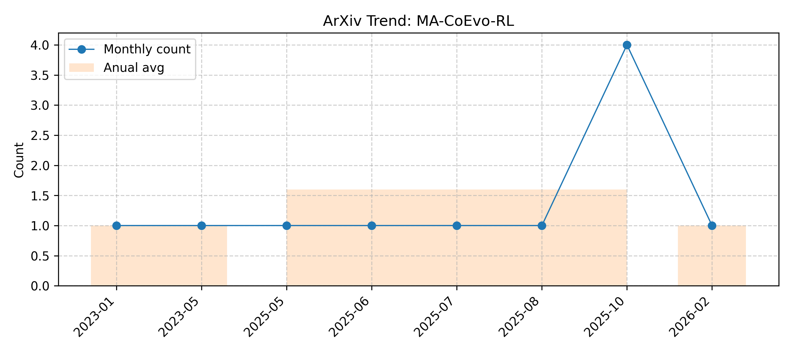

# MA-CoEvo-RL

> Updated on 2026.02.23

[🔙 Back to Index](README.md)

| Date | Title | Categories | Abstract | PDF | Code |
|:---|:---|:---|:---|:---|:---|
|**2026-02-06**|**MAGIC: A Co-Evolving Attacker-Defender Adversarial Game for Robust LLM Safety**|cs.AI, cs.CL, cs.LG, cs.MA| 

Full Abstract
Ensuring robust safety alignment is crucial for Large Language Models (LLMs), yet existing defenses often lag behind evolving adversarial attacks due to their \textbf{reliance on static, pre-collected data distributions}. In this paper, we introduce \textbf{MAGIC}, a novel multi-turn multi-agent reinforcement learning framework that formulates LLM safety alignment as an adversarial asymmetric game. Specifically, an attacker agent learns to iteratively rewrite original queries into deceptive prompts, while a defender agent simultaneously optimizes its policy to recognize and refuse such inputs. This dynamic process triggers a \textbf{co-evolution}, where the attacker's ever-changing strategies continuously uncover long-tail vulnerabilities, driving the defender to generalize to unseen attack patterns. Remarkably, we observe that the attacker, endowed with initial reasoning ability, evolves \textbf{novel, previously unseen combinatorial strategies} through iterative RL training, underscoring our method's substantial potential. Theoretically, we provide insights into a more robust game equilibrium and derive safety guarantees. Extensive experiments validate our framework's effectiveness, demonstrating superior defense success rates without compromising the helpfulness of the model. Our code is available at https://github.com/BattleWen/MAGIC.
|[2602.01539v2](http://arxiv.org/abs/2602.01539v2)| null|
|**2025-10-30**|**Multi-Agent Evolve: LLM Self-Improve through Co-evolution**|cs.AI| 

Full Abstract
Reinforcement Learning (RL) has demonstrated significant potential in enhancing the reasoning capabilities of large language models (LLMs). However, the success of RL for LLMs heavily relies on human-curated datasets and verifiable rewards, which limit their scalability and generality. Recent Self-Play RL methods, inspired by the success of the paradigm in games and Go, aim to enhance LLM reasoning capabilities without human-annotated data. However, their methods primarily depend on a grounded environment for feedback (e.g., a Python interpreter or a game engine); extending them to general domains remains challenging. To address these challenges, we propose Multi-Agent Evolve (MAE), a framework that enables LLMs to self-evolve in solving diverse tasks, including mathematics, reasoning, and general knowledge Q&A. The core design of MAE is based on a triplet of interacting agents (Proposer, Solver, Judge) that are instantiated from a single LLM, and applies reinforcement learning to optimize their behaviors. The Proposer generates questions, the Solver attempts solutions, and the Judge evaluates both while co-evolving. Experiments on Qwen2.5-3B-Instruct demonstrate that MAE achieves an average improvement of 4.54% on multiple benchmarks. These results highlight MAE as a scalable, data-efficient method for enhancing the general reasoning abilities of LLMs with minimal reliance on human-curated supervision.
|[2510.23595v3](http://arxiv.org/abs/2510.23595v3)| null|
|**2026-02-09**|**CoMAS: Co-Evolving Multi-Agent Systems via Interaction Rewards**|cs.CL, cs.AI| 

Full Abstract
Self-evolution is a central research topic in enabling large language model (LLM)-based agents to continually improve their capabilities after pretraining. Recent research has witnessed a transition from reinforcement learning (RL)-free to RL-based methods. Current RL-based methods either rely on dense external reward signals or extract intrinsic reward signals from LLMs themselves. However, these approaches diverge from the self-evolution mechanisms observed in human intelligence, where individuals learn and improve through mutual discussion and collaboration. In this work, we introduce Co-Evolving Multi-Agent Systems (CoMAS), a novel framework that enables agents to improve autonomously by learning from inter-agent interactions without external supervision. CoMAS generates intrinsic rewards from rich discussion dynamics, employs an LLM-as-a-judge mechanism to formulate these rewards, and optimizes each agent's policy through RL, thereby enabling decentralized and scalable co-evolution. Experimental results demonstrate that CoMAS consistently outperforms untrained agents and achieves state-of-the-art performance across most evaluation settings. Ablation studies confirm the necessity of interaction-based reward signals and reveal promising scalability as the number and diversity of agents increase. These findings establish CoMAS as a novel and effective paradigm for self-evolution in LLM-based agents.
|[2510.08529v2](http://arxiv.org/abs/2510.08529v2)| null|
|**2025-10-09**|**The Alignment Waltz: Jointly Training Agents to Collaborate for Safety**|cs.CL| 

Full Abstract
Harnessing the power of LLMs requires a delicate dance between being helpful and harmless. This creates a fundamental tension between two competing challenges: vulnerability to adversarial attacks that elicit unsafe content, and a tendency for overrefusal on benign but sensitive prompts. Current approaches often navigate this dance with safeguard models that completely reject any content that contains unsafe portions. This approach cuts the music entirely-it may exacerbate overrefusals and fails to provide nuanced guidance for queries it refuses. To teach models a more coordinated choreography, we propose WaltzRL, a novel multi-agent reinforcement learning framework that formulates safety alignment as a collaborative, positive-sum game. WaltzRL jointly trains a conversation agent and a feedback agent, where the latter is incentivized to provide useful suggestions that improve the safety and helpfulness of the conversation agent's responses. At the core of WaltzRL is a Dynamic Improvement Reward (DIR) that evolves over time based on how well the conversation agent incorporates the feedback. At inference time, unsafe or overrefusing responses from the conversation agent are improved rather than discarded. The feedback agent is deployed together with the conversation agent and only engages adaptively when needed, preserving helpfulness and low latency on safe queries. Our experiments, conducted across five diverse datasets, demonstrate that WaltzRL significantly reduces both unsafe responses (e.g., from 39.0% to 4.6% on WildJailbreak) and overrefusals (from 45.3% to 9.9% on OR-Bench) compared to various baselines. By enabling the conversation and feedback agents to co-evolve and adaptively apply feedback, WaltzRL enhances LLM safety without degrading general capabilities, thereby advancing the Pareto front between helpfulness and harmlessness.
|[2510.08240v1](http://arxiv.org/abs/2510.08240v1)| null|
|**2026-02-01**|**MARS: Co-evolving Dual-System Deep Research via Multi-Agent Reinforcement Learning**|cs.AI, cs.CL, cs.LG| 

Full Abstract
Large Reasoning Models (LRMs) face two fundamental limitations: excessive token consumption when overanalyzing simple information processing tasks, and inability to access up-to-date knowledge beyond their training data. We introduce MARS (Multi-Agent System for Deep ReSearch), a novel co-evolution framework that jointly optimizes dual cognitive systems through multi-agent reinforcement learning. Unlike prior approaches that employ fixed or independently-trained summarizers, MARS enables System 1 (fast, intuitive processing) and System 2 (deliberate reasoning) to co-adapt through shared trajectory rewards, developing complementary strategies where System 1 learns to distill information specifically useful for System 2's reasoning. We extend Group Relative Policy Optimization (GRPO) for multi-agent settings with three key innovations: (1) decoupled gradient computation ensuring proper credit assignment despite shared rewards, (2) bin-packing optimization for efficient parallel information processing, and (3) advantage-weighted balanced sampling preventing training imbalance. Extensive experiments demonstrate that MARS (8B), trained under a challenging Zero RL setting without any supervised fine-tuning, achieves 8.17% on HLE -- outperforming WebThinker (32B with SFT, 6.87%) and narrowing the gap with proprietary models like Claude 3.7 Sonnet (7.89%) -- while achieving an average gain of 8.9% across 7 knowledge-intensive tasks.
|[2510.04935v2](http://arxiv.org/abs/2510.04935v2)| null|
|**2025-09-06**|**Evo-MARL: Co-Evolutionary Multi-Agent Reinforcement Learning for Internalized Safety**|cs.AI| 

Full Abstract
Multi-agent systems (MAS) built on multimodal large language models exhibit strong collaboration and performance. However, their growing openness and interaction complexity pose serious risks, notably jailbreak and adversarial attacks. Existing defenses typically rely on external guard modules, such as dedicated safety agents, to handle unsafe behaviors. Unfortunately, this paradigm faces two challenges: (1) standalone agents offer limited protection, and (2) their independence leads to single-point failure-if compromised, system-wide safety collapses. Naively increasing the number of guard agents further raises cost and complexity. To address these challenges, we propose Evo-MARL, a novel multi-agent reinforcement learning (MARL) framework that enables all task agents to jointly acquire defensive capabilities. Rather than relying on external safety modules, Evo-MARL trains each agent to simultaneously perform its primary function and resist adversarial threats, ensuring robustness without increasing system overhead or single-node failure. Furthermore, Evo-MARL integrates evolutionary search with parameter-sharing reinforcement learning to co-evolve attackers and defenders. This adversarial training paradigm internalizes safety mechanisms and continually enhances MAS performance under co-evolving threats. Experiments show that Evo-MARL reduces attack success rates by up to 22% while boosting accuracy by up to 5% on reasoning tasks-demonstrating that safety and utility can be jointly improved.
|[2508.03864v2](http://arxiv.org/abs/2508.03864v2)| null|
|**2025-09-15**|**Hide-and-Shill: A Reinforcement Learning Framework for Market Manipulation Detection in Symphony-a Decentralized Multi-Agent System**|cs.AI| 

Full Abstract
Decentralized finance (DeFi) has introduced a new era of permissionless financial innovation but also led to unprecedented market manipulation. Without centralized oversight, malicious actors coordinate shilling campaigns and pump-and-dump schemes across various platforms. We propose a Multi-Agent Reinforcement Learning (MARL) framework for decentralized manipulation detection, modeling the interaction between manipulators and detectors as a dynamic adversarial game. This framework identifies suspicious patterns using delayed token price reactions as financial indicators.Our method introduces three innovations: (1) Group Relative Policy Optimization (GRPO) to enhance learning stability in sparse-reward and partially observable settings; (2) a theory-based reward function inspired by rational expectations and information asymmetry, differentiating price discovery from manipulation noise; and (3) a multi-modal agent pipeline that integrates LLM-based semantic features, social graph signals, and on-chain market data for informed decision-making.The framework is integrated within the Symphony system, a decentralized multi-agent architecture enabling peer-to-peer agent execution and trust-aware learning through distributed logs, supporting chain-verifiable evaluation. Symphony promotes adversarial co-evolution among strategic actors and maintains robust manipulation detection without centralized oracles, enabling real-time surveillance across global DeFi ecosystems.Trained on 100,000 real-world discourse episodes and validated in adversarial simulations, Hide-and-Shill achieves top performance in detection accuracy and causal attribution. This work bridges multi-agent systems with financial surveillance, advancing a new paradigm for decentralized market intelligence. All resources are available at the Hide-and-Shill GitHub repository to promote open research and reproducibility.
|[2507.09179v2](http://arxiv.org/abs/2507.09179v2)| null|
|**2025-10-06**|**Chasing Moving Targets with Online Self-Play Reinforcement Learning for Safer Language Models**|cs.LG, cs.CL, cs.MA| 

Full Abstract
Conventional language model (LM) safety alignment relies on a reactive, disjoint procedure: attackers exploit a static model, followed by defensive fine-tuning to patch exposed vulnerabilities. This sequential approach creates a mismatch -- attackers overfit to obsolete defenses, while defenders perpetually lag behind emerging threats. To address this, we propose Self-RedTeam, an online self-play reinforcement learning algorithm where an attacker and defender agent co-evolve through continuous interaction. We cast safety alignment as a two-player zero-sum game, where a single model alternates between attacker and defender roles -- generating adversarial prompts and safeguarding against them -- while a reward LM adjudicates outcomes. This enables dynamic co-adaptation. Grounded in the game-theoretic framework of zero-sum games, we establish a theoretical safety guarantee which motivates the design of our method: if self-play converges to a Nash Equilibrium, the defender will reliably produce safe responses to any adversarial input. Empirically, Self-RedTeam uncovers more diverse attacks (+21.8% SBERT) compared to attackers trained against static defenders and achieves higher robustness on safety benchmarks (e.g., +65.5% on WildJailBreak) than defenders trained against static attackers. We further propose hidden Chain-of-Thought, allowing agents to plan privately, which boosts adversarial diversity and reduces over-refusals. Our results motivate a shift from reactive patching to proactive co-evolution in LM safety training, enabling scalable, autonomous, and robust self-improvement of LMs via multi-agent reinforcement learning (MARL).
|[2506.07468v3](http://arxiv.org/abs/2506.07468v3)| null|
|**2025-05-08**|**CCL: Collaborative Curriculum Learning for Sparse-Reward Multi-Agent Reinforcement Learning via Co-evolutionary Task Evolution**|cs.AI, cs.MA| 

Full Abstract
Sparse reward environments pose significant challenges in reinforcement learning, especially within multi-agent systems (MAS) where feedback is delayed and shared across agents, leading to suboptimal learning. We propose Collaborative Multi-dimensional Course Learning (CCL), a novel curriculum learning framework that addresses this by (1) refining intermediate tasks for individual agents, (2) using a variational evolutionary algorithm to generate informative subtasks, and (3) co-evolving agents with their environment to enhance training stability. Experiments on five cooperative tasks in the MPE and Hide-and-Seek environments show that CCL outperforms existing methods in sparse reward settings.
|[2505.07854v1](http://arxiv.org/abs/2505.07854v1)| null|
|**2023-05-04**|**Stackelberg Games for Learning Emergent Behaviors During Competitive Autocurricula**|cs.AI, cs.GT, cs.MA, cs.RO| 

Full Abstract
Autocurricular training is an important sub-area of multi-agent reinforcement learning~(MARL) that allows multiple agents to learn emergent skills in an unsupervised co-evolving scheme. The robotics community has experimented autocurricular training with physically grounded problems, such as robust control and interactive manipulation tasks. However, the asymmetric nature of these tasks makes the generation of sophisticated policies challenging. Indeed, the asymmetry in the environment may implicitly or explicitly provide an advantage to a subset of agents which could, in turn, lead to a low-quality equilibrium. This paper proposes a novel game-theoretic algorithm, Stackelberg Multi-Agent Deep Deterministic Policy Gradient (ST-MADDPG), which formulates a two-player MARL problem as a Stackelberg game with one player as the `leader' and the other as the `follower' in a hierarchical interaction structure wherein the leader has an advantage. We first demonstrate that the leader's advantage from ST-MADDPG can be used to alleviate the inherent asymmetry in the environment. By exploiting the leader's advantage, ST-MADDPG improves the quality of a co-evolution process and results in more sophisticated and complex strategies that work well even against an unseen strong opponent.
|[2305.03735v1](http://arxiv.org/abs/2305.03735v1)| null|
|**2023-01-19**|**Multi-Agent Interplay in a Competitive Survival Environment**|cs.LG, cs.AI, cs.MA| 

Full Abstract
Solving hard-exploration environments in an important challenge in Reinforcement Learning. Several approaches have been proposed and studied, such as Intrinsic Motivation, co-evolution of agents and tasks, and multi-agent competition. In particular, the interplay between multiple agents has proven to be capable of generating human-relevant emergent behaviour that would be difficult or impossible to learn in single-agent settings. In this work, an extensible competitive environment for multi-agent interplay was developed, which features realistic physics and human-relevant semantics. Moreover, several experiments on different variants of this environment were performed, resulting in some simple emergent strategies and concrete directions for future improvement. The content presented here is part of the author's thesis "Multi-Agent Interplay in a Competitive Survival Environment" for the Master's Degree in Artificial Intelligence and Robotics at Sapienza University of Rome, 2022.
|[2301.08030v1](http://arxiv.org/abs/2301.08030v1)| null|

(<a href='#ma-coevo-rl'>back to top</a>)

