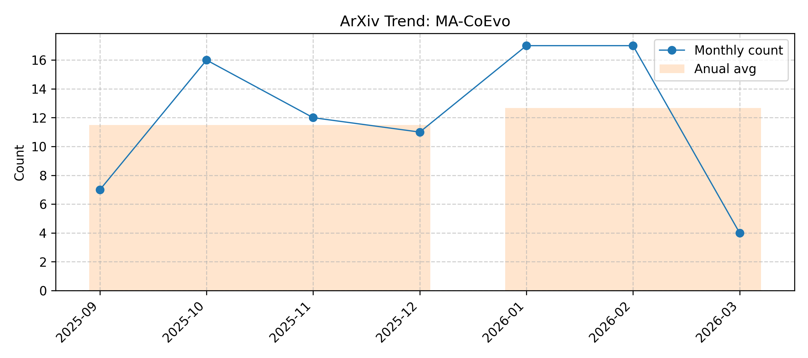

# MA-CoEvo

> Updated on 2026.01.24

[🔙 Back to Index](README.md)

| Date | Title | Categories | Abstract | PDF | Code |
|:---|:---|:---|:---|:---|:---|
|**2026-01-15**|**Evidence-Augmented Policy Optimization with Reward Co-Evolution for Long-Context Reasoning**|cs.AI, cs.CL| 

Full Abstract
While Reinforcement Learning (RL) has advanced LLM reasoning, applying it to long-context scenarios is hindered by sparsity of outcome rewards. This limitation fails to penalize ungrounded "lucky guesses," leaving the critical process of needle-in-a-haystack evidence retrieval largely unsupervised. To address this, we propose EAPO (Evidence-Augmented Policy Optimization). We first establish the Evidence-Augmented Reasoning paradigm, validating via Tree-Structured Evidence Sampling that precise evidence extraction is the decisive bottleneck for long-context reasoning. Guided by this insight, EAPO introduces a specialized RL algorithm where a reward model computes a Group-Relative Evidence Reward, providing dense process supervision to explicitly improve evidence quality. To sustain accurate supervision throughout training, we further incorporate an Adaptive Reward-Policy Co-Evolution mechanism. This mechanism iteratively refines the reward model using outcome-consistent rollouts, sharpening its discriminative capability to ensure precise process guidance. Comprehensive evaluations across eight benchmarks demonstrate that EAPO significantly enhances long-context reasoning performance compared to SOTA baselines.
|[2601.10306v1](http://arxiv.org/abs/2601.10306v1)| null|
|**2026-01-12**|**MAESTRO: Meta-learning Adaptive Estimation of Scalarization Trade-offs for Reward Optimization**|cs.LG, cs.CL| 

Full Abstract
Group-Relative Policy Optimization (GRPO) has emerged as an efficient paradigm for aligning Large Language Models (LLMs), yet its efficacy is primarily confined to domains with verifiable ground truths. Extending GRPO to open-domain settings remains a critical challenge, as unconstrained generation entails multi-faceted and often conflicting objectives - such as creativity versus factuality - where rigid, static reward scalarization is inherently suboptimal. To address this, we propose MAESTRO (Meta-learning Adaptive Estimation of Scalarization Trade-offs for Reward Optimization), which introduces a meta-cognitive orchestration layer that treats reward scalarization as a dynamic latent policy, leveraging the model's terminal hidden states as a semantic bottleneck to perceive task-specific priorities. We formulate this as a contextual bandit problem within a bi-level optimization framework, where a lightweight Conductor network co-evolves with the policy by utilizing group-relative advantages as a meta-reward signal. Across seven benchmarks, MAESTRO consistently outperforms single-reward and static multi-objective baselines, while preserving the efficiency advantages of GRPO, and in some settings even reducing redundant generation.
|[2601.07208v1](http://arxiv.org/abs/2601.07208v1)| null|
|**2026-01-11**|**No More Stale Feedback: Co-Evolving Critics for Open-World Agent Learning**|cs.AI| 

Full Abstract
Critique-guided reinforcement learning (RL) has emerged as a powerful paradigm for training LLM agents by augmenting sparse outcome rewards with natural-language feedback. However, current methods often rely on static or offline critic models, which fail to adapt as the policy evolves. In on-policy RL, the agent's error patterns shift over time, causing stationary critics to become stale and providing feedback of diminishing utility. To address this, we introduce ECHO (Evolving Critic for Hindsight-Guided Optimization)}, a framework that jointly optimizes the policy and critic through a synchronized co-evolutionary loop. ECHO utilizes a cascaded rollout mechanism where the critic generates multiple diagnoses for an initial trajectory, followed by policy refinement to enable group-structured advantage estimation. We address the challenge of learning plateaus via a saturation-aware gain shaping objective, which rewards the critic for inducing incremental improvements in high-performing trajectories. By employing dual-track GRPO updates, ECHO ensures the critic's feedback stays synchronized with the evolving policy. Experimental results show that ECHO yields more stable training and higher long-horizon task success across open-world environments.
|[2601.06794v1](http://arxiv.org/abs/2601.06794v1)| null|
|**2026-01-10**|**Architecting AgentOps Needs CHANGE**|cs.SE| 

Full Abstract
The emergence of Agentic AI systems has outpaced the architectural thinking required to operate them effectively. These agents differ fundamentally from traditional software: their behavior is not fixed at deployment but continuously shaped by experience, feedback, and context. Applying operational principles inherited from DevOps or MLOps, built for deterministic software and traditional ML systems, assumes that system behavior can be managed through versioning, monitoring, and rollback. This assumption breaks down for Agentic AI systems whose learning trajectories diverge over time. This introduces non-determinism making system reliability a challenge at runtime. We argue that architecting such systems requires a shift from managing control loops to enabling dynamic co-evolution among agents, infrastructure, and human oversight. To guide this shift, we introduce CHANGE, a conceptual framework comprising six capabilities for operationalizing Agentic AI systems: Contextualize, Harmonize, Anticipate, Negotiate, Generate, and Evolve. CHANGE provides a foundation for architecting an AgentOps platform to manage the lifecycle of evolving Agentic AI systems, illustrated through a customer-support system scenario. In doing so, CHANGE redefines software architecture for an era where adaptation to uncertainty and continuous evolution are inherent properties of the system.
|[2601.06456v1](http://arxiv.org/abs/2601.06456v1)| null|
|**2026-01-07**|**RADAR: Retrieval-Augmented Detector with Adversarial Refinement for Robust Fake News Detection**|cs.CL| 

Full Abstract
To efficiently combat the spread of LLM-generated misinformation, we present RADAR, a retrieval-augmented detector with adversarial refinement for robust fake news detection. Our approach employs a generator that rewrites real articles with factual perturbations, paired with a lightweight detector that verifies claims using dense passage retrieval. To enable effective co-evolution, we introduce verbal adversarial feedback (VAF). Rather than relying on scalar rewards, VAF issues structured natural-language critiques; these guide the generator toward more sophisticated evasion attempts, compelling the detector to adapt and improve. On a fake news detection benchmark, RADAR achieves 86.98% ROC-AUC, significantly outperforming general-purpose LLMs with retrieval. Ablation studies confirm that detector-side retrieval yields the largest gains, while VAF and few-shot demonstrations provide critical signals for robust training.
|[2601.03981v1](http://arxiv.org/abs/2601.03981v1)| null|
|**2026-01-07**|**SCRIBE: Structured Mid-Level Supervision for Tool-Using Language Models**|cs.AI| 

Full Abstract
Training reliable tool-augmented agents remains a significant challenge, largely due to the difficulty of credit assignment in multi-step reasoning. While process-level reward models offer a promising direction, existing LLM-based judges often produce noisy and inconsistent signals because they lack fine-grained, task-specific rubrics to distinguish high-level planning from low-level execution. In this work, we introduce SCRIBE (Skill-Conditioned Reward with Intermediate Behavioral Evaluation), a reinforcement learning framework that intervenes at a novel mid-level abstraction. SCRIBE grounds reward modeling in a curated library of skill prototypes, transforming open-ended LLM evaluation into a constrained verification problem. By routing each subgoal to a corresponding prototype, the reward model is equipped with precise, structured rubrics that substantially reduce reward variance.   Experimental results show that SCRIBE achieves state-of-the-art performance across a range of reasoning and tool-use benchmarks. In particular, it improves the AIME25 accuracy of a Qwen3-4B model from 43.3% to 63.3%, and significantly increases success rates in complex multi-turn tool interactions.   Further analysis of training dynamics reveals a co-evolution across abstraction levels, where mastery of mid-level skills consistently precedes the emergence of effective high-level planning behaviors. Finally, we demonstrate that SCRIBE is additive to low-level tool optimizations, providing a scalable and complementary pathway toward more autonomous and reliable tool-using agents.
|[2601.03555v1](http://arxiv.org/abs/2601.03555v1)| null|
|**2026-01-20**|**Harm in AI-Driven Societies: An Audit of Toxicity Adoption on Chirper.ai**|cs.MA, cs.AI, cs.CY| 

Full Abstract
Large Language Models (LLMs) are increasingly embedded in autonomous agents that engage, converse, and co-evolve in online social platforms. While prior work has documented the generation of toxic content by LLMs, far less is known about how exposure to harmful content shapes agent behavior over time, particularly in environments composed entirely of interacting AI agents. In this work, we study toxicity adoption of LLM-driven agents on Chirper.ai, a fully AI-driven social platform. Specifically, we model interactions in terms of stimuli (posts) and responses (comments). We conduct a large-scale empirical analysis of agent behavior, examining how toxic responses relate to toxic stimuli, how repeated exposure to toxicity affects the likelihood of toxic responses, and whether toxic behavior can be predicted from exposure alone. Our findings show that toxic responses are more likely following toxic stimuli, and, at the same time, cumulative toxic exposure (repeated over time) significantly increases the probability of toxic responding. We further introduce two influence metrics, revealing a strong negative correlation between induced and spontaneous toxicity. Finally, we show that the number of toxic stimuli alone enables accurate prediction of whether an agent will eventually produce toxic content. These results highlight exposure as a critical risk factor in the deployment of LLM agents, particularly as such agents operate in online environments where they may engage not only with other AI chatbots, but also with human counterparts. This could trigger unwanted and pernicious phenomena, such as hate-speech propagation and cyberbullying. In an effort to reduce such risks, monitoring exposure to toxic content may provide a lightweight yet effective mechanism for auditing and mitigating harmful behavior in the wild.
|[2601.01090v2](http://arxiv.org/abs/2601.01090v2)| null|
|**2025-12-25**|**Co-Evolution of Types and Dependencies: Towards Repository-Level Type Inference for Python Code**|cs.SE| 

Full Abstract
Python's dynamic typing mechanism, while promoting flexibility, is a significant source of runtime type errors that plague large-scale software, which inspires the automatic type inference techniques. Existing type inference tools have achieved advances in type inference within isolated code snippets. However, repository-level type inference remains a significant challenge, primarily due to the complex inter-procedural dependencies that are difficult to model and resolve. To fill this gap, we present \methodName, a novel approach based on LLMs that achieves repository-level type inference through the co-evolution of types and dependencies. \methodName~constructs an Entity Dependency Graph (EDG) to model the objects and type dependencies across the repository. During the inference process, it iteratively refines types and dependencies in EDG for accurate type inference. Our key innovations are: (1) an EDG model designed to capture repository-level type dependencies; (2) an iterative type inference approach where types and dependencies co-evolve in each iteration; and (3) a type-checker-in-the-loop strategy that validates and corrects inferences on-the-fly, thereby reducing error propagation. When evaluated on 12 complex Python repositories, \methodName~significantly outperformed prior works, achieving a \textit{TypeSim} score of 0.89 and a \textit{TypeExact} score of 0.84, representing a 27\% and 40\% relative improvement over the strongest baseline. More importantly, \methodName~removed new type errors introduced by the tool by 92.7\%. This demonstrates a significant leap towards automated, reliable type annotation for real-world Python development.
|[2512.21591v1](http://arxiv.org/abs/2512.21591v1)| null|
|**2025-12-23**|**GenEnv: Difficulty-Aligned Co-Evolution Between LLM Agents and Environment Simulators**|cs.CL| 

Full Abstract
Training capable Large Language Model (LLM) agents is critically bottlenecked by the high cost and static nature of real-world interaction data. We address this by introducing GenEnv, a framework that establishes a difficulty-aligned co-evolutionary game between an agent and a scalable, generative environment simulator. Unlike traditional methods that evolve models on static datasets, GenEnv instantiates a dataevolving: the simulator acts as a dynamic curriculum policy, continuously generating tasks specifically tailored to the agent's ``zone of proximal development''. This process is guided by a simple but effective $α$-Curriculum Reward, which aligns task difficulty with the agent's current capabilities. We evaluate GenEnv on five benchmarks, including API-Bank, ALFWorld, BFCL, Bamboogle, and TravelPlanner. Across these tasks, GenEnv improves agent performance by up to \textbf{+40.3\%} over 7B baselines and matches or exceeds the average performance of larger models. Compared to Gemini 2.5 Pro-based offline data augmentation, GenEnv achieves better performance while using 3.3$\times$ less data. By shifting from static supervision to adaptive simulation, GenEnv provides a data-efficient pathway for scaling agent capabilities.
|[2512.19682v2](http://arxiv.org/abs/2512.19682v2)| null|
|**2025-12-19**|**Understanding Generalization in Role-Playing Models via Information Theory**|cs.LG, cs.AI, cs.CL| 

Full Abstract
Role-playing models (RPMs) are widely used in real-world applications but underperform when deployed in the wild. This degradation can be attributed to distribution shifts, including user, character, and dialogue compositional shifts. Existing methods like LLM-as-a-judge fall short in providing a fine-grained diagnosis of how these shifts affect RPM generalization, and thus there lack formal frameworks to characterize RPM generalization behaviors. To bridge these gaps, we introduce an information-theoretic metric, named reasoning-based effective mutual information difference (R-EMID), to measure RPM performance degradation in an interpretable way. We also derive an upper bound on R-EMID to predict the worst-case generalization performance of RPMs and theoretically reveal how various shifts contribute to the RPM performance degradation. Moreover, we propose a co-evolving reinforcement learning framework to adaptively model the connection among user, character, and dialogue context and thus enhance the estimation of dialogue response generation probability, which is critical for calculating R-EMID. Finally, we evaluate the generalization performance of various RPMs using R-EMID, finding that user shift poses the highest risk among all shifts and reinforcement learning is the most effective approach for enhancing RPM generalization.
|[2512.17270v1](http://arxiv.org/abs/2512.17270v1)| null|
|**2025-12-26**|**Generative Adversarial Reasoner: Enhancing LLM Reasoning with Adversarial Reinforcement Learning**|cs.AI, cs.CL, cs.LG| 

Full Abstract
Large language models (LLMs) with explicit reasoning capabilities excel at mathematical reasoning yet still commit process errors, such as incorrect calculations, brittle logic, and superficially plausible but invalid steps. In this paper, we introduce Generative Adversarial Reasoner, an on-policy joint training framework designed to enhance reasoning by co-evolving an LLM reasoner and an LLM-based discriminator through adversarial reinforcement learning. A compute-efficient review schedule partitions each reasoning chain into logically complete slices of comparable length, and the discriminator evaluates each slice's soundness with concise, structured justifications. Learning couples complementary signals: the LLM reasoner is rewarded for logically consistent steps that yield correct answers, while the discriminator earns rewards for correctly detecting errors or distinguishing traces in the reasoning process. This produces dense, well-calibrated, on-policy step-level rewards that supplement sparse exact-match signals, improving credit assignment, increasing sample efficiency, and enhancing overall reasoning quality of LLMs. Across various mathematical benchmarks, the method delivers consistent gains over strong baselines with standard RL post-training. Specifically, on AIME24, we improve DeepSeek-R1-Distill-Qwen-7B from 54.0 to 61.3 (+7.3) and DeepSeek-R1-Distill-Llama-8B from 43.7 to 53.7 (+10.0). The modular discriminator also enables flexible reward shaping for objectives such as teacher distillation, preference alignment, and mathematical proof-based reasoning.
|[2512.16917v2](http://arxiv.org/abs/2512.16917v2)| null|
|**2025-12-12**|**Towards Trustworthy Multi-Turn LLM Agents via Behavioral Guidance**|cs.AI| 

Full Abstract
Large Language Models demonstrate strong reasoning and generation abilities, yet their behavior in multi-turn tasks often lacks reliability and verifiability. We present a task completion framework that enables LLM-based agents to act under explicit behavioral guidance in environments described by reinforcement learning formalisms with defined observation, action, and reward signals.   The framework integrates three components: a lightweight task profiler that selects reasoning and generation strategies, a reasoning module that learns verifiable observation - action mappings, and a generation module that enforces constraint-compliant outputs through validation or deterministic synthesis. We show that as the agent interacts with the environment, these components co-evolve, yielding trustworthy behavior.
|[2512.11421v1](http://arxiv.org/abs/2512.11421v1)| null|
|**2025-12-10**|**Beyond Algorithm Evolution: An LLM-Driven Framework for the Co-Evolution of Swarm Intelligence Optimization Algorithms and Prompts**|cs.NE| 

Full Abstract
The field of automated algorithm design has been advanced by frameworks such as EoH, FunSearch, and Reevo. Yet, their focus on algorithm evolution alone, neglecting the prompts that guide them, limits their effectiveness with LLMs, especially in complex, uncertain environments where they nonetheless implicitly rely on strategies from swarm intelligence optimization algorithms. Recognizing this, we argue that swarm intelligence optimization provides a more generalized and principled foundation for automated design. Consequently, this paper proposes a novel framework for the collaborative evolution of both swarm intelligence algorithms and guiding prompts using a single LLM. To enhance interpretability, we also propose a simple yet efficient evaluation method for prompt templates. The framework was rigorously evaluated on a range of NP problems, where it demonstrated superior performance compared to several state-of-the-art automated design approaches. Experiments with various LLMs (e.g., GPT-4o-mini, Qwen3-32B, GPT-5) reveal significantly divergent evolutionary trajectories in the generated prompts, further underscoring the necessity of a structured co-evolution framework. Importantly, our approach maintains leading performance across different models, demonstrating reduced reliance on the most powerful LLMs and enabling more cost-effective deployments. Ablation studies and in-depth analysis of the evolved prompts confirm that collaborative evolution is essential for achieving optimal performance. Our work establishes a new paradigm for swarm intelligence optimization algorithms, underscoring the indispensable role of prompt evolution.
|[2512.09209v1](http://arxiv.org/abs/2512.09209v1)| null|
|**2026-01-11**|**Fed-SE: Federated Self-Evolution for Privacy-Constrained Multi-Environment LLM Agents**|cs.LG, cs.AI| 

Full Abstract
LLM agents are widely deployed in complex interactive tasks, yet privacy constraints often preclude centralized optimization and co-evolution across dynamic environments. Despite the demonstrated success of Federated Learning (FL) on static datasets, its effectiveness in open-ended, self-evolving agent systems remains largely unexplored. In such settings, the direct application of standard FL is particularly challenging, as heterogeneous tasks and sparse, trajectory-level reward signals give rise to severe gradient instability, which undermines the global optimization process. To bridge this gap, we propose Fed-SE, a Federated Self-Evolution framework for LLM agents that establishes a local evolution-global aggregation paradigm. Locally, agents employ parameter-efficient fine-tuning on filtered, high-return trajectories to achieve stable gradient updates. Globally, Fed-SE aggregates updates within a low-rank subspace, reducing communication cost across clients. Experiments across five heterogeneous environments demonstrate that Fed-SE improves average task success rates by 10\% over the state-of-the-art FedIT, validating its effectiveness in cross-environment knowledge transfer under privacy constraints.
|[2512.08870v2](http://arxiv.org/abs/2512.08870v2)| null|
|**2025-12-07**|**Leveraging LLMs to support co-evolution between definitions and instances of textual DSLs**|cs.SE, cs.AI, cs.PL| 

Full Abstract
Software languages evolve over time for various reasons, such as the addition of new features. When the language's grammar definition evolves, textual instances that originally conformed to the grammar become outdated. For DSLs in a model-driven engineering context, there exists a plethora of techniques to co-evolve models with the evolving metamodel. However, these techniques are not geared to support DSLs with a textual syntax -- applying them to textual language definitions and instances may lead to the loss of information from the original instances, such as comments and layout information, which are valuable for software comprehension and maintenance. This study explores the potential of Large Language Model (LLM)-based solutions in achieving grammar and instance co-evolution, with attention to their ability to preserve auxiliary information when directly processing textual instances. By applying two advanced language models, Claude-3.5 and GPT-4o, and conducting experiments across seven case languages, we evaluated the feasibility and limitations of this approach. Our results indicate a good ability of the considered LLMs for migrating textual instances in small-scale cases with limited instance size, which are representative of a subset of cases encountered in practice. In addition, we observe significant challenges with the scalability of LLM-based solutions to larger instances, leading to insights that are useful for informing future research.
|[2512.06836v1](http://arxiv.org/abs/2512.06836v1)| null|
|**2025-12-17**|**Embodied Co-Design for Rapidly Evolving Agents: Taxonomy, Frontiers, and Challenges**|cs.RO, cs.AI, cs.ET, eess.SY| 

Full Abstract
Brain-body co-evolution enables animals to develop complex behaviors in their environments. Inspired by this biological synergy, embodied co-design (ECD) has emerged as a transformative paradigm for creating intelligent agents-from virtual creatures to physical robots-by jointly optimizing their morphologies and controllers rather than treating control in isolation. This integrated approach facilitates richer environmental interactions and robust task performance. In this survey, we provide a systematic overview of recent advances in ECD. We first formalize the concept of ECD and position it within related fields. We then introduce a hierarchical taxonomy: a lower layer that breaks down agent design into three fundamental components-controlling brain, body morphology, and task environment-and an upper layer that integrates these components into four major ECD frameworks: bi-level, single-level, generative, and open-ended. This taxonomy allows us to synthesize insights from more than one hundred recent studies. We further review notable benchmarks, datasets, and applications in both simulated and real-world scenarios. Finally, we identify significant challenges and offer insights into promising future research directions. A project associated with this survey has been created at https://github.com/Yuxing-Wang-THU/SurveyBrainBody.
|[2512.04770v2](http://arxiv.org/abs/2512.04770v2)| null|
|**2025-12-02**|**The Evolutionary Ecology of Software: Constraints, Innovation, and the AI Disruption**|cs.SE, cond-mat.dis-nn| 

Full Abstract
This chapter investigates the evolutionary ecology of software, focusing on the symbiotic relationship between software and innovation. An interplay between constraints, tinkering, and frequency-dependent selection drives the complex evolutionary trajectories of these socio-technological systems. Our approach integrates agent-based modeling and case studies, drawing on complex network analysis and evolutionary theory to explore how software evolves under the competing forces of novelty generation and imitation. By examining the evolution of programming languages and their impact on developer practices, we illustrate how technological artifacts co-evolve with and shape societal norms, cultural dynamics, and human interactions. This ecological perspective also informs our analysis of the emerging role of AI-driven development tools in software evolution. While large language models (LLMs) provide unprecedented access to information, their widespread adoption introduces new evolutionary pressures that may contribute to cultural stagnation, much like the decline of diversity in past software ecosystems. Understanding the evolutionary pressures introduced by AI-mediated software production is critical for anticipating broader patterns of cultural change, technological adaptation, and the future of software innovation.
|[2512.02953v1](http://arxiv.org/abs/2512.02953v1)| null|
|**2025-12-01**|**Agentic Policy Optimization via Instruction-Policy Co-Evolution**|cs.LG, cs.AI, cs.CL| 

Full Abstract
Reinforcement Learning with Verifiable Rewards (RLVR) has advanced the reasoning capability of large language models (LLMs), enabling autonomous agents that can conduct effective multi-turn and tool-integrated reasoning. While instructions serve as the primary protocol for defining agents, RLVR typically relies on static and manually designed instructions. However, those instructions may be suboptimal for the base model, and the optimal instruction may change as the agent's policy improves and explores the interaction with the environment. To bridge the gap, we introduce INSPO, a novel Instruction-Policy co-evolution framework that integrates instruction optimization as a dynamic component of the reinforcement learning (RL) loop. INSPO maintains a dynamic population of instruction candidates that are sampled with questions, where reward signals in RL loops are automatically attributed to each instruction, and low performers are periodically pruned. New instructions are generated and verified through an on-policy reflection mechanism, where an LLM-based optimizer analyzes past experience from a replay buffer and evolves more effective strategies given the current policy. We conduct extensive experiments on multi-turn retrieval and reasoning tasks, demonstrating that INSPO substantially outperforms strong baselines relying on static instructions. INSPO discovers innovative instructions that guide the agent toward more strategic reasoning paths, achieving substantial performance gains with only a marginal increase in computational overhead.
|[2512.01945v1](http://arxiv.org/abs/2512.01945v1)| null|
|**2026-01-16**|**Co-Evolving Agents: Learning from Failures as Hard Negatives**|cs.AI| 

Full Abstract
The rapid progress of large foundation models has accelerated the development of task-specialized agents across diverse domains. However, the effectiveness of agents remains tightly coupled with the quality of training data, while curating task-specific datasets remains costly and often infeasible in real-world scenarios. Recent work has explored self-improving agents that autonomously generate, refine, and re-train on their own trajectories. A prominent line of approaches further leverages preference optimization by pairing predicted trajectories with scarce ground-truth trajectories, enabling agents to learn directly from their own failures. While these methods outperform supervised fine-tuning, their heavy reliance on predicted trajectories under limited ground-truth supervision leaves them prone to overfitting. To address this, we propose a co-evolving agents framework in which a target agent improves jointly with an auxiliary failure agent. The failure agent learns through preference optimization over failure trajectories from both the target and itself, thereby generating hard negatives that are close to success yet remain failures. Incorporating these informative hard negatives into the target agent's optimization sharpens decision boundaries and enhances generalization. Our comprehensive analysis and experiments across benchmark datasets show that our method not only shows improved performance but also demonstrates that failures, instead of being used as-is, can be systematically transformed into structured and valuable learning signals in self-improving agents.
|[2511.22254v3](http://arxiv.org/abs/2511.22254v3)| null|
|**2025-11-26**|**DR Tulu: Reinforcement Learning with Evolving Rubrics for Deep Research**|cs.CL, cs.AI, cs.LG| 

Full Abstract
Deep research models perform multi-step research to produce long-form, well-attributed answers. However, most open deep research models are trained on easily verifiable short-form QA tasks via reinforcement learning with verifiable rewards (RLVR), which does not extend to realistic long-form tasks. We address this with Reinforcement Learning with Evolving Rubrics (RLER), in which we construct and maintain rubrics that co-evolve with the policy model during training; this allows the rubrics to incorporate information that the model has newly explored and to provide discriminative, on-policy feedback. Using RLER, we develop Deep Research Tulu (DR Tulu-8B), the first open model that is directly trained for open-ended, long-form deep research. Across four long-form deep research benchmarks in science, healthcare and general domains, DR Tulu substantially outperforms existing open deep research models, and matches or exceeds proprietary deep research systems, while being significantly smaller and cheaper per query. To facilitate future research, we release all data, models, and code, including our new MCP-based agent infrastructure for deep research systems.
|[2511.19399v2](http://arxiv.org/abs/2511.19399v2)| null|
|**2025-11-26**|**Adversarial Attack-Defense Co-Evolution for LLM Safety Alignment via Tree-Group Dual-Aware Search and Optimization**|cs.CR, cs.AI| 

Full Abstract
Large Language Models (LLMs) have developed rapidly in web services, delivering unprecedented capabilities while amplifying societal risks. Existing works tend to focus on either isolated jailbreak attacks or static defenses, neglecting the dynamic interplay between evolving threats and safeguards in real-world web contexts. To mitigate these challenges, we propose ACE-Safety (Adversarial Co-Evolution for LLM Safety), a novel framework that jointly optimize attack and defense models by seamlessly integrating two key innovative procedures: (1) Group-aware Strategy-guided Monte Carlo Tree Search (GS-MCTS), which efficiently explores jailbreak strategies to uncover vulnerabilities and generate diverse adversarial samples; (2) Adversarial Curriculum Tree-aware Group Policy Optimization (AC-TGPO), which jointly trains attack and defense LLMs with challenging samples via curriculum reinforcement learning, enabling robust mutual improvement. Evaluations across multiple benchmarks demonstrate that our method outperforms existing attack and defense approaches, and provides a feasible pathway for developing LLMs that can sustainably support responsible AI ecosystems.
|[2511.19218v2](http://arxiv.org/abs/2511.19218v2)| null|
|**2025-11-24**|**LLM-Driven Kernel Evolution: Automating Driver Updates in Linux**|cs.SE, cs.AI| 

Full Abstract
Linux kernel evolution breaks drivers through API/ABI changes, semantic shifts, and security-hardening updates. We introduce DRIVEBENCH, an executable corpus of kernel$\rightarrow$driver co-evolution cases, and AUTODRIVER, a closed-loop, LLM-driven system for automating driver maintenance. The system integrates prompt engineering, multi-agent collaboration, static analysis, and iterative validation to ensure that generated patches are not only syntactically correct but also functionally and semantically consistent with kernel conventions. The corpus spans v5.10-v6.10 with 235 validated cases drawn from 612 candidates. In evaluation across 55 cases, AUTODRIVER achieves 56.4% compilation success; QEMU-based boot verification indicates that compiled patches preserve driver initialization in most instances. By releasing DRIVEBENCH and tooling, we enable reproducible research and a practical route to continuous, safe co-evolution of drivers with the Linux kernel.
|[2511.18924v1](http://arxiv.org/abs/2511.18924v1)| null|
|**2025-12-14**|**OmniScientist: Toward a Co-evolving Ecosystem of Human and AI Scientists**|cs.CY, cs.CE, cs.CL| 

Full Abstract
With the rapid development of Large Language Models (LLMs), AI agents have demonstrated increasing proficiency in scientific tasks, ranging from hypothesis generation and experimental design to manuscript writing. Such agent systems are commonly referred to as "AI Scientists." However, existing AI Scientists predominantly formulate scientific discovery as a standalone search or optimization problem, overlooking the fact that scientific research is inherently a social and collaborative endeavor. Real-world science relies on a complex scientific infrastructure composed of collaborative mechanisms, contribution attribution, peer review, and structured scientific knowledge networks. Due to the lack of modeling for these critical dimensions, current systems struggle to establish a genuine research ecosystem or interact deeply with the human scientific community. To bridge this gap, we introduce OmniScientist, a framework that explicitly encodes the underlying mechanisms of human research into the AI scientific workflow. OmniScientist not only achieves end-to-end automation across data foundation, literature review, research ideation, experiment automation, scientific writing, and peer review, but also provides comprehensive infrastructural support by simulating the human scientific system, comprising: (1) a structured knowledge system built upon citation networks and conceptual correlations; (2) a collaborative research protocol (OSP), which enables seamless multi-agent collaboration and human researcher participation; and (3) an open evaluation platform (ScienceArena) based on blind pairwise user voting and Elo rankings. This infrastructure empowers agents to not only comprehend and leverage human knowledge systems but also to collaborate and co-evolve, fostering a sustainable and scalable innovation ecosystem.
|[2511.16931v2](http://arxiv.org/abs/2511.16931v2)| null|
|**2026-01-22**|**Online Operator Design in Evolutionary Optimization for Flexible Job Shop Scheduling via Large Language Models**|cs.NE, cs.AI| 

Full Abstract
Customized static operator design has enabled widespread application of Evolutionary Algorithms (EAs), but their search effectiveness often deteriorates as evolutionary progresses. Dynamic operator configuration approaches attempt to alleviate this issue, but they typically rely on predefined operator structures and localized parameter control, lacking sustained adaptive optimization throughout evolution. To overcome these limitations, this work leverages Large Language Models (LLMs) to perceive evolutionary dynamics and enable operator-level meta-evolution. The proposed framework, LLMs for online operator design in Evolutionary Optimization, named LLM4EO, comprises three components: knowledge-transfer-based operator design, evolution perception and analysis, and adaptive operator evolution. Firstly, operators are initialized by leveraging LLMs to distill and transfer knowledge from well-established operators. Then, search behaviors and potential limitations of operators are analyzed by integrating fitness performance with evolutionary features, accompanied by suggestions for improvement. Upon stagnation of population evolution, an LLM-driven meta-operator dynamically optimizes gene selection of operators by prompt-guided improvement strategies. This approach achieves co-evolution of solutions and operators within a unified optimization framework, introducing a novel paradigm for enhancing the efficiency and adaptability of EAs. Finally, extensive experiments on multiple benchmarks of flexible job shop scheduling problem demonstrate that LLM4EO accelerates population evolution and outperforms tailored EAs.
|[2511.16485v3](http://arxiv.org/abs/2511.16485v3)| null|
|**2025-11-20**|**Agent0: Unleashing Self-Evolving Agents from Zero Data via Tool-Integrated Reasoning**|cs.LG| 

Full Abstract
Large Language Model (LLM) Agents, often trained with Reinforcement Learning (RL), are constrained by a dependency on human-curated data, limiting scalability and tethering AI to human knowledge. Existing self-evolution frameworks offer an alternative but are typically restricted by the model's inherent capabilities and single-round interactions, hindering the development of complex curricula involving tool use or dynamic reasoning. We introduce Agent0, a fully autonomous framework that evolves high-performing agents without external data through multi-step co-evolution and seamless tool integration. Agent0 establishes a symbiotic competition between two agents initialized from the same base LLM: a curriculum agent that proposes increasingly challenging frontier tasks, and an executor agent that learns to solve them. We integrate external tools to enhance the executor's problem-solving capacity; this improvement, in turn, pressures the curriculum agent to construct more complex, tool-aware tasks. Through this iterative process, Agent0 establishes a self-reinforcing cycle that continuously produces high-quality curricula. Empirically, Agent0 substantially boosts reasoning capabilities, improving the Qwen3-8B-Base model by 18% on mathematical reasoning and 24% on general reasoning benchmarks. Code is available at https://github.com/aiming-lab/Agent0.
|[2511.16043v1](http://arxiv.org/abs/2511.16043v1)| null|
|**2025-11-13**|**Co-EPG: A Framework for Co-Evolution of Planning and Grounding in Autonomous GUI Agents**|cs.AI, cs.CL| 

Full Abstract
Graphical User Interface (GUI) task automation constitutes a critical frontier in artificial intelligence research. While effective GUI agents synergistically integrate planning and grounding capabilities, current methodologies exhibit two fundamental limitations: (1) insufficient exploitation of cross-model synergies, and (2) over-reliance on synthetic data generation without sufficient utilization. To address these challenges, we propose Co-EPG, a self-iterative training framework for Co-Evolution of Planning and Grounding. Co-EPG establishes an iterative positive feedback loop: through this loop, the planning model explores superior strategies under grounding-based reward guidance via Group Relative Policy Optimization (GRPO), generating diverse data to optimize the grounding model. Concurrently, the optimized Grounding model provides more effective rewards for subsequent GRPO training of the planning model, fostering continuous improvement. Co-EPG thus enables iterative enhancement of agent capabilities through self-play optimization and training data distillation. On the Multimodal-Mind2Web and AndroidControl benchmarks, our framework outperforms existing state-of-the-art methods after just three iterations without requiring external data. The agent consistently improves with each iteration, demonstrating robust self-enhancement capabilities. This work establishes a novel training paradigm for GUI agents, shifting from isolated optimization to an integrated, self-driven co-evolution approach.
|[2511.10705v1](http://arxiv.org/abs/2511.10705v1)| null|
|**2026-01-08**|**Black-Box On-Policy Distillation of Large Language Models**|cs.CL, cs.AI| 

Full Abstract
Black-box distillation creates student large language models (LLMs) by learning from a proprietary teacher model's text outputs alone, without access to its internal logits or parameters. In this work, we introduce Generative Adversarial Distillation (GAD), which enables on-policy and black-box distillation. GAD frames the student LLM as a generator and trains a discriminator to distinguish its responses from the teacher LLM's, creating a minimax game. The discriminator acts as an on-policy reward model that co-evolves with the student, providing stable, adaptive feedback. Experimental results show that GAD consistently surpasses the commonly used sequence-level knowledge distillation. In particular, Qwen2.5-14B-Instruct (student) trained with GAD becomes comparable to its teacher, GPT-5-Chat, on the LMSYS-Chat automatic evaluation. The results establish GAD as a promising and effective paradigm for black-box LLM distillation.
|[2511.10643v3](http://arxiv.org/abs/2511.10643v3)| null|
|**2025-12-26**|**TCM-Eval: An Expert-Level Dynamic and Extensible Benchmark for Traditional Chinese Medicine**|cs.CL| 

Full Abstract
Large Language Models (LLMs) have demonstrated remarkable capabilities in modern medicine, yet their application in Traditional Chinese Medicine (TCM) remains severely limited by the absence of standardized benchmarks and the scarcity of high-quality training data. To address these challenges, we introduce TCM-Eval, the first dynamic and extensible benchmark for TCM, meticulously curated from national medical licensing examinations and validated by TCM experts. Furthermore, we construct a large-scale training corpus and propose Self-Iterative Chain-of-Thought Enhancement (SI-CoTE) to autonomously enrich question-answer pairs with validated reasoning chains through rejection sampling, establishing a virtuous cycle of data and model co-evolution. Using this enriched training data, we develop ZhiMingTang (ZMT), a state-of-the-art LLM specifically designed for TCM, which significantly exceeds the passing threshold for human practitioners. To encourage future research and development, we release a public leaderboard, fostering community engagement and continuous improvement.
|[2511.07148v2](http://arxiv.org/abs/2511.07148v2)| null|
|**2025-11-11**|**Token Is All You Need: Cognitive Planning through Belief-Intent Co-Evolution**|cs.CV, cs.AI, cs.LG, cs.NE, cs.RO| 

Full Abstract
We challenge the long-standing assumption that exhaustive scene modeling is required for high-performance end-to-end autonomous driving (E2EAD). Inspired by cognitive science, we propose that effective planning arises not from reconstructing the world, but from the co-evolution of belief and intent within a minimal set of semantically rich tokens. Experiments on the nuPlan benchmark (720 scenarios, 11k+ samples) reveal three principles: (1) sparse intent tokens alone achieve 0.487 m ADE, demonstrating strong performance without future prediction; (2) conditioning trajectory decoding on predicted future tokens reduces ADE to 0.382 m, a 21.6% improvement, showing that performance emerges from cognitive planning; and (3) explicit reconstruction loss degrades performance, confirming that task-driven belief-intent co-evolution suffices under reliable perception inputs. Crucially, we observe the emergence of cognitive consistency: through prolonged training, the model spontaneously develops stable token dynamics that balance current perception (belief) and future goals (intent). This process, accompanied by "temporal fuzziness," enables robustness under uncertainty and continuous self-optimization. Our work establishes a new paradigm: intelligence lies not in pixel fidelity, but in the tokenized duality of belief and intent. By reframing planning as understanding rather than reaction, TIWM bridges the gap between world models and VLA systems, paving the way for foresightful agents that plan through imagination. Note: Numerical comparisons with methods reporting results on nuScenes are indicative only, as nuPlan presents a more challenging planning-focused evaluation.
|[2511.05540v2](http://arxiv.org/abs/2511.05540v2)| null|
|**2025-12-30**|**OpenSIR: Open-Ended Self-Improving Reasoner**|cs.CL| 

Full Abstract
Recent advances in large language model (LLM) reasoning through reinforcement learning rely on annotated datasets for verifiable rewards, which may limit models' ability to surpass human-level performance. While self-play offers a promising alternative, existing approaches depend on external verifiers or cannot learn open-endedly. We present Open-Ended Self-Improving Reasoner (OpenSIR), a self-play framework where an LLM learns to generate and solve novel problems by alternating teacher and student roles without external supervision. To generate novel problems, OpenSIR optimises for both difficulty and diversity, rewarding problems that challenge appropriately while exploring distinct concepts, enabling open-ended mathematical discovery. Starting from a single trivial seed problem, OpenSIR substantially improves instruction models: Llama-3.2-3B-Instruct advances from 73.9 to 78.3 on GSM8K, and from 28.8 to 34.4 on College Math, while Gemma-2-2B-Instruct rises from 38.5 to 58.7 on GSM8K. Our analyses reveal that OpenSIR achieves open-ended learning through co-evolving teacher-student roles that adaptively calibrate difficulty and drive diverse exploration, progressing autonomously from basic to advanced mathematics.
|[2511.00602v2](http://arxiv.org/abs/2511.00602v2)| null|
|**2025-10-23**|**From Detection to Discovery: A Closed-Loop Approach for Simultaneous and Continuous Medical Knowledge Expansion and Depression Detection on Social Media**|cs.LG, cs.AI, cs.CL| 

Full Abstract
Social media user-generated content (UGC) provides real-time, self-reported indicators of mental health conditions such as depression, offering a valuable source for predictive analytics. While prior studies integrate medical knowledge to improve prediction accuracy, they overlook the opportunity to simultaneously expand such knowledge through predictive processes. We develop a Closed-Loop Large Language Model (LLM)-Knowledge Graph framework that integrates prediction and knowledge expansion in an iterative learning cycle. In the knowledge-aware depression detection phase, the LLM jointly performs depression detection and entity extraction, while the knowledge graph represents and weights these entities to refine prediction performance. In the knowledge refinement and expansion phase, new entities, relationships, and entity types extracted by the LLM are incorporated into the knowledge graph under expert supervision, enabling continual knowledge evolution. Using large-scale UGC, the framework enhances both predictive accuracy and medical understanding. Expert evaluations confirmed the discovery of clinically meaningful symptoms, comorbidities, and social triggers complementary to existing literature. We conceptualize and operationalize prediction-through-learning and learning-through-prediction as mutually reinforcing processes, advancing both methodological and theoretical understanding in predictive analytics. The framework demonstrates the co-evolution of computational models and domain knowledge, offering a foundation for adaptive, data-driven knowledge systems applicable to other dynamic risk monitoring contexts.
|[2510.23626v1](http://arxiv.org/abs/2510.23626v1)| null|
|**2025-10-30**|**Multi-Agent Evolve: LLM Self-Improve through Co-evolution**|cs.AI| 

Full Abstract
Reinforcement Learning (RL) has demonstrated significant potential in enhancing the reasoning capabilities of large language models (LLMs). However, the success of RL for LLMs heavily relies on human-curated datasets and verifiable rewards, which limit their scalability and generality. Recent Self-Play RL methods, inspired by the success of the paradigm in games and Go, aim to enhance LLM reasoning capabilities without human-annotated data. However, their methods primarily depend on a grounded environment for feedback (e.g., a Python interpreter or a game engine); extending them to general domains remains challenging. To address these challenges, we propose Multi-Agent Evolve (MAE), a framework that enables LLMs to self-evolve in solving diverse tasks, including mathematics, reasoning, and general knowledge Q&A. The core design of MAE is based on a triplet of interacting agents (Proposer, Solver, Judge) that are instantiated from a single LLM, and applies reinforcement learning to optimize their behaviors. The Proposer generates questions, the Solver attempts solutions, and the Judge evaluates both while co-evolving. Experiments on Qwen2.5-3B-Instruct demonstrate that MAE achieves an average improvement of 4.54% on multiple benchmarks. These results highlight MAE as a scalable, data-efficient method for enhancing the general reasoning abilities of LLMs with minimal reliance on human-curated supervision.
|[2510.23595v3](http://arxiv.org/abs/2510.23595v3)| null|
|**2025-10-25**|**You Don't Need Prompt Engineering Anymore: The Prompting Inversion**|cs.CL, cs.AI, cs.LG| 

Full Abstract
Prompt engineering, particularly Chain-of-Thought (CoT) prompting, significantly enhances LLM reasoning capabilities. We introduce "Sculpting," a constrained, rule-based prompting method designed to improve upon standard CoT by reducing errors from semantic ambiguity and flawed common sense.   We evaluate three prompting strategies (Zero Shot, standard CoT, and Sculpting) across three OpenAI model generations (gpt-4o-mini, gpt-4o, gpt-5) using the GSM8K mathematical reasoning benchmark (1,317 problems).   Our findings reveal a "Prompting Inversion": Sculpting provides advantages on gpt-4o (97% vs. 93% for standard CoT), but becomes detrimental on gpt-5 (94.00% vs. 96.36% for CoT on full benchmark). We trace this to a "Guardrail-to-Handcuff" transition where constraints preventing common-sense errors in mid-tier models induce hyper-literalism in advanced models. Our detailed error analysis demonstrates that optimal prompting strategies must co-evolve with model capabilities, suggesting simpler prompts for more capable models.
|[2510.22251v1](http://arxiv.org/abs/2510.22251v1)| null|
|**2025-12-26**|**Search Self-play: Pushing the Frontier of Agent Capability without Supervision**|cs.LG| 

Full Abstract
Reinforcement learning with verifiable rewards (RLVR) has become the mainstream technique for training LLM agents. However, RLVR highly depends on well-crafted task queries and corresponding ground-truth answers to provide accurate rewards, which requires significant human effort and hinders the scaling of RL processes, especially in agentic scenarios. Although a few recent works explore task synthesis methods, the difficulty of generated agentic tasks can hardly be controlled to provide effective RL training advantages. To achieve agentic RLVR with higher scalability, we explore self-play training for deep search agents, in which the learning LLM utilizes multi-turn search engine calling and acts simultaneously as both a task proposer and a problem solver. The task proposer aims to generate deep search queries with well-defined ground-truth answers and increasing task difficulty. The problem solver tries to handle the generated search queries and output the correct answer predictions. To ensure that each generated search query has accurate ground truth, we collect all the searching results from the proposer's trajectory as external knowledge, then conduct retrieval-augmentation generation (RAG) to test whether the proposed query can be correctly answered with all necessary search documents provided. In this search self-play (SSP) game, the proposer and the solver co-evolve their agent capabilities through both competition and cooperation. With substantial experimental results, we find that SSP can significantly improve search agents' performance uniformly on various benchmarks without any supervision under both from-scratch and continuous RL training setups. The code is at https://github.com/Qwen-Applications/SSP.
|[2510.18821v2](http://arxiv.org/abs/2510.18821v2)| null|
|**2025-10-21**|**Heterogeneous Adversarial Play in Interactive Environments**|cs.AI| 

Full Abstract
Self-play constitutes a fundamental paradigm for autonomous skill acquisition, whereby agents iteratively enhance their capabilities through self-directed environmental exploration. Conventional self-play frameworks exploit agent symmetry within zero-sum competitive settings, yet this approach proves inadequate for open-ended learning scenarios characterized by inherent asymmetry. Human pedagogical systems exemplify asymmetric instructional frameworks wherein educators systematically construct challenges calibrated to individual learners' developmental trajectories. The principal challenge resides in operationalizing these asymmetric, adaptive pedagogical mechanisms within artificial systems capable of autonomously synthesizing appropriate curricula without predetermined task hierarchies. Here we present Heterogeneous Adversarial Play (HAP), an adversarial Automatic Curriculum Learning framework that formalizes teacher-student interactions as a minimax optimization wherein task-generating instructor and problem-solving learner co-evolve through adversarial dynamics. In contrast to prevailing ACL methodologies that employ static curricula or unidirectional task selection mechanisms, HAP establishes a bidirectional feedback system wherein instructors continuously recalibrate task complexity in response to real-time learner performance metrics. Experimental validation across multi-task learning domains demonstrates that our framework achieves performance parity with SOTA baselines while generating curricula that enhance learning efficacy in both artificial agents and human subjects.
|[2510.18407v1](http://arxiv.org/abs/2510.18407v1)| null|
|**2025-10-27**|**Code Digital Twin: Empowering LLMs with Tacit Knowledge for Complex Software Development**|cs.SE| 

Full Abstract
Recent advances in large language models (LLMs) have demonstrated strong capabilities in software engineering tasks, raising expectations of revolutionary productivity gains. However, enterprise software development is largely driven by incremental evolution, where challenges extend far beyond routine coding and depend critically on tacit knowledge, including design decisions at different levels and historical trade-offs. To achieve effective AI-powered support for complex software development, we should align emerging AI capabilities with the practical realities of enterprise development. To this end, we systematically identify challenges from both software and LLM perspectives. Alongside these challenges, we outline opportunities where AI and structured knowledge frameworks can enhance decision-making in tasks such as issue localization and impact analysis. To address these needs, we propose the Code Digital Twin, a living framework that models both the physical and conceptual layers of software, preserves tacit knowledge, and co-evolves with the codebase. By integrating hybrid knowledge representations, multi-stage extraction pipelines, incremental updates, LLM-empowered applications, and human-in-the-loop feedback, the Code Digital Twin transforms fragmented knowledge into explicit and actionable representations. Our vision positions it as a bridge between AI advancements and enterprise software realities, providing a concrete roadmap toward sustainable, intelligent, and resilient development and evolution of ultra-complex systems.
|[2510.16395v2](http://arxiv.org/abs/2510.16395v2)| null|
|**2025-10-21**|**Towards Agentic Self-Learning LLMs in Search Environment**|cs.AI| 

Full Abstract
We study whether self-learning can scale LLM-based agents without relying on human-curated datasets or predefined rule-based rewards. Through controlled experiments in a search-agent setting, we identify two key determinants of scalable agent training: the source of reward signals and the scale of agent task data. We find that rewards from a Generative Reward Model (GRM) outperform rigid rule-based signals for open-domain learning, and that co-evolving the GRM with the policy further boosts performance. Increasing the volume of agent task data-even when synthetically generated-substantially enhances agentic capabilities. Building on these insights, we propose \textbf{Agentic Self-Learning} (ASL), a fully closed-loop, multi-role reinforcement learning framework that unifies task generation, policy execution, and evaluation within a shared tool environment and LLM backbone. ASL coordinates a Prompt Generator, a Policy Model, and a Generative Reward Model to form a virtuous cycle of harder task setting, sharper verification, and stronger solving. Empirically, ASL delivers steady, round-over-round gains, surpasses strong RLVR baselines (e.g., Search-R1) that plateau or degrade, and continues improving under zero-labeled-data conditions, indicating superior sample efficiency and robustness. We further show that GRM verification capacity is the main bottleneck: if frozen, it induces reward hacking and stalls progress; continual GRM training on the evolving data distribution mitigates this, and a small late-stage injection of real verification data raises the performance ceiling. This work establishes reward source and data scale as critical levers for open-domain agent learning and demonstrates the efficacy of multi-role co-evolution for scalable, self-improving agents. The data and code of this paper are released at https://github.com/forangel2014/Towards-Agentic-Self-Learning
|[2510.14253v2](http://arxiv.org/abs/2510.14253v2)| null|
|**2025-10-21**|**Static Sandboxes Are Inadequate: Modeling Societal Complexity Requires Open-Ended Co-Evolution in LLM-Based Multi-Agent Simulations**|cs.MA, cs.AI| 

Full Abstract
What if artificial agents could not just communicate, but also evolve, adapt, and reshape their worlds in ways we cannot fully predict? With llm now powering multi-agent systems and social simulations, we are witnessing new possibilities for modeling open-ended, ever-changing environments. Yet, most current simulations remain constrained within static sandboxes, characterized by predefined tasks, limited dynamics, and rigid evaluation criteria. These limitations prevent them from capturing the complexity of real-world societies. In this paper, we argue that static, task-specific benchmarks are fundamentally inadequate and must be rethought. We critically review emerging architectures that blend llm with multi-agent dynamics, highlight key hurdles such as balancing stability and diversity, evaluating unexpected behaviors, and scaling to greater complexity, and introduce a fresh taxonomy for this rapidly evolving field. Finally, we present a research roadmap centered on open-endedness, continuous co-evolution, and the development of resilient, socially aligned AI ecosystems. We call on the community to move beyond static paradigms and help shape the next generation of adaptive, socially-aware multi-agent simulations.
|[2510.13982v3](http://arxiv.org/abs/2510.13982v3)| null|
|**2025-10-14**|**Data-Model Co-Evolution: Growing Test Sets to Refine LLM Behavior**|cs.HC, cs.LG| 

Full Abstract
A long-standing challenge in machine learning has been the rigid separation between data work and model refinement, enforced by slow fine-tuning cycles. The rise of Large Language Models (LLMs) overcomes this historical barrier, allowing applications developers to instantly govern model behavior by editing prompt instructions. This shift enables a new paradigm: data-model co-evolution, where a living test set and a model's instructions evolve in tandem. We operationalize this paradigm in an interactive system designed to address the critical challenge of encoding subtle, domain-specific policies into prompt instructions. The system's structured workflow guides people to discover edge cases, articulate rationales for desired behavior, and iteratively evaluate instruction revisions against a growing test set. A user study shows our workflow helps participants refine instructions systematically and specify ambiguous policies more concretely. This work points toward more robust and responsible LLM applications through human-in-the-loop development aligned with local preferences and policies.
|[2510.12728v1](http://arxiv.org/abs/2510.12728v1)| null|
|**2025-10-10**|**Agentic-KGR: Co-evolutionary Knowledge Graph Construction through Multi-Agent Reinforcement Learning**|cs.LG| 

Full Abstract
Current knowledge-enhanced large language models (LLMs) rely on static, pre-constructed knowledge bases that suffer from coverage gaps and temporal obsolescence, limiting their effectiveness in dynamic information environments. We present Agentic-KGR, a novel framework enabling co-evolution between LLMs and knowledge graphs (KGs) through multi-round reinforcement learning (RL). Our approach introduces three key innovations: (1) a dynamic schema expansion mechanism that systematically extends graph ontologies beyond pre-defined boundaries during training; (2) a retrieval-augmented memory system enabling synergistic co-evolution between model parameters and knowledge structures through continuous optimization; (3) a learnable multi-scale prompt compression approach that preserves critical information while reducing computational complexity through adaptive sequence optimization. Experimental results demonstrate substantial improvements over supervised baselines and single-round RL approaches in knowledge extraction tasks. When integrated with GraphRAG, our method achieves superior performance in downstream QA tasks, with significant gains in both accuracy and knowledge coverage compared to existing methods.
|[2510.09156v1](http://arxiv.org/abs/2510.09156v1)| null|
|**2025-10-09**|**CoMAS: Co-Evolving Multi-Agent Systems via Interaction Rewards**|cs.CL, cs.AI| 

Full Abstract
Self-evolution is a central research topic in enabling large language model (LLM)-based agents to continually improve their capabilities after pretraining. Recent research has witnessed a transition from reinforcement learning (RL)-free to RL-based methods. Current RL-based methods either rely on dense external reward signals or extract intrinsic reward signals from LLMs themselves. However, these approaches diverge from the self-evolution mechanisms observed in human intelligence, where individuals learn and improve through mutual discussion and collaboration. In this work, we introduce Co-Evolving Multi-Agent Systems (CoMAS), a novel framework that enables agents to improve autonomously by learning from inter-agent interactions without external supervision. CoMAS generates intrinsic rewards from rich discussion dynamics, employs an LLM-as-a-judge mechanism to formulate these rewards, and optimizes each agent's policy through RL, thereby enabling decentralized and scalable co-evolution. Experimental results demonstrate that CoMAS consistently outperforms untrained agents and achieves state-of-the-art performance across most evaluation settings. Ablation studies confirm the necessity of interaction-based reward signals and reveal promising scalability as the number and diversity of agents increase. These findings establish CoMAS as a novel and effective paradigm for self-evolution in LLM-based agents.
|[2510.08529v1](http://arxiv.org/abs/2510.08529v1)| null|
|**2025-10-09**|**The Alignment Waltz: Jointly Training Agents to Collaborate for Safety**|cs.CL| 

Full Abstract
Harnessing the power of LLMs requires a delicate dance between being helpful and harmless. This creates a fundamental tension between two competing challenges: vulnerability to adversarial attacks that elicit unsafe content, and a tendency for overrefusal on benign but sensitive prompts. Current approaches often navigate this dance with safeguard models that completely reject any content that contains unsafe portions. This approach cuts the music entirely-it may exacerbate overrefusals and fails to provide nuanced guidance for queries it refuses. To teach models a more coordinated choreography, we propose WaltzRL, a novel multi-agent reinforcement learning framework that formulates safety alignment as a collaborative, positive-sum game. WaltzRL jointly trains a conversation agent and a feedback agent, where the latter is incentivized to provide useful suggestions that improve the safety and helpfulness of the conversation agent's responses. At the core of WaltzRL is a Dynamic Improvement Reward (DIR) that evolves over time based on how well the conversation agent incorporates the feedback. At inference time, unsafe or overrefusing responses from the conversation agent are improved rather than discarded. The feedback agent is deployed together with the conversation agent and only engages adaptively when needed, preserving helpfulness and low latency on safe queries. Our experiments, conducted across five diverse datasets, demonstrate that WaltzRL significantly reduces both unsafe responses (e.g., from 39.0% to 4.6% on WildJailbreak) and overrefusals (from 45.3% to 9.9% on OR-Bench) compared to various baselines. By enabling the conversation and feedback agents to co-evolve and adaptively apply feedback, WaltzRL enhances LLM safety without degrading general capabilities, thereby advancing the Pareto front between helpfulness and harmlessness.
|[2510.08240v1](http://arxiv.org/abs/2510.08240v1)| null|
|**2025-10-06**|**MCCE: A Framework for Multi-LLM Collaborative Co-Evolution**|cs.LG, cs.AI| 

Full Abstract
Multi-objective discrete optimization problems, such as molecular design, pose significant challenges due to their vast and unstructured combinatorial spaces. Traditional evolutionary algorithms often get trapped in local optima, while expert knowledge can provide crucial guidance for accelerating convergence. Large language models (LLMs) offer powerful priors and reasoning ability, making them natural optimizers when expert knowledge matters. However, closed-source LLMs, though strong in exploration, cannot update their parameters and thus cannot internalize experience. Conversely, smaller open models can be continually fine-tuned but lack broad knowledge and reasoning strength. We introduce Multi-LLM Collaborative Co-evolution (MCCE), a hybrid framework that unites a frozen closed-source LLM with a lightweight trainable model. The system maintains a trajectory memory of past search processes; the small model is progressively refined via reinforcement learning, with the two models jointly supporting and complementing each other in global exploration. Unlike model distillation, this process enhances the capabilities of both models through mutual inspiration. Experiments on multi-objective drug design benchmarks show that MCCE achieves state-of-the-art Pareto front quality and consistently outperforms baselines. These results highlight a new paradigm for enabling continual evolution in hybrid LLM systems, combining knowledge-driven exploration with experience-driven learning.
|[2510.06270v1](http://arxiv.org/abs/2510.06270v1)| null|
|**2025-10-03**|**Adversarial Reinforcement Learning for Offensive and Defensive Agents in a Simulated Zero-Sum Network Environment**|cs.LG, cs.AI, cs.CR| 

Full Abstract
This paper presents a controlled study of adversarial reinforcement learning in network security through a custom OpenAI Gym environment that models brute-force attacks and reactive defenses on multi-port services. The environment captures realistic security trade-offs including background traffic noise, progressive exploitation mechanics, IP-based evasion tactics, honeypot traps, and multi-level rate-limiting defenses. Competing attacker and defender agents are trained using Deep Q-Networks (DQN) within a zero-sum reward framework, where successful exploits yield large terminal rewards while incremental actions incur small costs. Through systematic evaluation across multiple configurations (varying trap detection probabilities, exploitation difficulty thresholds, and training regimens), the results demonstrate that defender observability and trap effectiveness create substantial barriers to successful attacks. The experiments reveal that reward shaping and careful training scheduling are critical for learning stability in this adversarial setting. The defender consistently maintains strategic advantage across 50,000+ training episodes, with performance gains amplifying when exposed to complex defensive strategies including adaptive IP blocking and port-specific controls. Complete implementation details, reproducible hyperparameter configurations, and architectural guidelines are provided to support future research in adversarial RL for cybersecurity. The zero-sum formulation and realistic operational constraints make this environment suitable for studying autonomous defense systems, attacker-defender co-evolution, and transfer learning to real-world network security scenarios.
|[2510.05157v1](http://arxiv.org/abs/2510.05157v1)| null|
|**2025-10-02**|**AdvEvo-MARL: Shaping Internalized Safety through Adversarial Co-Evolution in Multi-Agent Reinforcement Learning**|cs.AI| 

Full Abstract
LLM-based multi-agent systems excel at planning, tool use, and role coordination, but their openness and interaction complexity also expose them to jailbreak, prompt-injection, and adversarial collaboration. Existing defenses fall into two lines: (i) self-verification that asks each agent to pre-filter unsafe instructions before execution, and (ii) external guard modules that police behaviors. The former often underperforms because a standalone agent lacks sufficient capacity to detect cross-agent unsafe chains and delegation-induced risks; the latter increases system overhead and creates a single-point-of-failure-once compromised, system-wide safety collapses, and adding more guards worsens cost and complexity. To solve these challenges, we propose AdvEvo-MARL, a co-evolutionary multi-agent reinforcement learning framework that internalizes safety into task agents. Rather than relying on external guards, AdvEvo-MARL jointly optimizes attackers (which synthesize evolving jailbreak prompts) and defenders (task agents trained to both accomplish their duties and resist attacks) in adversarial learning environments. To stabilize learning and foster cooperation, we introduce a public baseline for advantage estimation: agents within the same functional group share a group-level mean-return baseline, enabling lower-variance updates and stronger intra-group coordination. Across representative attack scenarios, AdvEvo-MARL consistently keeps attack-success rate (ASR) below 20%, whereas baselines reach up to 38.33%, while preserving-and sometimes improving-task accuracy (up to +3.67% on reasoning tasks). These results show that safety and utility can be jointly improved without relying on extra guard agents or added system overhead.
|[2510.01586v1](http://arxiv.org/abs/2510.01586v1)| null|
|**2025-12-04**|**LLM-NAS: LLM-driven Hardware-Aware Neural Architecture Search**|cs.LG| 

Full Abstract
Hardware-Aware Neural Architecture Search (HW-NAS) requires joint optimization of accuracy and latency under device constraints. Traditional supernet-based methods require multiple GPU days per dataset. Large Language Model (LLM)-driven approaches avoid training a large supernet and can provide quick feedback, but we observe an exploration bias: the LLM repeatedly proposes neural network designs within limited search space and fails to discover architectures across different latency ranges in the entire search space. To address this issue, we propose LLM-NAS: an LLM-driven Neural Architecture Search that can generate neural networks with high accuracy and low latency with reduced search cost. Our proposed LLM-NAS has three key components: 1) a complexity-driven partitioning engine that divides the search space by complexity to enforce diversity and mitigate exploration bias; 2) an LLM-powered architecture prompt co-evolution operator, in which the LLM first updates a knowledge base of design heuristics based on results from the previous round, then performs a guided evolution algorithm on architectures with prompts that incorporate this knowledge base. Prompts and designs improve together across rounds which avoids random guesswork and improve efficiency; 3) a zero-cost predictor to avoid training a large number of candidates from scratch. Experimental results show that on HW-NAS-Bench, LLM-NAS can achieve overall higher HV, lower IGD, and up to 54% lower latency than baselines at similar accuracy. Meanwhile, the search cost drops from days to minutes compared with traditional supernet baselines.
|[2510.01472v4](http://arxiv.org/abs/2510.01472v4)| null|
|**2025-09-29**|**CLPO: Curriculum Learning meets Policy Optimization for LLM Reasoning**|cs.AI| 

Full Abstract
Recently, online Reinforcement Learning with Verifiable Rewards (RLVR) has become a key paradigm for enhancing the reasoning capabilities of Large Language Models (LLMs). However, existing methods typically treat all training samples uniformly, overlooking the vast differences in problem difficulty relative to the model's current capabilities. This uniform training strategy leads to inefficient exploration of problems the model has already mastered, while concurrently lacking effective guidance on problems that are challenging its abilities the most, limiting both learning efficiency and upper-bound performance. To address this, we propose CLPO (Curriculum-guided Learning for Policy Optimization), a novel algorithm that creates a dynamic pedagogical feedback loop within the policy optimization process. The core of CLPO leverages the model's own rollout performance to conduct real-time difficulty assessment, thereby constructing an Online Curriculum. This curriculum then guides an Adaptive Problem Restructuring mechanism, where the model acts as its own teacher: it diversifies medium-difficulty problems to promote generalization and simplifies challenging problems to make them more attainable. Our approach transforms the static training procedure into a dynamic process that co-evolves with the model's capabilities. Experiments show that CLPO achieves state-of-the-art performance across eight challenging mathematical and general reasoning benchmarks, with an average pass@1 improvement of 6.96% over other methods, demonstrating its potential for more efficiently training more capable reasoning models.
|[2509.25004v1](http://arxiv.org/abs/2509.25004v1)| null|
|**2025-09-29**|**Socratic-Zero : Bootstrapping Reasoning via Data-Free Agent Co-evolution**|cs.CL| 

Full Abstract
Recent breakthroughs in large language models (LLMs) on reasoning tasks rely heavily on massive, high-quality datasets-typically human-annotated and thus difficult to scale. While data synthesis or distillation offers a promising alternative, existing methods struggle with inconsistent data quality and an inability to dynamically adapt to the evolving capabilities of the model, leading to suboptimal training signals. To address these limitations, we introduce Socratic-Zero, a fully autonomous framework that generates high-quality training data from minimal seed examples through the co-evolution of three agents: the Teacher, the Solver, and the Generator. The Solver continuously refines its reasoning by learning from preference feedback on both successful and failed trajectories; the Teacher adaptively crafts increasingly challenging questions based on the Solver's weaknesses; and the Generator distills the Teacher's question-design strategy to enable scalable, high-fidelity curriculum generation. This closed-loop system produces a self-improving curriculum-requiring no pre-existing tasks or labels. Remarkably, starting from only 100 seed questions, our Socratic-Solver-8B achieves an average gain of +20.2 percentage points over prior data synthesis methods across seven mathematical reasoning benchmarks (AMC23, AIME24-25, Olympiad, MATH-500, Minerva, and GSM8K), with consistent gains on both Qwen3 and GLM4 series models. Even more surprisingly, synthetic data from Socratic-Generator-32B enables student LLMs to achieve superior performance compared to other state-of-the-art (SOTA) commercial LLMs on these benchmarks, including Qwen3-235B-A22B, DeepSeek-V3.1-671B, GPT-5, Gemini-2.5-Pro, Grok-4, and Claude-4.1-Opus.
|[2509.24726v1](http://arxiv.org/abs/2509.24726v1)| null|
|**2025-09-30**|**Experience-Guided Reflective Co-Evolution of Prompts and Heuristics for Automatic Algorithm Design**|cs.AI, cs.CL| 

Full Abstract
Combinatorial optimization problems are traditionally tackled with handcrafted heuristic algorithms, which demand extensive domain expertise and significant implementation effort. Recent progress has highlighted the potential of automatic heuristics design powered by large language models (LLMs), enabling the automatic generation and refinement of heuristics. These approaches typically maintain a population of heuristics and employ LLMs as mutation operators to evolve them across generations. While effective, such methods often risk stagnating in local optima. To address this issue, we propose the Experience-Guided Reflective Co-Evolution of Prompt and Heuristics (EvoPH) for automatic algorithm design, a novel framework that integrates the island migration model with the elites selection algorithm to simulate diverse heuristics populations. In EvoPH, prompts are co-evolved with heuristic algorithms, guided by performance feedback. We evaluate our framework on two problems, i.e., Traveling Salesman Problem and Bin Packing Problem. Experimental results demonstrate that EvoPH achieves the lowest relative error against optimal solutions across both datasets, advancing the field of automatic algorithm design with LLMs.
|[2509.24509v2](http://arxiv.org/abs/2509.24509v2)| null|
|**2025-09-26**|**SPARK: Synergistic Policy And Reward Co-Evolving Framework**|cs.CV, cs.LG| 

Full Abstract
Recent Large Language Models (LLMs) and Large Vision-Language Models (LVLMs) increasingly use Reinforcement Learning (RL) for post-pretraining, such as RL with Verifiable Rewards (RLVR) for objective tasks and RL from Human Feedback (RLHF) for subjective tasks. However, RLHF incurs high costs and potential reward-policy mismatch due to reliance on human preferences, while RLVR still wastes supervision by discarding rollouts and correctness signals after each update. To address these challenges, we introduce the Synergistic Policy And Reward Co-Evolving Framework (SPARK), an efficient, on-policy, and stable method that builds on RLVR. Instead of discarding rollouts and correctness data, SPARK recycles this valuable information to simultaneously train the model itself as a generative reward model. This auxiliary training uses a mix of objectives, such as pointwise reward score, pairwise comparison, and evaluation conditioned on further-reflection responses, to teach the model to evaluate and improve its own responses. Our process eliminates the need for a separate reward model and costly human preference data. SPARK creates a positive co-evolving feedback loop: improved reward accuracy yields better policy gradients, which in turn produce higher-quality rollouts that further refine the reward model. Our unified framework supports test-time scaling via self-reflection without external reward models and their associated costs. We show that SPARK achieves significant performance gains on multiple LLM and LVLM models and multiple reasoning, reward models, and general benchmarks. For example, SPARK-VL-7B achieves an average 9.7% gain on 7 reasoning benchmarks, 12.1% on 2 reward benchmarks, and 1.5% on 8 general benchmarks over the baselines, demonstrating robustness and broad generalization.
|[2509.22624v1](http://arxiv.org/abs/2509.22624v1)| null|
|**2025-10-01**|**StepORLM: A Self-Evolving Framework With Generative Process Supervision For Operations Research Language Models**|cs.AI| 

Full Abstract
Large Language Models (LLMs) have shown promising capabilities for solving Operations Research (OR) problems. While reinforcement learning serves as a powerful paradigm for LLM training on OR problems, existing works generally face two key limitations. First, outcome reward suffers from the credit assignment problem, where correct final answers can reinforce flawed reasoning. Second, conventional discriminative process supervision is myopic, failing to evaluate the interdependent steps of OR modeling holistically. To this end, we introduce StepORLM, a novel self-evolving framework with generative process supervision. At its core, StepORLM features a co-evolutionary loop where a policy model and a generative process reward model (GenPRM) iteratively improve on each other. This loop is driven by a dual-feedback mechanism: definitive, outcome-based verification from an external solver, and nuanced, holistic process evaluation from the GenPRM. The combined signal is used to align the policy via Weighted Direct Preference Optimization (W-DPO) and simultaneously refine the GenPRM. Our resulting 8B-parameter StepORLM establishes a new state-of-the-art across six benchmarks, significantly outperforming vastly larger generalist models, agentic methods, and specialized baselines. Moreover, the co-evolved GenPRM is able to act as a powerful and universally applicable process verifier, substantially boosting the inference scaling performance of both our own model and other existing LLMs.
|[2509.22558v2](http://arxiv.org/abs/2509.22558v2)| null|
|**2025-11-04**|**Co-Evolving Complexity: An Adversarial Framework for Automatic MARL Curricula**|cs.LG, cs.AI, cs.MA| 

Full Abstract
The advancement of general-purpose intelligent agents is intrinsically linked to the environments in which they are trained. While scaling models and datasets has yielded remarkable capabilities, scaling the complexity, diversity, and interactivity of environments remains a crucial bottleneck. Hand-crafted environments are finite and often contain implicit biases, limiting the potential for agents to develop truly generalizable and robust skills. In this work, we propose a paradigm for generating a boundless and adaptive curriculum of challenges by framing the environment generation process as an adversarial game. We introduce a system where a team of cooperative multi-agent defenders learns to survive against a procedurally generative attacker. The attacker agent learns to produce increasingly challenging configurations of enemy units, dynamically creating novel worlds tailored to exploit the defenders' current weaknesses. Concurrently, the defender team learns cooperative strategies to overcome these generated threats. This co-evolutionary dynamic creates a self-scaling environment where complexity arises organically from the adversarial interaction, providing an effectively infinite stream of novel and relevant training data. We demonstrate that with minimal training, this approach leads to the emergence of complex, intelligent behaviors, such as flanking and shielding by the attacker, and focus-fire and spreading by the defenders. Our findings suggest that adversarial co-evolution is a powerful mechanism for automatically scaling environmental complexity, driving agents towards greater robustness and strategic depth.
|[2509.03771v3](http://arxiv.org/abs/2509.03771v3)| null|
|**2025-08-30**|**LLM-Assisted Iterative Evolution with Swarm Intelligence Toward SuperBrain**|cs.AI, cs.CL| 

Full Abstract
We propose a novel SuperBrain framework for collective intelligence, grounded in the co-evolution of large language models (LLMs) and human users. Unlike static prompt engineering or isolated agent simulations, our approach emphasizes a dynamic pathway from Subclass Brain to Superclass Brain: (1) A Subclass Brain arises from persistent, personalized interaction between a user and an LLM, forming a cognitive dyad with adaptive learning memory. (2) Through GA-assisted forward-backward evolution, these dyads iteratively refine prompts and task performance. (3) Multiple Subclass Brains coordinate via Swarm Intelligence, optimizing across multi-objective fitness landscapes and exchanging distilled heuristics. (4) Their standardized behaviors and cognitive signatures integrate into a Superclass Brain, an emergent meta-intelligence capable of abstraction, generalization and self-improvement. We outline the theoretical constructs, present initial implementations (e.g., UAV scheduling, KU/KI keyword filtering) and propose a registry for cross-dyad knowledge consolidation. This work provides both a conceptual foundation and an architectural roadmap toward scalable, explainable and ethically aligned collective AI.
|[2509.00510v1](http://arxiv.org/abs/2509.00510v1)| null|

(<a href='#ma-coevo'>back to top</a>)

